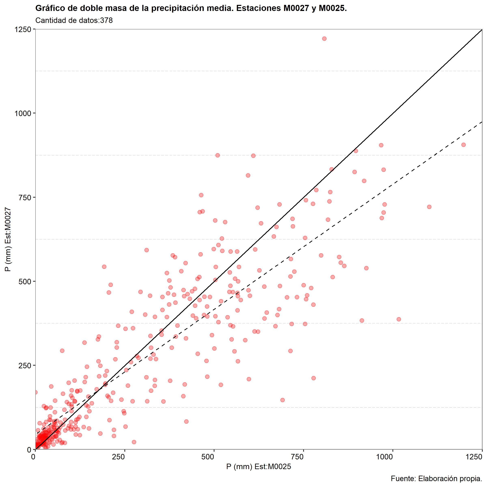
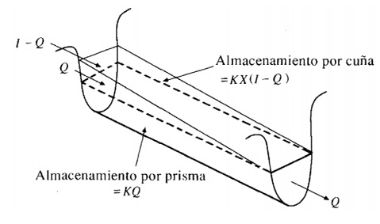

<style>
body{
text-align: justify}
</style>

```{r setup, include=FALSE}
knitr::opts_chunk$set(echo = TRUE, fig.cap = TRUE, ft.keepnext=F)

rm(list=ls()) #clean up the memory

require(pacman)
pacman::p_load(raster, ggnewscale, rgdal, rgeos, stringr, RColorBrewer, sf, tidyverse, gtools, ggnewscale)
# 
# library("easypackages")
# libraries("kableExtra", "flextable", "tm", "ggplot2", "grid", "dplyr", "tidyr", "gridExtra", "cowplot", "patchwork", "imager", "imagerExtra", "sp", "stars", "magrittr", "ggspatial", "basemaps","scales", "colorspace", "marmap", "shadowtext", "ggrepel", "ggthemes", "extrafont", "lubridate", "gghighlight","latex2exp", "qqplotr", "moments", "terra", "ggnewscale", "fitdistrplus", "stats4", "MASS", "survival", "actuar", "distrMod", "fitur", "methods")

library("easypackages")
libraries("flextable", "ggplot2", "grid", "dplyr", "tidyr", "gridExtra", "cowplot", "patchwork", "imager", "imagerExtra", "scales")


setwd('F:/Proj_R/La_Union_html_rmd')

pic_a <- load.image(file = "Imagenes/Escudo.jpg")
ar_pic_a <- dim(pic_a)[2]/dim(pic_a)[1] #find our aspect ratio

pic_b <- load.image(file = "Imagenes/escalas_colores_1.jpg")
ar_pic_b <- dim(pic_b)[2]/dim(pic_b)[1] #find our aspect ratio

pic_c <- load.image(file = "Imagenes/escalas_colores_2.jpg")
ar_pic_c <- dim(pic_c)[2]/dim(pic_c)[1] #find our aspect ratio

pic_d <- load.image(file = "Imagenes/Grafica_de_Co.png")
ar_pic_d <- dim(pic_d)[2]/dim(pic_d)[1] #find our aspect ratio

pic_e <- load.image(file = "Imagenes/Grafica_de_Co_TC.png")
ar_pic_e <- dim(pic_e)[2]/dim(pic_e)[1] #find our aspect ratio

pic_f <- load.image(file = "Imagenes/Grafica_de_C_Co.png")
ar_pic_f <- dim(pic_f)[2]/dim(pic_f)[1] #find our aspect ratio

pic_g <- load.image(file = "Imagenes/Grafica_de_C_Co_vs_He_Ho.png")
ar_pic_g <- dim(pic_g)[2]/dim(pic_g)[1] #find our aspect ratio

pic_h <- load.image(file = "Imagenes/Grafica_de_k_n_vs_ha_Ho.png")
ar_pic_h <- dim(pic_h)[2]/dim(pic_h)[1] #find our aspect ratio

pic_i <- load.image(file = "Imagenes/Grafica_de_radios.png")
ar_pic_i <- dim(pic_i)[2]/dim(pic_i)[1] #find our aspect ratio


pic_1 <- load.image(file = "Imagenes/Macrolocalizacion.png")
ar_pic_1 <- dim(pic_1)[2]/dim(pic_1)[1] #find our aspect ratio

pic_2 <- load.image(file = "Imagenes/Img_satel_1.png")
ar_pic_2 <- dim(pic_2)[2]/dim(pic_2)[1] #find our aspect ratio

pic_3 <- load.image(file = "Imagenes/Cuencas_gral.png")
ar_pic_3 <- dim(pic_3)[2]/dim(pic_3)[1] #find our aspect ratio

pic_4 <- load.image(file = "Imagenes/Tres_cuencas.png")
ar_pic_4 <- dim(pic_4)[2]/dim(pic_4)[1] #find our aspect ratio

pic_5 <- load.image(file = "Imagenes/DEM_RBlanco.png")
ar_pic_5 <- dim(pic_5)[2]/dim(pic_5)[1] #find our aspect ratio

pic_6 <- load.image(file = "Imagenes/Tres_cuencas_subcs.png")
ar_pic_6 <- dim(pic_6)[2]/dim(pic_6)[1] #find our aspect ratio

pic_7 <- load.image(file = "Imagenes/Sbcs_RBlanco.png.")
ar_pic_7 <- dim(pic_7)[2]/dim(pic_7)[1] #find our aspect ratio

pic_8 <- load.image(file = "Imagenes/Thiesen_zonas.png.")
ar_pic_8 <- dim(pic_8)[2]/dim(pic_8)[1] #find our aspect ratio

pic_9 <- load.image(file = "Imagenes/ts_Pmensual_M0025.png")
ar_pic_9 <- dim(pic_9)[2]/dim(pic_9)[1] #find our aspect ratio

pic_10 <- load.image(file = "Imagenes/bp_Pmensual_M0025.png")
ar_pic_10 <- dim(pic_10)[2]/dim(pic_10)[1] #find our aspect ratio

pic_11 <- load.image(file = "Imagenes/Hist_Panual_M0025.png")
ar_pic_11 <- dim(pic_11)[2]/dim(pic_11)[1] #find our aspect ratio

pic_12 <- load.image(file = "Imagenes/Prob_exc.png")
ar_pic_12 <- dim(pic_12)[2]/dim(pic_12)[1] #find our aspect ratio

pic_13 <- load.image(file = "Imagenes/All_pluviogram.png")
ar_pic_13 <- dim(pic_13)[2]/dim(pic_13)[1] #find our aspect ratio

pic_14 <- load.image(file = "Imagenes/Mapas_para_CN_Coc.png")
ar_pic_14 <- dim(pic_14)[2]/dim(pic_14)[1] #find our aspect ratio

pic_15 <- load.image(file = "Imagenes/Mapas_CN_Coc.png")
ar_pic_15 <- dim(pic_15)[2]/dim(pic_15)[1] #find our aspect ratio

pic_16 <- load.image(file = "Imagenes/Mapas_para_CN_Cuc.png")
ar_pic_16 <- dim(pic_16)[2]/dim(pic_16)[1] #find our aspect ratio

pic_17 <- load.image(file = "Imagenes/Mapas_CN_Cuc.png")
ar_pic_17 <- dim(pic_17)[2]/dim(pic_17)[1] #find our aspect ratio

pic_18 <- load.image(file = "Imagenes/Mapas_c_quin.png")
ar_pic_18 <- dim(pic_18)[2]/dim(pic_18)[1] #find our aspect ratio

pic_19 <- load.image(file = "Imagenes/Ec_ajuste_hQ.png")
ar_pic_19 <- dim(pic_19)[2]/dim(pic_19)[1] #find our aspect ratio

pic_20 <- load.image(file = "Imagenes/ts_QH0177.png")
ar_pic_20 <- dim(pic_20)[2]/dim(pic_20)[1] #find our aspect ratio

pic_21 <- load.image(file = "Imagenes/Series_termp_lluvia.png")
ar_pic_21 <- dim(pic_21)[2]/dim(pic_21)[1] #find our aspect ratio

pic_22 <- load.image(file = "Imagenes/Curva_dobm.png")
ar_pic_22 <- dim(pic_22)[2]/dim(pic_22)[1] #find our aspect ratio

pic_23 <- load.image(file = "Imagenes/Curva_dobm2.png")
ar_pic_23 <- dim(pic_23)[2]/dim(pic_23)[1] #find our aspect ratio

pic_24 <- load.image(file = "Imagenes/Cuenca_hms_Cocola.png")
ar_pic_24 <- dim(pic_24)[2]/dim(pic_24)[1] #find our aspect ratio

pic_25 <- load.image(file = "Imagenes/Cuenca_hms_Cucaracha.png")
ar_pic_25 <- dim(pic_25)[2]/dim(pic_25)[1] #find our aspect ratio

pic_26 <- load.image(file = "Imagenes/Datos_cuencas_hms.png")
ar_pic_26 <- dim(pic_26)[2]/dim(pic_26)[1] #find our aspect ratio

pic_27 <- load.image(file = "Imagenes/Muskingum_img1.jpg")
ar_pic_27 <- dim(pic_27)[2]/dim(pic_27)[1] #find our aspect ratio

pic_28 <- load.image(file = "Imagenes/zoom_cierres.png")
ar_pic_28 <- dim(pic_28)[2]/dim(pic_28)[1] #find our aspect ratio

pic_29 <- load.image(file = "Imagenes/Hidrog_6T_1.png")
ar_pic_29 <- dim(pic_29)[2]/dim(pic_29)[1] #find our aspect ratio

pic_30 <- load.image(file = "Imagenes/Hidrog_6T_2.png")
ar_pic_30 <- dim(pic_30)[2]/dim(pic_30)[1] #find our aspect ratio

pic_31 <- load.image(file = "Imagenes/TvsQmax.png")
ar_pic_31 <- dim(pic_31)[2]/dim(pic_31)[1] #find our aspect ratio

pic_32 <- load.image(file = "Imagenes/Vertedor_planta.png")
ar_pic_32 <- dim(pic_32)[2]/dim(pic_32)[1] #find our aspect ratio

pic_33 <- load.image(file = "Imagenes/Cimacio_1a.png")
ar_pic_33 <- dim(pic_33)[2]/dim(pic_33)[1] #find our aspect ratio

pic_34 <- load.image(file = "Imagenes/Nivel_max_planta.png")
ar_pic_34 <- dim(pic_34)[2]/dim(pic_34)[1] #find our aspect ratio

pic_35 <- load.image(file = "Imagenes/Curva_hQ_vertedor.png.")
ar_pic_35 <- dim(pic_35)[2]/dim(pic_35)[1] #find our aspect ratio

```

<br>

```{css, echo=FALSE}

/*------Lo puse para demostrar que en el chunk puede haber codigo css pero esto no afecta a nada-------*/

#TOC {
  max-width: fit-content;
  white-space: now-rap;
}

div:has(> #TOC){
display: flex;
flex-direction: row-reverse;
}
```

::: {style="text-align: center"}

:::

```{r echo=FALSE, fig.asp=ar_pic_a, fig.width=1.5, fig.align='center'}

#fig.asp=ar_pic1, fig.height=1, fig.pos="H"
#

# {align="center"}
# {width="40%"}{align="center"}

#<p style="text-align:center;"></p>

#<div {style="text-align: center"}
#
#</div>

#::: {style="text-align: center"}
#
#:::

#{width="40%"}
    
```

# INTRODUCCIÓN.

<br>

## Objetivo general.

<br>

Determinar los caudales medios, mínimos y máximos mensuales en las posibles captaciones superficiales de agua cruda para el sistema de abasto de agua potable al área consolidada de la cabecera parroquial La Unión del Cantón Quinindé.

<br>

## Objetivos específicos.

<br>

-   Delimitar las cuencas y subcuencas hidrográficas que conforman cada uno de los sistemas hidrológicos de las variantes de captaciones y obtener sus características morfométricas.

-   Realizar un estudio de lluvias medias en las cuencas.

-   Obtener el mapa de CN de las cuencas y subcuencas para el modelo hidrológico en HECHMS.

-   Realizar un estudio de lluvias máximas para las cuencas en estudios.

-   Obtener caudales medios anuales y distribuirlos en los meses.

-   Evaluar las posibles variantes de captación.

-   Realizar un estudio de caudales máximos para un posterior análisis de inundabilidad.

<br>

# MATERIALES Y MÉTODOS.

<br>

[**Materiales**]{.underline}

Para los análisis hidrológicos de las cuencas y sistema fluvial se emplea:

-   Modelo de elevación digital del terreno con celdas uniformes de 4m x 4m, producto obtenido del proyecto SIGTIERRAS, ver [@mancero2015evaluacion] y [@corral2020drives]

-   Modelo de elevación digital del terreno con celdas uniformes de 30m x 30m, de la (Shuttle Radar Topography Mission) srtmm, ver [@farr2000shuttle]

-   Imágenes satelitales multiespectrales de alta resolución 4.7 m, del proyecto Planet, ver [@team2017planet]

-   [Software]{.underline}: Quantum GIS, más conocido como QGIS, es uno de los Sistema de Información Geográfica de uso libre más empleado en el mundo. QGIS presenta librerías de funciones propias de él y de otros SIG libres muy potentes como GRASS, SAGA, GDAL, además de contar con capacidades para incluir scripts de Python, R etc. Todo esto lo hace verdaderamente muy potente, sobre todo para estudios hidrológicos donde se han desarrollado un amplio grupo de herramientas [@van2019qgis].

-   [Software]{.underline}: R, es un entorno y lenguaje de programación con un enfoque al análisis estadístico, nació como una reimplementación de software libre del lenguaje S. Se trata de uno de los lenguajes de programación más utilizados en investigación científica, cuenta con una gran comunidad de personas que desarrollan paquetes en una amplia gama de ramas de la ciencia y la técnica, en tal sentido se destacan los campos del análisis espacial, estadístico, hidrológico y la visualización donde existen paquetes como *sf*, *raster*, *ggplot2*, que se emplean para realizar análisis espacial aplicado a cuencas hidrográficas, *fitdistrplus*, *stats4*, *MASS*, *gamless*, *rriskDistributions*, *climextRemes*, *moments*, *lmomco* y *extRemes*, paquetes estos últimos empleados para el análisis de frecuencias obtención de función probabilística de mejor ajuste, y los paquetes *e1071*, *rpart*, *randomForest*, para la realización de clasificación supervisada de imagenes satelitales, también se emplean otro grupo de paquetes para realizar otras funciones.

-   [Software]{.underline}: Hydrologic Modeling System HEC-HMS versión 4.5. Este software es desarrollado por el Centro de Ingeniería Hidrológica (Hydrologic Engineering Cencer-HEC) del Cuerpo de Ingenieros del Ejército de los Estados Unidos (U.S. Army Corps of Engineers-USACE). Es de libre uso y difusión, y eso unido a su indudable calidad lo hace uno de los programas más empleado para temas hidrológicos en cuencas hidrográficas en el mundo. Desde el punto de vista teórico está sustentado en un modelo conceptual (de base física y empírica) con representación espacial semidistribuida por medio de la división de la cuenca en unidades menores llamadas subcuencas.

-   [Software]{.underline}: HEC-DSSVue y HEC-SSP son softwares de libre uso pertenecientes al Centro de Ingeniería Hidrológica del Cuerpo de Ingenieros del Ejercito de los Estados Unidos (US Army Corps of Engineers, Hydrologic Engineering Center). El primero se emplea para realizar un archivo y el segundo para realizar un análisis de frecuencias y obtención de función probabilística de mejor ajuste.

-   [Software]{.underline}: TableCurve 2D V5.01.01. Este es un potente software para realizar complejos ajustes matemáticos.

<br>

[**Métodos**]{.underline}

Para la obtención de los [caudales medios y mínimos]{.underline} se emplean métodos estadísticos aplicados a las series de caudales diarios obtenidos en una estación hidrológica administrada por el Instituto Nacional de Meteorología e Hidrología INAMHI así como ecuaciones empíricas de amplio uso en proyectos técnicos.

Por su parte, los [caudales máximos]{.underline} se obtienen por medio de un modelo semidistribuido en HEC-HMS que emplea un grupo de métodos determinísticos y probabilísticos para los diferentes parámetros que calcula; a continuación se presenta un resumen de estos métodos.

<br>

<p class="text-right" style="background-color: aliceblue">

Principales métodos empleados por el software HEC-HMS y que son empleados en la modelación hidrológica.

</p>

[Métodos de intercepción de lluvia por las plantas]{.underline} (Canopy Methods) Si existe vegetación, parte de la precipitación será retenida en las hojas para evaporarse después. HEC-HMS tiene incorporado el siguiente grupo de métodos para realizar este proceso, estos son: Dynamic Canopy, Simple Canopy, Gridded Simple Canopy.

En este caso no se considerará este parámetro, suele usarse más en modelos de simulación continua.

[Métodos de almacenamiento superficial]{.underline} (Surface Storage) Estos métodos determinan la precipitación que puede quedar almacenada en pequeñas depresiones superficiales para infiltrarse o evaporarse posteriormente. HEC-HMS tiene incorporado el siguiente grupo de métodos para realizar este proceso, estos son: Simple Surface, Gridded Simple Surface.

En este caso no se considerará este parámetro, de la misma forma que el anterior, suele usarse más en modelos de simulación continua.

[Métodos de pérdida]{.underline} (Loss Methods) también se conocen como (Runoff-volume). Estos son métodos que permiten determinar la cantidad de agua que se infiltra dentro de una subcuenca siempre que se conozca la lluvia distribuida en el tiempo (hietograma) y algunos parámetros de la subcuenca. En otras palabras, estos métodos convierten el hietograma bruto de entrada en la cuenca en un hietograma neto, siendo este último el primero menos las pérdidas de agua ocurridas por infiltración, es decir este hietograma neto determinado con alguno de estos métodos lo que calcula es la llamada lluvia efectiva que es la que en definitivas llega al rio como escurrimiento directo y que provoca las crecidas. HEC-HMS tiene incorporado el siguiente grupo de métodos para resolver este problema, estos son: -Defict constant (DC), -Exponential, -Green Ampt, -Gridded déficit constant, -Gridded SMA, -initial constant, - **SCS curve number**, -Smith Parlange, -Soil moisture accounting.

En este caso se empleará el método del número de la curva del Soil Conservation Services, popularmente conocido como método de CN, aplicado con una metodología orientada a la obtención de los valores de CN para cada subcuenta del modelo por medio de herramientas SIG, ver [@gutierres2017determinacion], [@ferrer1995generacion] y [@maurtua2016generacion].

[Métodos de escurrimiento directo]{.underline} (Direct-runoff) también se conocen como (Transform Method) Estos métodos se encargan de tomar el hietograma de lluvia efectiva y lo transforman en caudal producido por la subcuenca materializado en un hidrograma en el cierre de cada subcuenca de estudio. HEC-HMS tiene incorporado el siguiente grupo de métodos para realizar este proceso, estos son: Clark's UH, Kinematic wave, ModClark, **SCS UH**, Snyder's UH, User-specified s-graph, User-specified unit hydrograph (UH).

En este caso se empleará el método del hidrograma unitario del Soil Conservation Services.

[Métodos para estimar el flujo base]{.underline} (Baseflow) Estos métodos garantizan considerar que los tramos de ríos de análisis en el modelo no están secos (sin agua) en el periodo de la simulación. HEC-HMS tiene incorporado el siguiente grupo de métodos para realizar este proceso, estos son: Bounded recession, **Constant monthly**, linear reservoir, Nonlinear Boussinesq, Recession.

En este caso se empleará el método de Constante mensual.

<p class="text-right" style="background-color: aliceblue">

Principales métodos aplicados a los tramos de ríos (reach).

</p>

[Métodos de tránsito]{.underline} (Routing Methods) En muchas ocasiones se debe transitar un hidrograma desde el cierre de una subcuenca (que se encuentra aguas arriba) hasta el cierre de otra cuenca contigua a la anterior (pero que se encuentra aguas abajo). Para tal propósito HEC-HMS tiene incorporado el siguiente grupo de métodos, estos son: Kinematic wave, Lag, Lag and K, Modified Plus, **Muskingum"**, Muskingum-Cunge, Normal Depth, Straddle Stagger.

En este caso se empleará el método de Muskingum que es ampliamente aplicado en este tipo de estudios.

<p class="text-right" style="background-color: aliceblue">

Principales métodos aplicados al modelo meteorológico.

</p>

[Métodos de precipitación]{.underline} (Precipitation Methods) Uno de los datos más importantes que se deben incorporar a un modelo hidrológico es la precipitación ya que esta viene a ser el estímulo más importante al modelo hidrológico (si es que no se considera el aporte de agua producto del deshielo de la nieve que también puede ser considerado en HEC-HMS como uno de los elementos aportantes de flujo del modelo meteorológico).

Para considerar la precipitación HEC-HMS tiene incorporado el siguiente grupo de métodos, estos son: Frequency Storm, Gage Weights, Gridded Precipitation, Inverse Distance, Hypothetical Storm, **Specified Hyetograph**, Standard Project Storm, HMR 52 Storm.

En este caso se empleará el método de entrada de un Hietograma especificado.

<br>

# ZONA DE ESTUDIO.

<br>

## Descripción general.

<br>

El área consolidada de la cabecera parroquial "La Unión" del Cantón Quinindé es la zona estudio del proyecto y como puede verse en la figura \@ref(fig:figura1) se encuentra ubicada en el sur de la provincia Esmeraldas. La Unión tiene una población cercana a los 20 000 habitantes y en su zona periurbana predomina la actividad agrícola, ver la figura \@ref(fig:figura2).

```{r figura1, echo=FALSE, fig.cap = "Ubicación de la zona de estudio.", fig.id="figura1", fig.asp=ar_pic_1, fig.width = 6, fig.pos="H", message=FALSE, warning=FALSE}

#--- Dato ---#
fig_1_created<-"Si"         #"Si" Es porque ya se creo el grafico y solo hay que cargarlo, "No" hay que creralo
#------------#

if (fig_1_created=="Si"){
  
  
  
}else{
  source("Funciones.R")
  
  #ecu<-Suram_polig %>% 
  #filter(iso_code=="ECU")
  
  ecu_prov<-read_sf(dsn="shp_files/Ec_Prov_wgs84_17N.shp", quiet= TRUE)
  La_union_box<-read_sf(dsn="shp_files/La_union_box.shp", quiet= TRUE)
  
  Prov_Esmeraldas<-ecu_prov %>% 
  filter(DPA_DESPRO=="ESMERALDAS")
  Col_Narino_wgs84_17N<-read_sf(dsn="shp_files/Col_Narino_wgs84_17N.shp", quiet= TRUE)

  ecu_prov_simp <- st_simplify(ecu_prov, dTolerance = 10)
  #per_simp <- st_simplify(per, dTolerance = 10)
  #col_simp <- st_simplify(col, dTolerance = 10)
  
  #--- Entrada a la funcion para hacer el mapa ---#
  g1<-fun_graf_prov(ecu_prov, Col_Narino_wgs84_17N, Prov_Esmeraldas, La_union_box) 
  #-----------------------------------------------#
  
  #------- Se graba en disco el mapa creado ------#
 ggsave(plot = g1, filename = 'F:/Proj_R/La_Union/Imagenes/Macrolocalizacion.png', 
        units = 'in', width = 8, height = 7, dpi = 300)
  #-----------------------------------------------#
 
  #knitr::include_graphics("Macrolocalizacion.png")
}

```

<br>

En la figura \@ref(fig:figura1) se puede observar que la zona urbana de la ciudad tiene una superficie aproximada de $450~ha$. En esta misma imagen se puede observar la ubicación de 8 pozos de bombeo que constituyen la principal fuente de abasto de agua para la ciudad. <br>

<br>

```{r figura2, echo=FALSE, fig.cap = "Imagen satelital Planet, área urbana de La Unión y pozos de abasto de agua.", fig.id="figura2", fig.asp=ar_pic_2, out.width="1000px", fig.align='center', message=FALSE, warning=FALSE}

#--- Dato ---#
fig_2_created<-"Si"         #"Si" Es porque ya se creo el grafico y solo hay que cargarlo, "No" hay que creralo
#------------#

if (fig_2_created=="Si"){
  
  
  
}else{
  source("Funciones.R")
  
    #------ convert to data.frame ------#
  
  ortoim_1<-raster::stack ("F:/Proj_R/La_Union/raster_files/Imag_Satelit_Planet_LU17N.tif")
  Pueb_LU<-read_sf(dsn="shp_files/Area_pueblo_La_Union.shp", quiet= TRUE)
  LU_wells<-read_sf(dsn="shp_files/Pozos_La_Union.shp", quiet= TRUE)
    
  LU_wells$Nombre<-as.factor(LU_wells$Nombre)
    
  #Coerce raster into dataframe with coordinate columns for each pixel center: for ggplot2
  ortoim_1_df <- raster::as.data.frame(ortoim_1, xy=T)
  
  ortoim_1_df[!complete.cases(ortoim_1_df),] #Returns zero rows, no pixel is lacking any data
  
  ortoim_1_df <- ortoim_1_df %>% rename(Red = Imag_Satelit_Planet_LU17N_1,   #Rename bands
                                      Green = Imag_Satelit_Planet_LU17N_2,
                                      Blue = Imag_Satelit_Planet_LU17N_3)
  
  
  #--- Entrada a la funcion para hacer el mapa ---#
  g2<-fun_img_sat1(ortoim_1_df, Pueb_LU, LU_wells) 
  #-----------------------------------------------#
  
  #------- Se graba en disco el mapa creado ------#
 ggsave(plot = g2, filename = 'F:/Proj_R/La_Union/Imagenes/Img_satel_1.png', 
        units = 'in', width = 8, height = 8, dpi = 300)
  #-----------------------------------------------#
 
  #knitr::include_graphics("Macrolocalizacion.png")
}

```

<br>

Para complementar la información sobre las fuentes de abasto de agua a La Unión se presenta la tabla \@ref(tab:tabla1) donde aparecen datos importantes de los pozos y los equipos de bombeo.

<br>

<br>

```{r tabla1, echo=FALSE, include=TRUE, tab.cap="Datos de pozos y bombas que conforman el sistema de captación de agua para consumo de La Unión.", tab.id="tabla1"}

poz.union <-read.csv("csv_files/Pozos_La_union.csv", header = T)  #Datos tabla para firma.

poz.union$Cota<-round(poz.union$Cota, digits = 2)

colnames(poz.union)<-c("Nro","Nombre","Vía de acceso","Sector","Norte (m)","Este (m)", "Cota (m)", "Profundidad (m)", "Potencia (Hp)", "Caudal (l/s)", "Estado")


flextable(data=poz.union) %>%
theme_booktabs() %>%
  bold(part = "header", bold = TRUE ) %>%
  flextable::width(j=c(1:11), width=c(1,1.6,2.5,2.5,1.6,1.5,1.2,2.1,1.6,1.3,1.5), unit = "cm") %>%
  flextable::align(align = "center", part = "all") %>%
  fontsize(size = 8, part = "header") %>%
  fontsize(size = 7, part = "body") %>%
  add_header_row(values = c("Pozo", "Pozo", "Ubicación", "Ubicación", "Ubicación", "Ubicación", "Ubicación",
                            "Datos hidráulicos", "Datos hidráulicos", "Datos hidráulicos", "Estado")) %>% 
  merge_v(j=c(11), part = "header") %>%
  merge_h(i=1, part = "header") %>% 
  add_footer_lines(values="Fuente: Elaboración propia.") %>% 
  italic(italic = TRUE, part = "footer")

```

<br>

En el presente estudio se analiza (desde el punto de vista hidrológico) posibles alternativas para dotar de una fuente superficial de abasto de agua a la zona urbana de la cabecera parroquial "La Unión". En tal sentido se presenta la figura \@ref(fig:figura3) en la que se puede observar las 4 propuestas de captación que se analizan: Río Mache, Río Cucaracha, Río Cocola y Río Blanco.

```{r figura3, echo=FALSE, fig.cap = "Puntos de captación de agua superficial analizados en el estudio.", fig.id="figura3", fig.asp=ar_pic_3, fig.width = 6, fig.pos="H", message=FALSE, warning=FALSE}

#--- Dato ---#
fig_3_created<-"Si"         #"Si" Es porque ya se creo el grafico y solo hay que cargarlo, "No" hay que creralo
#------------#

if (fig_3_created=="Si"){
  
  
  
}else{
  source("Funciones.R")
  

    #------ convert to data.frame ------#
r_mache<-read_sf(dsn="shp_files/Rio_Mache.shp", quiet= TRUE)
r_cucaracha<-read_sf(dsn="shp_files/Rio_Cucaracha.shp", quiet= TRUE)
r_cocola<-read_sf(dsn="shp_files/Rio_Cocola_mod_wgs84_17N.shp", quiet= TRUE)
r_blanco<-read_sf(dsn="shp_files/Rio_Blanco_La_Union.shp", quiet= TRUE)

r_mache$Orden_map<-round(r_mache$Orden/8, digits = 2) #Se incluye columna para dibujar rios con espesor adecuado
r_cucaracha$Orden_map<-round(r_cucaracha$Orden/8, digits = 2) #Se incluye columna para dibujar rios con espesor adecuado
r_cocola$Orden_map<-round(r_cocola$Orden/8, digits = 2) #Se incluye columna para dibujar rios con espesor adecuado
r_blanco$Orden_map<-round(r_blanco$Orden/8, digits = 2) #Se incluye columna para dibujar rios con espesor adecuado

Pueb_LU<-read_sf(dsn="shp_files/Area_pueblo_La_Union.shp", quiet= TRUE)

Subcs_rMache<-read_sf(dsn="shp_files/Subcs_Mache_vect_raw.shp", quiet= TRUE)
Subcs_rCucaracha<-read_sf(dsn="shp_files/Cucaracha_subc_vect.shp", quiet= TRUE)
Subcs_rCocola<-read_sf(dsn="shp_files/subcuencas.shp", quiet= TRUE)
#Subcs_rBlanco<-read_sf(dsn="shp_files/Subcs_Blanco_La_Union.shp", quiet= TRUE)
Subcs_rBlanco_comb<-read_sf(dsn="shp_files/Cuenca_Blanco_La_Union.shp", quiet= TRUE)

Tomas<-read_sf(dsn="shp_files/Ptos_visitas_wgs84_17N.shp", quiet= TRUE)  
  
#Aqui se disuelven todas las subcuencas y queda solo un poligono de toda la cuenca
Subcs_rMache_comb<-Subcs_rMache %>% group_by(Cuenca) %>% summarise()
Subcs_rCuc_comb<-Subcs_rCucaracha %>% group_by(Cuenca) %>% summarise()
Subcs_rCoc_comb<-Subcs_rCocola %>% group_by(Cuenca) %>% summarise()
Subcs_rBlanco_comb<-Subcs_rBlanco_comb[,c("Cuenca", "geometry")]

#Aquí se crea una lista con los shp y despues se unen todos en un solo objeto de clase "sf"
shp_list1<-list(Subcs_rMache_comb, Subcs_rCuc_comb, Subcs_rCoc_comb, Subcs_rBlanco_comb)
all_Cuencas <- rbind(shp_list1[[1]], shp_list1[[2]], shp_list1[[3]], shp_list1[[4]])

  #--- Entrada a la funcion para hacer el mapa ---#
  g3<-fun_img_cuencas(all_Cuencas, Tomas, r_mache, r_cucaracha, r_cocola, r_blanco, Pueb_LU) 
  #-----------------------------------------------#
  
  #------- Se graba en disco el mapa creado ------#
 ggsave(plot = g3, filename = 'F:/Proj_R/La_Union/Imagenes/Cuencas_gral.png', 
        units = 'in', width = 8, height = 6, dpi = 300)
  #-----------------------------------------------#
 
  #knitr::include_graphics("Macrolocalizacion.png")
}

```

<br>

# ESTUDIO HIDROLÓGICO

<br>

A continuación se presenta un estudio hidrológico para la obtención de caudales medios y máximos en las cuencas aportantes a los cierres de la variantes definidas. Primeramente se delimitan las cuencas y subcuencas, así como sus sistemas fluviales asociados que son vitales para la creación de modelos hidrológicos en HECHMS. Debido a que no existen estaciones hidrológicas en los ríos analizados (salvo en el Blanco) se realiza un análisis de lluvias medias mensuales para el caso del caudal medio y de lluvias máximas para la obtención de hidrogramas de crecidas para diferentes períodos de retorno por medio de los modelos hidrológicos.

<br>

## Determinación de cuencas y subcuencas hidrográficas con sus sistemas fluviales.

<br>

La obtención de cuencas y subcuencas hidrográficas con sus sistemas fluviales se realizó por medio del sistema de información geográfico QGIS en su versión estable a largo plazo LTR (siglas en inglés) 3.16, con herramientas que para este propósito tiene GRASS y SAGA.

La base fundamental para realizar el proceso de delimitación de las cuencas es el modelo de elevación digital del terreno, por sus siglas en inglés DEM (digital elevation model) generado en el proyecto SIGTIERRAS del Magap con precisión de 4 metros, es decir, con tamaño de cuadrículas de 4m, equivalente a una escala de 1:4000, que es muy buena para este tipo de estudios hidrológicos ver [@mancero2015evaluacion] y [@corral2020drives]. Como el proyecto SIGTIERRAS no logró ocupar toda la superficie de estudio se decidió emplear el DEM de la (Shuttle Radar Topography Mission) srtm con precisión de 30 metros (celdas uniformes de 30m x 30m) en pequeñas zonas de la cuenca alta de las variantes Mache, Cucaracha y Cocola, y en el caso del Blanco todo el análisis fue realizado con el DEM de 30 metros srtm, ver [@farr2000shuttle].

Los geoprocesos asociados a la obtención de las subcuencas y sistema fluvial fueron realizados fundamentalmente con funciones del SIG Grass que se encuentran en QGIS destacándose: 1- [r.carve]{.underline}: Con esta función se modifica el dem de partida disminuyendo 0.5 m la cota en los pixeles que intersectan con un tema de líneas que fue obtenido por medio de vectorización y que representa los ríos y meandros principales de los sistemas fluviales en estudio, este nuevo dem garantiza que en el proceso de creación del sistema fluvial, los ríos transcurran exactamente por donde lo hacen en la realidad, eliminando con esto errores de trazado y conexión del modelo que suelen ocurrir generalmente en las zonas de topografía llana en la cuenca por imprecisiones en la obtención del dem. 2- **r.fill**: Se rellenan las zonas de depresiones en las que pueda quedar estancada el agua, para garantizar el recorrido de los ríos sin interrupciones. 3- **r.watershed**: Esta es sin dudas la principal función, con ella se obtienen las subcuencas y el sistema de drenaje, en este caso se empleó el criterio de un valor mínimo de acumulación de flujo para la creación de los ríos. 4- **r.water.outlet**: Con esta función se introduce el cierre de la cuenca y se obtiene toda la cuenca de estudio, posteriormente con funciones de selección, cambio de formato ráster a vectorial y unión de polígonos y líneas se pueden obtener los polígonos que representan las subcuencas y microcuencas [@chonillo2022respuesta].

En la figura \@ref(fig:figura4) se puede observar la delimitación de las cuencas Mache, Cucaracha y Cocola (y sus subcuencas correspondientes) así como el modelo de elevación digital del terreno, la ubicación de La Unión y muy importante, los sistemas fluviales representados con líneas de diferente espesor atendiendo al orden de Strahler de cada tramo, (este orden será explicado en las secciones posteriores).

<br>

```{r figura4, echo=FALSE, fig.cap = "Modelo de elevación digital del terreno, cuencas Mache, Cucaracha y Cocola.", fig.id="figura4", fig.asp=ar_pic_4, out.width="1000px", fig.align='center', message=FALSE, warning=FALSE}

#--- Dato ---#
fig_4_created<-"Si"         #"Si" Es porque ya se creo el grafico y solo hay que cargarlo, "No" hay que creralo
#------------#

if (fig_4_created=="Si"){
  
  
  
}else{
  source("Funciones.R")
  
    #------ Load shp and raster ------#
  
dem_3cuencas<-raster("raster_files/dem_srtm30m_trescuencas.tif")                # raster
dem_3cuencas_hill<-raster("raster_files/dem_srtm30m_trescuencas_hill.tif")      # raster

r_mache<-read_sf(dsn="shp_files/Rio_Mache.shp", quiet= TRUE)
r_cucaracha<-read_sf(dsn="shp_files/Rio_Cucaracha.shp", quiet= TRUE)
r_cocola<-read_sf(dsn="shp_files/Rio_Cocola_mod_wgs84_17N.shp", quiet= TRUE)

r_mache$Orden_map<-round(r_mache$Orden/6, digits = 2) #Se incluye columna para dibujar rios con espesor adecuado
r_cucaracha$Orden_map<-round(r_cucaracha$Orden/6, digits = 2) #Se incluye columna para dibujar rios con espesor adecuado
r_cocola$Orden_map<-round(r_cocola$Orden/6, digits = 2) #Se incluye columna para dibujar rios con espesor adecuado

Pueb_LU<-read_sf(dsn="shp_files/Area_pueblo_La_Union.shp", quiet= TRUE)

Subcs_rMache<-read_sf(dsn="shp_files/Subcs_Mache_vect_raw.shp", quiet= TRUE)
Subcs_rCucaracha<-read_sf(dsn="shp_files/Cucaracha_subc_vect.shp", quiet= TRUE)
Subcs_rCocola<-read_sf(dsn="shp_files/subcuencas.shp", quiet= TRUE)

Tomas<-read_sf(dsn="shp_files/Ptos_visitas_wgs84_17N.shp", quiet= TRUE)  
  
#Aqui se disuelven todas las subcuencas y queda solo un poligono de toda la cuenca
Subcs_rMache_comb<-Subcs_rMache %>% group_by(Cuenca) %>% summarise()
Subcs_rCuc_comb<-Subcs_rCucaracha %>% group_by(Cuenca) %>% summarise()
Subcs_rCoc_comb<-Subcs_rCocola %>% group_by(Cuenca) %>% summarise()


#Aquí se crea una lista con los shp y despues se unen todos en un solo objeto de clase "sf"
shp_list1<-list(Subcs_rMache_comb, Subcs_rCuc_comb, Subcs_rCoc_comb)
all_Cuencas <- rbind(shp_list1[[1]], shp_list1[[2]], shp_list1[[3]])


#------ convert raster to data.frame ------#
  dem_3cuencas_df <- raster::rasterToPoints(dem_3cuencas, spatial = FALSE) %>% 
    as_tibble %>% 
    set_names(c('x','y','Cota'))
  dem_3cuencas_hill_df <- raster::rasterToPoints(dem_3cuencas_hill, spatial = FALSE) %>% 
    as_tibble %>% 
    set_names(c('x','y','value'))
#-----------------------------------#


  #--- Entrada a la funcion para hacer el mapa ---#
  g4<-fun_img_trescuencas(all_Cuencas, Tomas, r_mache, r_cucaracha, r_cocola, Pueb_LU, 
                          dem_3cuencas_df, dem_3cuencas_hill_df, Subcs_rMache, Subcs_rCucaracha, Subcs_rCocola) 
  #-----------------------------------------------#
  
  #------- Se graba en disco el mapa creado ------#
 ggsave(plot = g4, filename = 'F:/Proj_R/La_Union/Imagenes/Tres_cuencas.png', 
        units = 'in', width = 8, height = 8, dpi = 300)
  #-----------------------------------------------#
 
  #knitr::include_graphics("Macrolocalizacion.png")
}

```

<br>

Atendiendo a la considerable diferencia de superficie de estas tres cuencas con la cuenca del río Blanco se decide realizar una figura homóloga a la \@ref(fig:figura4) para el río Blanco.

En la \@ref(fig:figura5) también se ubican las obras hidráulicas principales que existen en la cuenca y que en alguna medida influyen en la hidrodinámica del sistema, estas son en primer lugar el azud vertedero con compuertas radiales en el río Pilatón, así como la presa Toachi.

<br>

```{r figura5, echo=FALSE, fig.cap = "Modelo de elevación digital del terreno, cuenca del río Blanco a la altura de La Unión.", fig.id="figura5", fig.asp=ar_pic_5, out.width="1000px", fig.align='center', message=FALSE, warning=FALSE}

#--- Dato ---#
fig_5_created<-"Si"         #"Si" Es porque ya se creo el grafico y solo hay que cargarlo, "No" hay que creralo
#------------#

if (fig_5_created=="Si"){
  
  
  
}else{
  source("Funciones.R")
  
    #------ Load shp and raster ------#
  
dem_Blanco<-raster("raster_files/dem_srtm30m_Blanco.tif")                # raster
dem_Blanco_hill<-raster("raster_files/dem_srtm30m_Blanco_hill.tif")      # raster

r_blanco<-read_sf(dsn="shp_files/Rio_Blanco_La_Union.shp", quiet= TRUE)
r_blanco$Orden_map<-round(r_blanco$Orden/8, digits = 2) #Se incluye columna para dibujar rios con espesor adecuado

Pueb_LU<-read_sf(dsn="shp_files/Area_pueblo_La_Union.shp", quiet= TRUE)
Subcs_rBlanco<-read_sf(dsn="shp_files/Subcs_Blanco_La_Union.shp", quiet= TRUE)
Subcs_rBlanco_comb<-read_sf(dsn="shp_files/Cuenca_Blanco_La_Union.shp", quiet= TRUE)

Est_Hid_H0138<-read_sf(dsn="shp_files/Est_hidrol_ppal_H0138_wgs84_17N.shp", quiet= TRUE)
Obr_Hid_Blanco<-read_sf(dsn="shp_files/Obras_Hid_Blanco.shp", quiet= TRUE)

Obr_Hid_Blanco[1,2]<-"Azud Pilaton"
Obr_Hid_Blanco[2,2]<-"Presa Toachi"

Tomas<-read_sf(dsn="shp_files/Ptos_visitas_wgs84_17N.shp", quiet= TRUE)
Tomas<-Tomas[c(-1,-2,-3),] #Solo queda la Cuenca del rio Blanco.

#------ convert raster to data.frame ------#
  dem_Blanco_df <- raster::rasterToPoints(dem_Blanco, spatial = FALSE) %>% 
    as_tibble %>% 
    set_names(c('x','y','Cota'))
  dem_Blanco_hill_df <- raster::rasterToPoints(dem_Blanco_hill, spatial = FALSE) %>% 
    as_tibble %>% 
    set_names(c('x','y','value'))
#-----------------------------------#


  #--- Entrada a la funcion para hacer el mapa ---#
  g5<-fun_img_dem_Blanco(dem_Blanco_df, Tomas, dem_Blanco_hill_df, r_blanco, 
                         Pueb_LU, Subcs_rBlanco, Subcs_rBlanco_comb, Est_Hid_H0138, Obr_Hid_Blanco) 
  #-----------------------------------------------#
  
  #------- Se graba en disco el mapa creado ------#
 ggsave(plot = g5, filename = 'F:/Proj_R/La_Union/Imagenes/DEM_RBlanco.png', 
        units = 'in', width = 7, height = 9, dpi = 300)
  #-----------------------------------------------#
 
  #knitr::include_graphics("Macrolocalizacion.png")
}

```

<br>

En la figura \@ref(fig:figura5) también se incluye la estación hidrológica automatizada del INAMHI M0138 llamada: BLANCO D.J. TOACHI. Esta es una estación muy importante porque se encuentra relativamente cerca de la posible captación en el río Blanco y cuenta con una serie bastante amplia y completa de datos de caudales diarios, situación esta que desafortunadamente no se repite en el resto de las cuencas en estudio.

En la figura \@ref(fig:figura6) se muestran las subcuencas en las que se dividen las cuencas Mache, Cucaracha y Cocola, en cada polígono que representa una subcuenca se le ubica un código que la identifica con la cuenca, así el polígono con MA3 representa la la subcuenca 3 de la cuenca del río Mache, CU1 es la subcuenca 1 de la cuenca del río Cucaracha y C1 la subcuenca 1 de la cuenca del río Cocola. La numeración de las subcuencas en todos los casos se realiza de aguas arriba hacia aguas abajo.

<br>

```{r figura6, echo=FALSE, fig.cap = "Subcuencas de las cuencas Mache, Cucaracha y Cocola para el modelo HEC-HMS.", fig.id="figura6", fig.asp=ar_pic_6, fig.width = 6, fig.pos="H", message=FALSE, warning=FALSE}

#--- Dato ---#
fig_6_created<-"Si"         #"Si" Es porque ya se creo el grafico y solo hay que cargarlo, "No" hay que creralo
#------------#

if (fig_6_created=="Si"){
  
  
  
}else{
  source("Funciones.R")
  
    #------ Load shp and raster ------#
  
r_mache<-read_sf(dsn="shp_files/Rio_Mache.shp", quiet= TRUE)
r_cucaracha<-read_sf(dsn="shp_files/Rio_Cucaracha.shp", quiet= TRUE)
r_cocola<-read_sf(dsn="shp_files/Rio_Cocola_mod_wgs84_17N.shp", quiet= TRUE)

r_mache$Orden_map<-round(r_mache$Orden/6, digits = 2) #Se incluye columna para dibujar rios con espesor adecuado
r_cucaracha$Orden_map<-round(r_cucaracha$Orden/6, digits = 2) #Se incluye columna para dibujar rios con espesor adecuado
r_cocola$Orden_map<-round(r_cocola$Orden/6, digits = 2) #Se incluye columna para dibujar rios con espesor adecuado

Pueb_LU<-read_sf(dsn="shp_files/Area_pueblo_La_Union.shp", quiet= TRUE)

Subcs_rMache<-read_sf(dsn="shp_files/Subcs_Mache_vect_raw.shp", quiet= TRUE)
Subcs_rCucaracha<-read_sf(dsn="shp_files/Cucaracha_subc_vect.shp", quiet= TRUE)
Subcs_rCocola<-read_sf(dsn="shp_files/subcuencas.shp", quiet= TRUE)

Tomas<-read_sf(dsn="shp_files/Ptos_visitas_wgs84_17N.shp", quiet= TRUE)  
  
#Aqui se disuelven todas las subcuencas y queda solo un poligono de toda la cuenca
Subcs_rMache_comb<-Subcs_rMache %>% group_by(Cuenca) %>% summarise()
Subcs_rCuc_comb<-Subcs_rCucaracha %>% group_by(Cuenca) %>% summarise()
Subcs_rCoc_comb<-Subcs_rCocola %>% group_by(Cuenca) %>% summarise()


#Aquí se crea una lista con los shp y despues se unen todos en un solo objeto de clase "sf"
shp_list1<-list(Subcs_rMache_comb, Subcs_rCuc_comb, Subcs_rCoc_comb)
all_Cuencas <- rbind(shp_list1[[1]], shp_list1[[2]], shp_list1[[3]])


  #--- Entrada a la funcion para hacer el mapa ---#
  g6<-fun_img_trescuencas_subcs(all_Cuencas, Tomas, r_mache, r_cucaracha, r_cocola, Pueb_LU, Subcs_rMache, Subcs_rCucaracha, Subcs_rCocola) 
  #-----------------------------------------------#
  
  #------- Se graba en disco el mapa creado ------#
 ggsave(plot = g6, filename = 'F:/Proj_R/La_Union/Imagenes/Tres_cuencas_subcs.png', 
        units = 'in', width = 8, height = 8, dpi = 300)
  #-----------------------------------------------#
 
  #knitr::include_graphics("Macrolocalizacion.png")
}

```

<br>

En figura \@ref(fig:figura7), véase que desde el punto de vista organizativo se definen grupos de subcuencas que conforman en su conjunto a la cuenca del río Blanco.

<br>

```{r figura7, echo=FALSE, fig.cap = "Subcuencas de la cuenca del río Blanco para el modelo HEC-HMS.", fig.id="figura7", fig.asp=ar_pic_7, fig.width = 6, fig.pos="H", message=FALSE, warning=FALSE}

#--- Dato ---#
fig_7_created<-"Si"         #"Si" Es porque ya se creo el grafico y solo hay que cargarlo, "No" hay que creralo
#------------#

if (fig_7_created=="Si"){
  
  
  
}else{
  source("Funciones.R")
  
    #------ Load shp and raster ------#

r_blanco<-read_sf(dsn="shp_files/Rio_Blanco_La_Union.shp", quiet= TRUE)
r_blanco$Orden_map<-round(r_blanco$Orden/8, digits = 2) #Se incluye columna para dibujar rios con espesor adecuado

Pueb_LU<-read_sf(dsn="shp_files/Area_pueblo_La_Union.shp", quiet= TRUE)
Subcs_rBlanco<-read_sf(dsn="shp_files/Subcs_Blanco_La_Union.shp", quiet= TRUE)
Subcs_rBlanco_comb<-read_sf(dsn="shp_files/Cuenca_Blanco_La_Union.shp", quiet= TRUE)

#Est_Hid_H0138<-read_sf(dsn="shp_files/Est_hidrol_ppal_H0138_wgs84_17N.shp", quiet= TRUE)
#Obr_Hid_Blanco<-read_sf(dsn="shp_files/Obras_Hid_Blanco.shp", quiet= TRUE)

#Obr_Hid_Blanco[1,2]<-"Azud Pilaton"
#Obr_Hid_Blanco[2,2]<-"Presa Toachi"

Tomas<-read_sf(dsn="shp_files/Ptos_visitas_wgs84_17N.shp", quiet= TRUE)
Tomas<-Tomas[c(-1,-2,-3),] #Solo queda la Cuenca del rio Blanco.

  #--- Entrada a la funcion para hacer el mapa ---#
  g7<-fun_img_Sbcs_Blanco(Tomas, r_blanco, Pueb_LU, Subcs_rBlanco, Subcs_rBlanco_comb) 
  #-----------------------------------------------#
  
  #------- Se graba en disco el mapa creado ------#
 ggsave(plot = g7, filename = 'F:/Proj_R/La_Union/Imagenes/Sbcs_RBlanco.png', 
        units = 'in', width = 7, height = 9, dpi = 300)
  #-----------------------------------------------#
 
  #knitr::include_graphics("Macrolocalizacion.png")
}

```

<br>

## Análisis morfométrico.

<br>

Para este tipo de estudios es importante realizar un análisis de los principales parámetros morfométricos de cuencas, subcuencas y sistemas fluviales en estudio ya que con la interpretación de varios de estos parámetros se puede caracterizar la forma esperada de los hidrogramas de crecidas, fundamentalmente el valor del caudal pico y su tiempo de obtención.

Estos parámetros morfométricos se pueden agrupar en las clases, 1- generales, 2- relacionados con el relieve, 3- relacionados con la cuenca y 4- relacionados con la red de drenaje.

<br>

### Parámetros morfométricos generales.

<br>

Básicamente son 1- Área de la Cuenca. 2- Perímetro de la Cuenca. 3- Longitud axial de la cuenca y 4- Ancho medio de la cuenca. A continuación, se realiza una breve explicación de cada uno.

<br>

#### Área de la Cuenca.

<br>

Esta es el área plana (proyección horizontal) incluida entre la divisoria topográfica del DEM de cada subcuenca, se expresada como $A~(km^2)$. Este valor se obtiene en QGIS por medio de la calculadora de campos aplicada a la tabla de atributos del polígono que delimita a cada subcuenca.

<br>

#### Perímetro de la Cuenca.

<br>

Se representa por $P~(km)$ y es la longitud de toda la divisoria de la subcuenca, también se obtiene en QGIS por medio de la calculadora de campos aplicada a la tabla de atributos del polígono que delimita a cada subcuenca.

<br>

#### Longitud axial de la cuenca.

<br>

Se representa por $Lc~(km)$ y es la distancia horizontal desde la desembocadura de la cuenca (cierre o estación de aforo) hasta otro punto aguas arriba donde la tendencia general del rio principal corte la línea de contorno de la cuenca. Este valor se obtiene aplicando la herramienta de medición de longitud de línea en el SIG.

<br>

#### Ancho medio de la cuenca.

<br>

Se representa por $B~(km)$ y es la razón entre el área y la longitud de la cuenca.

<br>

### Parámetros morfométricos Relacionados con el relieve.

<br>

Básicamente son 1- Cota máxima de la cuenca. 2- Cota mínima de la cuenca. 3- Cota media de la cuenca. 4- Desnivel máximo de la cuenca. 5- Pendiente media de la cuenca. A continuación, se realiza una breve explicación de cada uno.

<br>

#### Cotas máxima, mínima y media de la cuenca.

<br>

Se representan por $Cmáxc~(m)$, $Cmínc~(m)$ y $Cmedc~(m)$ se obtienen por medio de una herramienta de análisis estadístico del dem de cada subcuenca donde entre otras variables se obtiene el menor y mayor valor de los píxeles del modelo.

<br>

#### Desnivel máximo de la cuenca.

<br>

Se representa por $H~(m)$ y es la resta de las cotas máxima y mínima de la cuenca.

<br>

#### Pendiente media de la cuenca.

<br>

Se representan por $Smc$ y se obtiene aplicándo herramientas de análisis estadístico al mapa ráster de pendientes creado previamente.

<br>

### Parámetros morfométricos relacionados con la cuenca.

<br>

Básicamente son 1- Factor de forma de la cuenca. 2- Coeficiente de compacidad o índice de Gravelius. 3- Coeficiente de circularidad de Miller. A continuación, se realiza una breve explicación de cada uno.

<br>

#### Factor de forma de Horton.

<br>

Este factor es la relación entre el ancho medio de la cuenca y su longitud axial. Puede expresarse tanto en función del ancho medio de la cuenca como del área como se muestra en la ecuación \@ref(eq:ecuacion1).

```{=tex}
\begin{equation} 
  R_f=\frac{B}{L_c}=\frac{A}{L_c^2}
  (\#eq:ecuacion1)
\end{equation}
```
<br>

Este factor de forma influye en los picos de caudales que se obtienen en los cierres de las subcuencas, en cuencas más alargadas los picos de caudales tienen a atenuarse ya que el tiempo de viaje del agua es mayor. Para tener una clasificación de la forma de la cuenca atendiendo al valor de este factor se presenta la tabla \@ref(tab:tabla2). Véase que los valores de $0 \leq R_f \geq \pi$.

<br>

```{r tabla2, echo=FALSE, include=TRUE, tab.cap="Clasificación de la forma de la subcuenca atendiendo al factor Rf.", tab.id="tabla2"}

tabla1<-data.frame("Valores aproximados"=c("> 0.22","0.22-0.3","0.3-0.37","0.37-0.45","0.45-0.6","0.6-0.8","0.8-1.2","> 1.2"),
                   "Forma_de_la_Cuenca"=c("Muy alargada","Alargada","Ligeramente alargada","Ni alargada no ensanchada","Ligeramente ensanchada", "Ensanchada","Muy ensanchada","Rodeando el desagüe"))
colnames(tabla1)<-c("Valores aproximados","Forma de la Cuenca")

flextable(data=tabla1) %>% 
  theme_booktabs() %>%
  bold(part = "header", bold = TRUE ) %>%
  flextable::width(j=c(1:2), width=c(7, 7), unit = "cm") %>% 
  flextable::align(align = "center", part = "all") %>% 
  fontsize(size = 11, part = "header") %>% 
  fontsize(size = 11, part = "body") %>%
  fontsize(size = 10, part = "footer") %>% 
  add_footer_lines(values="Fuente: Elaboración propia.") %>% 
  italic(italic = TRUE, part = "footer")
```

<br>

#### Coeficiente de compacidad o índice de Gravelius.

<br>

Se representa por $K_c$ y se define como la relación que existe entre el perímetro de la cuenca y el perímetro de una circunferencia de área igual a la de la cuenca, luego es un parámetro adimensional que puede ser calculado con la expresión \@ref(eq:ecuacion2).

```{=tex}
\begin{equation} 
  K_c=\frac{P}{2 \sqrt{\pi A}}=\frac{0.28 P}{\sqrt{A}}
  (\#eq:ecuacion2)
\end{equation}
```
<br>

En la tabla \@ref(tab:tabla3) se muestra una clasificación de la forma de la cuenca o subcuenca atendiendo a su valor de $K_c$.

<br>

```{r tabla3, echo=FALSE, include=TRUE, tab.cap="Clasificación de la forma de la subcuenca atendiendo al factor Kc.", tab.id="tabla3"}

tabla2<-data.frame("Clase_de_forma"=c("Clase I","Clase II","Clase III", "Clase IV"),
                   "Indice"=c("1.0 a 1.25","1.25 a 1.50","1.50 a 1.75", "más de 1.75"),
                   "Forma"=c("Casi redonda a oval redonda","Casi oblonga a oval oblonga","Casi oblonga a rectangular oblonga",
                             "Casi rectangular (alargada)"))
colnames(tabla2)<-c("Clase de forma","Kc","Forma de la cuenca")

flextable(data=tabla2) %>% 
  theme_booktabs() %>%
  bold(part = "header", bold = TRUE ) %>%
  flextable::width(j=c(1:3), width=c(4, 4, 8), unit = "cm") %>% 
  flextable::align(align = "center", part = "all") %>% 
  fontsize(size = 11, part = "header") %>% 
  fontsize(size = 11, part = "body") %>%
  fontsize(size = 10, part = "footer") %>% 
  add_footer_lines(values="Fuente: Elaboración propia.") %>% 
  italic(italic = TRUE, part = "footer")
```

<br>

#### Coeficiente de circularidad de Miller.

<br>

Se representa por $C_c$ y se obtiene por medio de la expresión \@ref(eq:ecuacion3):

```{=tex}
\begin{equation} 
  C_c=4 \pi \frac{A}{P^2}
  (\#eq:ecuacion3)
\end{equation}
```
<br>

<p class="text-left" style="background-color: #d0ece7">

**Nota:** Si $C_c$ tiende a 1: La cuenca se considera ENSANCHADA. Si $C_c$ tiende a 0: La cuenca se considera ALARGADA.

</p>

<br>

### Parámetros morfométricos de la red de drenaje.

<br>

Estos son: 1- Orden de los ríos de la cuenca. 2- Longitud del cauce principal. 3- Cota máxima del cauce principal. 4- Cota mínima del cauce principal. 5- Desnivel del cauce principal. 6- Longitud total de drenaje. 7- Densidad de drenaje. 8- Número total de corrientes o cauces. 9- Frecuencia de drenaje. 10- Pendiente media del cauce principal. 11- Pendiente media ponderada del cauce principal. 12- Tiempo de concentración y 13- Tiempo de retardo. A continuación, se realiza una breve explicación de cada uno.

<br>

#### Orden de los ríos de la cuenca.

<br>

Permite tener un mejor conocimiento de la complejidad y Desarrollo del Sistema de drenaje de la cuenca. El orden se relaciona con el caudal relativo del segmento de un canal. Hay varios sistemas de jerarquización, sin embargo, los más empleados son el de Horton (1945) - Strahler (1952). En el proyecto para ambas cuencas se obtuvo el orden de Strahler en el que los cauces de orden 1 son los que no tienen tributarios, los de orden 2 se forman de la unión de dos cauces de orden 1 y en general, los cauces de orden "n" se forman cuando dos cauces de orden "n-1" se unen, cuando un cauce se une a otro de orden mayor el cauce resultante hacia aguas abajo adquiere el mayor de los órdenes. El orden de la cuenca es el de su cauce principal a la salida (en el cierre).

<br>

#### Longitud del cauce principal.

<br>

Se representa por $Lcp~(km)$ y es la distancia del recorrido del rio principal desde su nacimiento hasta el cierre de la cuenca o subcuenca. Se obtiene por medio de herramientas de análisis espacial.

<br>

#### Cotas máxima y mínima del cauce principal.

<br>

Se representan por $Cmáxcp~(m)$ y $Cmíncp~(m)$ , se obtienen por medio de una herramienta de análisis estadístico del dem de cada subcuenca.

<br>

#### Desnivel del cauce principal.

<br>

Se representan por $\Delta \mathrm{hcp} (m)$, se obtiene restando las cotas máximas y mínimas del cauce principal, ecuación \@ref(eq:ecuacion4).

```{=tex}
\begin{equation} 
  \Delta \mathrm{hcp}=Cmáxcp-Cmíncp
  (\#eq:ecuacion4)
\end{equation}
```
<br>

#### Longitud total de drenaje.

<br>

Se representan por $Ltd~(km)$, y se define como la sumatoria de las longitudes de todos los cursos de agua que drenan en una cuenca o subcuenca determinada.

<br>

#### Densidad de drenaje.

<br>

En cierto modo es el reflejo de la dinámica de la cuenca, de la estabilidad de la red hidrográfica y del tipo de escorrentía de superficie, así como de la respuesta de la cuenca a una precipitación. Se define como la relación entre la longitud total de los cursos de agua y su área total, la unidad es $(\mathrm{km}^{-1})$, ver la ecuación \@ref(eq:ecuacion5).

<br>

```{=tex}
\begin{equation} 
  D=\frac{L t d}{A}
  (\#eq:ecuacion5)
\end{equation}
```
En la tabla \@ref(tab:tabla4) presentada por Delgadillo & Paez(2008) citados por [@camino2018estudio] se muestra una categorización de la capacidad de drenaje de una cuenca atendiendo al valor de la densidad de drenaje.

<br>

```{r tabla4, echo=FALSE, include=TRUE, tab.cap="Categorización de la capacidad de drenaje de la cuenca atendiendo a la densidad de drenaje D.", tab.id="tabla4"}

tabla3<-data.frame("Densidad de drenaje D"=c("< 1","1 a 2","2 a 3", "> 3"),
                   "Categoria"=c("Baja","Moderada","Alta", "Muy Alta"))
colnames(tabla3)<-c("Densidad de drenaje D","Categoría")


flextable(data=tabla3) %>% 
  theme_booktabs() %>%
  bold(part = "header", bold = TRUE ) %>%
  flextable::width(j=c(1:2), width=c(7, 7), unit = "cm") %>% 
  flextable::align(align = "center", part = "all") %>% 
  fontsize(size = 11, part = "header") %>% 
  fontsize(size = 11, part = "body") %>%
  fontsize(size = 10, part = "footer") %>% 
  add_footer_lines(values="Fuente: Delgadillo & Paez(2008) citados por (Camino et al., 2018).") %>% 
  italic(italic = TRUE, part = "footer")
```

<br>

De aquí también se puede decir que cuencas con valor de $D$ baja son cuencas "mal drenadas" en las que caudal demora en salir de la cuenca luego el hidrograma es distendido en el tiempo y con un pico de caudal bajo, mientras que en las cuencas con valor de $D$ altas se puede decir que son cuencas "bien drenadas" en las que el caudal encuentra muchas opciones para drenar y por lo tanto sale rápido de la cuenca, hay una mayor convergencia de caudales y esto hace que el hidrograma sea corto en el tiempo y con un caudal pico elevado.

<br>

#### Número total de corrientes o cauces.

<br>

Se representan por $Nc$, y no es más que la cantidad de cauces del sistema fluvial.

<br>

#### Frecuencia de drenaje.

<br>

Se define como el número total de corrientes o cauces entre la superficie de la cuenca, las unidades son $(\mathrm{km}^{-2})$ como puede demostrarse analizando la ecuación \@ref(eq:ecuacion6).

```{=tex}
\begin{equation} 
  F=\frac{Nc}{A}
  (\#eq:ecuacion6)
\end{equation}
```
<br>

Cuencas con $F$ pequeños (tendiendo a 0) son "mal drenadas", pueden emplearse los criterios de densidad de drenaje vistos con anterioridad.

<br>

#### Pendiente media del cauce principal.

<br>

Se representan por $Smcp$ , y no es más que el cociente entre el desnivel del cauce principal y la longitud del mismo, como puede verse en la ecuación \@ref(eq:ecuacion7).

```{=tex}
\begin{equation} 
  Smcp=\frac{\Delta \mathrm{hcp}}{Lcp}
  (\#eq:ecuacion7)
\end{equation}
```
<br>

#### Pendiente media ponderada del cauce principal.

<br>

Se representan por $Smpcp$, y representa la pendiente que garantiza que las áreas que se encuentra por encima y por debajo del perfil topográfico longitudinal del cauce principal sean iguales. Este es un valor más adecuado para la determinación del tiempo de concentración de la cuenca y en tal sentido se emplea en este proyecto. Se obtuvo por medio de un proceso basado en la obtención del perfil topográfico antes mencionado por medio de la herramienta Terrain profile de QGIS.

<br>

#### Tiempo de concentración.

<br>

Existen varias expresiones para calcular el tiempo de concentración de una cuenca que es el tiempo de viaje de una gota de lluvia que cae en el punto hidráulicamente más alejado de la cuenca y escurre superficialmente hasta su cierre. En este caso se emplea la expresión de Kirpich donde el tiempo de concentración se obtiene en minutos [@woodward2010national], ver la ecuación \@ref(eq:ecuacion8).

```{=tex}
\begin{equation} 
  t_c=3.989L_c^{0.77}S^{-0.385}
  (\#eq:ecuacion8)
\end{equation}
```
<br>

#### Tiempo de retardo.

<br>

El tiempo de retardo se relaciona con el tiempo de concentración por medio de la expresión \@ref(eq:ecuacion9) donde el $t_{lag}$ se obtiene en minutos:

```{=tex}
\begin{equation} 
  t_{lag}=0.6t_c
  (\#eq:ecuacion9)
\end{equation}
```
<br>

### Obtención y análisis de los parámetros morfométricos obtenidos para las subcuencas.

<br>

A continuación, se presentan las tablas \@ref(tab:tabla5) y \@ref(tab:tabla6) donde se ubican los valores de los parámetros morfométricos antes analizados para cada una de las subcuencas de las cuencas en estudio.

Véase que las columnas de los parámetros $R_f$, $K_c$ y $C_c$ tienen asociado escalas de colores a sus valores, con apoyo de las tablas \@ref(tab:tabla2) y \@ref(tab:tabla3) y la nota en la sección del Coeficiente de circularidad de Miller se puede identificar las microcuencas con formas alargadas (en las cuales el caudal se distribuye en un tiempo prolongado, luego para lluvias intensas, es de esperar picos de caudal poco importantes), o tendiendo a ser más redonda (en las cuales se esperan picos de caudal elevados). Con estos valores se puede tener una idea preliminar del comportamiento de las microcuencas ante eventos extremos máximos.

<br>

```{r tabla5, echo=FALSE, include=TRUE, tab.cap="Variables morfométricas Generales, de relieve y de cuenca de todas las cuencas.", tab.id="tabla5"}

#--- Dato ---#
Crear_tabla<-"No"         #"Si" Es porque ya se creo el grafico y solo hay que cargarlo, "No" hay que creralo
#------------#

if (Crear_tabla=="Si"){
  
  source("Funciones.R")
  
    #DEM general de las Cuencas Mache, Cucaracha y Cocola
    r_box_3c<-raster("raster_files/dem4m_whs84_17N_burned_filled.tif")                # raster
    r_box_Blanco<-raster("raster_files/dem_srtm30m_Blanco_box.tif")                   # raster

    #shp de textura de las Cuencas Mache, Cucaracha y Cocola
    v_tx_box_c1<-read_sf(dsn="shp_files/Suelos_Textura_Correg.shp", quiet= TRUE)
    v_tx_box_c2<-read_sf(dsn="shp_files/Textura_Blancobox_correg.shp", quiet= TRUE)

    #Cuenca Mache-------------------------------------------------------------------------
    Subcs_rMache<-read_sf(dsn="shp_files/Subcs_Mache_vect_raw.shp", quiet= TRUE)
    r_mache<-read_sf(dsn="shp_files/Rio_Mache.shp", quiet= TRUE)
    v_us_box_c1<- 1 #read_sf(dsn="shp_files/US_Cucaracha_wgs84_17N.shp", quiet= TRUE)  #No se tiene Uso de suelo, no se calcula CN para esta cuenca.
    Prod_rast_c1=c("No")  
    path_raster_creat_c1<-c("F:/Proj_R/La_Union/raster_files_creados")  #Direccion donde se guardaran los mapas raster que se creen
    path_vector_creat_c1<-c("F:/Proj_R/La_Union/shp_files_creados")     #Direccion donde se guardaran los mapas vectoriales que se creen
    Prod_vect_c1=c("No")                                                #Si- Produce los vectores en el proceso de mrfometria de subcuencas, No lo contrario 
    nomb_c1<-c("Mache")        #Primera parte del nombre de los ficheros que se crearian si es que Prod_rast=c("Si") y/o Prod_vect=c("Si")
    Tab_morf_dato_c1=c("No")    #"Si"- No se entra al proceso de creacion de las tablas (que son complejas), "No"- lo contrario
    do_CN=c("No")               #"Si"- Se calculan los valores de CN por cuenca, "No" - Lo contrario

    tab_analist<- fun_tabla_morfom(r_box_3c, Subcs_rMache, r_mache, v_tx_box_c1, v_us_box_c1, Prod_rast_c1,
                               path_raster_creat_c1, Prod_vect_c1, path_vector_creat_c1, nomb_c1, Tab_morf_dato_c1, do_CN)
    #-------------------------------------------------------------------------------------

    #Cuenca Cucaracha---------------------------------------------------------------------
    Subcs_rCucaracha<-read_sf(dsn="shp_files/Cucaracha_subc_vect.shp", quiet= TRUE)
    r_cucaracha<-read_sf(dsn="shp_files/Rio_Cucaracha.shp", quiet= TRUE)
    v_us_box_c1<-read_sf(dsn="shp_files/US_Cucaracha_wgs84_17N.shp", quiet= TRUE)
    Prod_rast_c1=c("No")
    path_raster_creat_c1<-c("F:/Proj_R/La_Union/raster_files_creados")  #Direccion donde se guardaran los mapas raster que se creen
    path_vector_creat_c1<-c("F:/Proj_R/La_Union/shp_files_creados")     #Direccion donde se guardaran los mapas vectoriales que se creen
    Prod_vect_c1=c("No")        #Si- Produce los vectores en el proceso de mrfometria de subcuencas, No lo contrario 
    nomb_c1<-c("Cucaracha")        #Primera parte del nombre de los ficheros que se crearian si es que Prod_rast=c("Si") y/o Prod_vect=c("Si")
    Tab_morf_dato_c1=c("No")    #"Si"- No se entra al proceso de creacion de las tablas (que son complejas), "No"- lo contrario
    do_CN=c("Si")               #"Si"- Se calculan los valores de CN por cuenca, "No" - Lo contrario

    tab_analist<- fun_tabla_morfom(r_box_3c, Subcs_rCucaracha, r_cucaracha, v_tx_box_c1, v_us_box_c1, Prod_rast_c1, 
                               path_raster_creat_c1, Prod_vect_c1, path_vector_creat_c1, nomb_c1, Tab_morf_dato_c1, do_CN)
    #-------------------------------------------------------------------------------------

    #Cuenca Cocola------------------------------------------------------------------------
    Subcs_rCocola<-read_sf(dsn="shp_files/subcuencas.shp", quiet= TRUE)
    r_cocola<-read_sf(dsn="shp_files/Rio_Cocola_mod_wgs84_17N.shp", quiet= TRUE)
    v_us_box_c1<-read_sf(dsn="shp_files/Uso_suelo_Cocola_wgs84_17N.shp", quiet= TRUE)
    Prod_rast_c1=c("No")
    path_raster_creat_c1<-c("F:/Proj_R/La_Union/raster_files_creados")  #Direccion donde se guardaran los mapas raster que se creen
    path_vector_creat_c1<-c("F:/Proj_R/La_Union/shp_files_creados")     #Direccion donde se guardaran los mapas vectoriales que se creen
    Prod_vect_c1=c("No")        #Si- Produce los vectores en el proceso de mrfometria de subcuencas, No lo contrario 
    nomb_c1<-c("Cocola")        #Primera parte del nombre de los ficheros que se crearian si es que Prod_rast=c("Si") y/o Prod_vect=c("Si")
    Tab_morf_dato_c1=c("No")    #"Si"- No se entra al proceso de creacion de las tablas (que son complejas), "No"- lo contrario
    do_CN=c("Si")               #"Si"- Se calculan los valores de CN por cuenca, "No" - Lo contrario

    tab_analist<- fun_tabla_morfom(r_box_3c, Subcs_rCocola, r_cocola, v_tx_box_c1, v_us_box_c1, Prod_rast_c1, 
                               path_raster_creat_c1, Prod_vect_c1, path_vector_creat_c1, nomb_c1, Tab_morf_dato_c1, do_CN)
    #-------------------------------------------------------------------------------------

    #Cuenca Blanco------------------------------------------------------------------------
    Subcs_rBlanco<-read_sf(dsn="shp_files/Subcs_Blanco_La_Union.shp", quiet= TRUE)
    r_blanco<-read_sf(dsn="shp_files/Rio_Blanco_La_Union.shp", quiet= TRUE)
    v_us_box_c1<- 1 #read_sf(dsn="shp_files/US_Cucaracha_wgs84_17N.shp", quiet= TRUE)  #No se tiene Uso de suelo, no se calcula CN para esta cuenca.
    Prod_rast_c1=c("No")
    path_raster_creat_c1<-c("F:/Proj_R/La_Union/raster_files_creados")  #Direccion donde se guardaran los mapas raster que se creen
    path_vector_creat_c1<-c("F:/Proj_R/La_Union/shp_files_creados")     #Direccion donde se guardaran los mapas vectoriales que se creen
    Prod_vect_c1=c("No")        #Si- Produce los vectores en el proceso de mrfometria de subcuencas, No lo contrario
    nomb_c1<-c("Blanco")        #Primera parte del nombre de los ficheros que se crearian si es que Prod_rast=c("Si") y/o Prod_vect=c("Si")
    Tab_morf_dato_c1=c("No")    #"Si"- No se entra al proceso de creacion de las tablas (que son complejas), "No"- lo contrario
    do_CN=c("No")               #"Si"- Se calculan los valores de CN por cuenca, "No" - Lo contrario

    tab_analist<- fun_tabla_morfom(r_box_Blanco, Subcs_rBlanco, r_blanco, v_tx_box_c2, v_us_box_c1, Prod_rast_c1, 
                               path_raster_creat_c1, Prod_vect_c1, path_vector_creat_c1, nomb_c1, Tab_morf_dato_c1, do_CN)
    #-------------------------------------------------------------------------------------
}


tab_analist_Cocola <-read.csv("csv_files/Tabla_morfom_Cocola.csv", header = T)                        #Datos tabla para firma.
tab_analist_Cucaracha <-read.csv("csv_files/Tabla_morfom_Cucaracha.csv", header = T)                  #Datos tabla para firma.
tab_analist_Mache <-read.csv("csv_files/Tabla_morfom_Mache.csv", header = T)                          #Datos tabla para firma.
tab_analist_Blanco <-read.csv("csv_files/Tabla_morfom_Blanco.csv", header = T, encoding='latin1')     #Datos tabla para firma.

#Aquí se unen las tablas, una de cada cuena. 
Tab_morf_1<-rbind(tab_analist_Cocola, tab_analist_Cucaracha, tab_analist_Mache, tab_analist_Blanco)

Tab_morf_1<-Tab_morf_1 %>%
    dplyr::select("ID","Cuenca", "Subcuencas", "Nombre","Area_km2","Perim_km","Lc","B","Cmax_c","Cmin_c","H","Alt_med_c","Pend_med_c","Rf","Kc","Cc")

colnames(Tab_morf_1) <- c("Nro","Cuenca","Sub cuencas","Código", "A(km2)","P(km)","Lc(km)","B(km)","Cmáxc (m)","Cmínc (m)","H(m)",
                        "Cmedc (m)","Smc","Rf","Kc","Cc")


col_palette_1 <- c("#FBEEE6", "#F6DDCC", "#EDBB99", "#E59866", "#DC7633", "#D35400", "#BA4A00", "#A04000")
col_ob_1<-Tab_morf_1$Rf
mycut_1<-cut(col_ob_1, 
             breaks=c(0, 0.22, 0.3, 0.37, 0.45, 0.6, 0.8, 1.2, 10),
             include.lowest = TRUE, label = FALSE)
mycolors_1 <- col_palette_1[mycut_1]

col_palette_2 <- c("#5DADE2", "#AED6F1", "#D6EAF8", "#EBF5FB")
col_ob_2<-Tab_morf_1$Kc
mycut_2<-cut(col_ob_2, 
             breaks=c(1, 1.25, 1.50, 1.75, 10),
             include.lowest = TRUE, label = FALSE)
mycolors_2 <- col_palette_2[mycut_2]

col_palette_3 <- c("#D5F5E3", "#ABEBC6","#82E0AA","#58D68D","#2ECC71")
col_ob_3<-Tab_morf_1$Cc
mycut_3<-cut(col_ob_3, 
             breaks=c(0, 0.2, 0.4, 0.6, 0.8, 1),
             include.lowest = TRUE, label = FALSE)
mycolors_3 <- col_palette_3[mycut_3]


flextable(data=Tab_morf_1) %>%
  theme_booktabs() %>%
  bold(part = "header", bold = TRUE ) %>%
  flextable::width(j=c(1:16), width=c(1, 2, 2, 1.5, 2 ,1.5, 1.5, 1.5, 1.5, 1.5, 1.5, 1.5, 1.5, 1.5, 1.5, 1.5), unit = "cm") %>%
  flextable::align(align = "center", part = "all") %>%
  fontsize(size = 9, part = "header") %>%
  fontsize(size = 8, part = "body") %>%
  merge_v(j=c(2), part = "body") %>%
  merge_v(j=c(3), part = "body") %>%
  add_header_row(values = c("Nro", "Cuenca","Sub cuencas", "Código", "Generales","Generales","Generales", "Generales", "Relieve", "Relieve", "Relieve", "Relieve", "Relieve", "Cuenca", "Cuenca","Cuenca")) %>% 
  merge_v(j=c(1,2,3,4), part = "header") %>%
  merge_h(i=1, part = "header") %>% 
  bg(j=c(14), bg=mycolors_1, part = "body") %>% 
  bg(j=c(15), bg=mycolors_2, part = "body") %>% 
  bg(j=c(16), bg=mycolors_3, part = "body") %>% 
  add_footer_lines(values="Fuente: Elaboración propia.") %>% 
  italic(italic = TRUE, part = "footer")

```

<br>


```{r tabla6, echo=FALSE, fig.asp=ar_pic_b, fig.width=8, fig.align='right', message=FALSE, warning=FALSE}

# 
# 
# 
# r figura7, echo=FALSE, fig.cap = "Subcuencas de la cuenca del río Blanco para el modelo HEC-HMS.", fig.id="figura7", fig.asp=ar_pic_7, fig.width = 6, fig.pos="H", message=FALSE, warning=FALSE

```

<br>

A continuación se presenta la tabla \@ref(tab:tabla6) donde se muestran las Variables morfométricas de la **red de drenaje** de todas las cuencas y subcuencas.

<br>

```{r echo=FALSE, include=TRUE, tab.cap="Variables morfométricas de la red de drenaje de todas las cuencas.", tab.id="tabla6"}


tab_analist_Cocola <-read.csv("csv_files/Tabla_morfom_Cocola.csv", header = T)                        #Datos tabla para firma.
tab_analist_Cucaracha <-read.csv("csv_files/Tabla_morfom_Cucaracha.csv", header = T)                  #Datos tabla para firma.
tab_analist_Mache <-read.csv("csv_files/Tabla_morfom_Mache.csv", header = T)                          #Datos tabla para firma.
tab_analist_Blanco <-read.csv("csv_files/Tabla_morfom_Blanco.csv", header = T, encoding='latin1')     #Datos tabla para firma.

#Aquí se unen las tablas, una de cada cuena. 
Tab_morf_2<-rbind(tab_analist_Cocola, tab_analist_Cucaracha, tab_analist_Mache, tab_analist_Blanco)

Tab_morf_2<-Tab_morf_2 %>%
    dplyr::select("ID","Cuenca", "Subcuencas", "Nombre","Lcp_km","Cmax_cp","Cmin_cp","dh","Ltd_km", "D","Nc","Frecd","Smcp","Smpcp","tc_min","tlag_min")

colnames(Tab_morf_2) <- c("Nro","Cuenca","Sub cuencas","Código", "Lcp (km)","Cmáxcp (m)","Cmíncp (m)","dhcp (m)","Ltd (km)","D","Nc","F","Smcp","Smpcp (%)","tc (min)","tlag (min)")


col_palette_4 <- c("#EDBB99", "#E59866", "#DC7633", "#D35400", "#BA4A00")
col_ob_4<-Tab_morf_2$D
mycut_4<-cut(col_ob_4,
             breaks=c(0, 0.5, 1, 2, 3, 10),
             include.lowest = TRUE, label = FALSE)
mycolors_4 <- col_palette_1[mycut_4]


flextable(data=Tab_morf_2) %>%
  theme_booktabs() %>%
  bold(part = "header", bold = TRUE ) %>%
  flextable::width(j=c(1:16), width=c(1, 2, 2, 2, 1.5 ,2, 2, 1.5, 1.5, 1.0, 1.0, 1.0, 1.5, 1.5, 1.5, 1.5), unit = "cm") %>%
  flextable::align(align = "center", part = "all") %>%
  fontsize(size = 9, part = "header") %>%
  fontsize(size = 8, part = "body") %>%
  merge_v(j=c(2), part = "body") %>%
  merge_v(j=c(3), part = "body") %>%
  add_header_row(values = c("Nro", "Cuenca","Sub cuencas", "Código", "Red de drenaje","Red de drenaje","Red de drenaje", "Red de drenaje", "Red de drenaje", "Red de drenaje", "Red de drenaje", "Red de drenaje", "Red de drenaje", "Red de drenaje", "Red de drenaje","Red de drenaje")) %>% 
  merge_v(j=c(1,2,3,4), part = "header") %>%
  merge_h(i=1, part = "header") %>% 
  bg(j=c(10), bg=mycolors_4, part = "body") %>% 
  # bg(j=c(15), bg=mycolors_2, part = "body") %>% 
  # bg(j=c(16), bg=mycolors_3, part = "body") %>% 
  add_footer_lines(values="Fuente: Elaboración propia.") %>% 
  italic(italic = TRUE, part = "footer")

```

<br>

{width="30%"}

```{r echo=FALSE, fig_c, fig.asp=ar_pic_c, fig.width=2, fig.align='right', message=FALSE, warning=FALSE}

#

```

<br>

## Definición preliminar de alternativas para captación de agua.

<br>

**Captación en el río Blanco:** La superficie de aporte de toda la cuenca es de $4945~Km^2$, esta es por mucho la mayor de todas las cuencas en análisis. Si bien con esta variante no habría problemas de disponibilidad de agua para las necesidades del proyecto, se ha podido comprobar que el río Blanco en época de lluvias (invierno) es muy caudaloso con corriente que tienen mucha energía lo cual provoca variaciones importantes en la morfometría del río y esto haría muy compleja y costosa la elaboración de la obra de toma, a esto habría que sumarle costos dinámicos (bombeo) y estáticos (tuberías, excavación, obras civiles, etc) elevados debido a la lejanía que existe desde la obra de toma y la zona urbana de La Unión (algo más de $10~km$). Un aspecto quizás menos significativo, pero también a considerar es que una vez construida la tubería, esta pudiera ser objeto de conexiones ilícitas en los poblados por donde transcurre y en tal sentido pudieran comprometerse los parámetros de cantidad, calidad y presión del suministro.

Por todos estos elementos se decide no considerar en lo adelante esta variante para los cálculos de caudales y concentrar los esfuerzos en variantes más acordes a las necesidades del proyecto.

**Captación en el río Cocola:** La superficie de aporte de toda la cuenca es de $28.75~Km^2$, esta por otra parte, es la cuenca más pequeña de las analizadas, sinembargo tiene la ventaja de tener el cierre en el centro de La Unión lo cual disminuiría considerablemente los gastos de bombeo y de tuberías hasta el depósito elevado. Si bien por referencia de moradores de la zona se tiene la referencia de que este río nunca se ha secado, es una incógnita su posibilidad de asumir el consumo planteado en el proyecto, por tal motivo se considera una variante importante a tener en cuenta en el análisis de variantes, toda vez que para completar la demanda solicitada se pudiera considerar el complemento con agua subterránea proveniente de los pozos existentes y otros posibles a desarrollar.

**Captación en el río Cucaracha:** La superficie de aporte de toda la cuenca es de $127.34~Km^2$, casi 4.5 veces más grande que la cuenca del río Cocola. La toma prevista en este río se encuentra a unos $9~km$ al oeste del centro urbano de La Unión. Si la variante del río Cocola no fuera factible todo indica que la toma en el río Cucaracha sería una opción muy atractiva, por tal motivo esta es una de las variantes más importantes a analizar en el proyecto.

**Captación en el río Mache:** La superficie de aporte de toda la cuenca es de $155.1~Km^2$, como puede verse este valor es algo superior que su similar del río Cucaracha pero está en el mismo orden. La toma prevista en este río se encuentra a unos $4.5~km$ al oeste de la toma del río Cucaracha. Como la superficie de esta cuenca no supera de forma significativa a la del río Cucaracha, la toma estaría unos $4.5~km$ más alejado de La Unión y en una cota inferior, todo indica que las variantes competitivas en para este proyecto serían las tomas en los ríos cocola y Cucaracha, dejandose entonces las cuencas de los ríos Blanco y Mache como opciones extremas si es que existen impedimentos técnicos con las variantes a estudiar.

<br>

## Análisis de lluvias medias y máximas para las cuencas predefinidas.

<br>

### Asignación de estaciones climatológicas a las cuencas y subcuencas

<br>

En el Ecuador la mayor red de estaciones climatológicas es gestionada por el Instituto Nacional de Meteorología e Hidrología INAMHI, durante varios años esta institución publicó los anuarios meteorológicos e hidrológicos que aglutinaban gran parte de los datos que recolectaba esta institución, [@naranjo2014anuario]. Esta, sin lugar a dudas es una fuente de datos imprescindible para estudios como el que aquí se realiza y en tal sentido, de estos anuarios se obtienen los valores de lluvia acumulada mes a mes desde el año 1990 hasta el 2012 de las estaciones cercanas o dentro de las cuencas de estudio.

En [@inamhi2015determinacion] (versión actualizada 2019) se realiza un estudio riguroso de los datos de lluvia, tanto de las estaciones pluviográficas como de las pluviométricas, y se llega a definir zonas de influencia de cada estación pluviográfica a nivel de país (basadas en la estrategia de polígonos de Thiessen) y se plantean ecuaciones de curvas IFD para las estaciones pluviométricas que se encuentren en casa zona de influencia y dependiendo únicamente de lo que en este estudio le llaman Intensidad de la lluvia para 24 horas $Id_{TR}~(mm/h)$.

En la figura \@ref(fig:figura8) se puede apreciar en la zona de influencia "10" perteneciente a la estación pluviográfica (Principal) con código: M0025 conocida como "LA CONCORDIA", que por demás se encuentra dentro de la cuenca Cucaracha. En esta misma zona también se encuentra la estación secundaria M0156.

Atendiendo a la baja densidad de estaciones climáticas en la zona, el tamaño relativamente pequeño de las cuencas Cucaracha y Cocola, la lejanía de la estación M0156 a las cuencas y la alta calidad de los datos de la estación M0025 se decide asignarle los datos de lluvia de esta última estación a las cuencas de los ríos Cucaracha y Cocola.

Para el caso de lluvias máximas se decide trabajar con lluvias intensas de una duración de dos horas ya que se entiende que esta es una duración bastante lógica para eventos lluviosos de este tipo en la zona. Por otra parte, se decide emplear períodos de retorno de 2, 5, 10, 25, 50 y 100 años.

El objetivo de este estudio de lluvias máximas es poder obtener los hietogramas que se deben asignar a cada subcuenca o microcuenca (según sea el caso) para ser incorporados como parte del modelo meteorológico en el método de precipitación en HEC-HMS.

Para la obtención de estos hietogramas se parte de las curvas de Intensidad frecuencia y duración (en lo adelante IFD), que se tengan de estaciones climatológicas en las cuencas de estudio o en su vecindad. Una vez con estas curvas se asigna la influencia de las curvas de cada estación a cada subcuenca o microcuenca (según sea el caso) y esta asignación se realiza por medio de la generación de áreas de influencia basadas en polígonos de Thiessen. Finalmente se aplica el método de bloques alternos, ver [@chow1994hidrologia] pudiéndose obtener hietogramas sintéticos de aguaceros que responden a intensidades acorde a sus probabilidades de ocurrencia.

<br>

```{r figura8, echo=FALSE, fig.cap = "Estaciones climatológicas principales y secundarias del INAMHI vecinas a la zona pluviográfica 10.", fig.id="figura8", fig.asp=ar_pic_8, fig.width = 6.5, fig.pos="H", message=FALSE, warning=FALSE}

#--- Dato ---#
fig_8_created<-"Si"         #"Si" Es porque ya se creo el grafico y solo hay que cargarlo, "No" hay que creralo
#------------#

if (fig_8_created=="Si"){
  
  
  
}else{
  source("Funciones.R")
  
  Col_Narino_wgs84_17N<-read_sf(dsn="shp_files/Col_Narino_wgs84_17N.shp", quiet= TRUE)
  ecu_prov<-read_sf(dsn="shp_files/Ec_Prov_wgs84_17N.shp", quiet= TRUE)
  Estacs_met_proj<-read_sf(dsn="shp_files/Est_Met_Autom_Polig_Thiess_IFD_wgs84_17N.shp", quiet= TRUE)
  Thies_zonas<-read_sf(dsn="shp_files/Zonas_IFD_Thiessen_ec_wgs84_17N.shp", quiet= TRUE)  #Zonas IFD Thiessen Ecuador.
  ecu_prov_simp <- st_simplify(ecu_prov, dTolerance = 10)
  Prov_Esmeraldas<-ecu_prov %>% filter(DPA_DESPRO=="ESMERALDAS")
  Pueb_LU<-read_sf(dsn="shp_files/Area_pueblo_La_Union.shp", quiet= TRUE)
  Tomas<-read_sf(dsn="shp_files/Ptos_visitas_wgs84_17N.shp", quiet= TRUE) 
  
  Tomas<-read_sf(dsn="shp_files/Ptos_visitas_wgs84_17N.shp", quiet= TRUE)
  Tomas<-Tomas[c(2,3),] #Solo quedan las cuencas Cucaracha y Cocola.
  
  Subcs_rCucaracha<-read_sf(dsn="shp_files/Cucaracha_subc_vect.shp", quiet= TRUE)
  Subcs_rCocola<-read_sf(dsn="shp_files/subcuencas.shp", quiet= TRUE)

  #Aqui se disuelven todas las subcuencas y queda solo un poligono de toda la cuenca
  Subcs_rCuc_comb<-Subcs_rCucaracha %>% group_by(Cuenca) %>% summarise()
  Subcs_rCoc_comb<-Subcs_rCocola %>% group_by(Cuenca) %>% summarise()

  #Aquí se crea una lista con los shp y despues se unen todos en un solo objeto de clase "sf"
  shp_list1<-list(Subcs_rCuc_comb, Subcs_rCoc_comb)
  Dos_Cuencas <- rbind(shp_list1[[1]], shp_list1[[2]])

  
  

  #--- Entrada a la funcion para hacer el mapa ---#
  g8<-fun_graf_Thies_zonas(ecu_prov, Thies_zonas, Estacs_met_proj, Prov_Esmeraldas, Pueb_LU, Tomas, Dos_Cuencas, Col_Narino_wgs84_17N) 
  #-----------------------------------------------#
  
  #------- Se graba en disco el mapa creado ------#
  ggsave(plot = g8, filename = 'F:/Proj_R/La_Union/Imagenes/Thiesen_zonas.png', 
        units = 'in', width = 9, height = 8, dpi = 300)
  #-----------------------------------------------#
}

```

<br>

### Análisis de lluvias medias.

<br>

Para este análisis se emplean los datos de lluvias mensuales de la estación M0025 del INAMHI desde el año 1963 hasta el 2019, datos obtenidos de los anuarios meteorológicos de esta institución. El objetivo es definir un año tipo (o de diseño) para distribuir la lluvia media anual y el caudal medio anual mensualmente, para esto primeramente se realizará un análisis de la serie de datos para el relleno de datos faltantes y eliminación de años con pocos datos, seguidamente un análisis exploratorio de los datos de la serie depurada y posteriormente un estudio de frecuencias de la serie de datos de precipitación anual.

<br>

#### Análisis exploratorio de datos.

<br>

En la tabla \@ref(tab:tabla7) se muestran los datos de lluvia acumulada mensual en (mm) en la estación meteorológica M0025 del INAMHI. De la serie original de datos desde el año 1963 hasta el 2019 se decidió eliminar los años - 1963 (datos faltantes en los meses enero, febrero, mayo y junio), -1964 (datos faltantes en los meses de abril a diciembre), -1971 (datos faltantes en los meses de junio a diciembre), -1972 (datos faltantes en los meses enero, abril y de junio a noviembre), en total fueron 4 años, esta decisión se toma debido a que son varios meses con datos faltantes en cada año, no existen estaciones meteorológicas bien cercana para aplicar métodos de relleno de datos robustos y finalmente la serie temporal es bastante extensa para lo aceptado en este tipo de trabajo, véase que se tienen 53 años a procesar, sin incluir los desechados. En este mismo aspecto, como se puede ver en la tabla, los años 1970, 1985 y 1988 tienen cada uno una celda de color gis, estos son meses en lo que no existían datos, en este caso se decidió aplicar el Método Racional Deductivo consultado en [@aranda1984procesos] que emplea los propios datos de la estación para estimar los faltantes.

En las tres últimas columnas de la tabla \@ref(tab:tabla7) se coloca la suma (para cada año) de las lluvias en los períodos 1- húmedo (PH desde diciembre a mayo), 2- seco (PS desde junio a noviembre) y finalmente considerando ambos períodos. Esta última columna será empleada como serie estadística de trabajo para la realización del análisis de frecuencia.

<br>

```{r tabla7, echo=FALSE, include=TRUE, tab.cap="Datos de precipitaciones mensuales en (mm) de la estación M0025 del INAMHI.", tab.id="tabla7"}

Pmedia_estM0025 <-read.csv("csv_files/Pmedia_estM0025_53a.csv", header = T)   
Pmedia_estM0025$Nro<- iconv(Pmedia_estM0025$Nro, "UTF-8", "latin1")
Pmedia_estM0025$Ano<- iconv(Pmedia_estM0025$Ano, "UTF-8", "latin1")

colnames(Pmedia_estM0025) <- c("Nro","Año","Ene","Feb", "Mar","Abr","May","Jun","Jul","Ago","Sep","Oct","Nov","Dic","Total PH","Total PS", "Total")

flextable(data=Pmedia_estM0025) %>%
  theme_booktabs() %>%
  bold(part = "header", bold = TRUE ) %>%
  flextable::width(j=c(1:17), width=c(1, 1.5, 1.5, 1.5, 1.5 ,1.5, 1.5, 1.5, 1.5, 1.5, 1.5, 1.5, 1.5, 1.5, 2, 2, 2), unit = "cm") %>%
  flextable::align(align = "center", part = "all") %>%
  fontsize(size = 9, part = "header") %>%
  fontsize(size = 8, part = "body") %>%
  merge_h(i=c(54,55,56), part = "body") %>%
  bg(i=c(54, 55, 56), bg="#FAFAFA", part = "body") %>%
  bg(i=c(1:53), j=c(15,16), bg="#F1F4BD", part = "body") %>%
  bg(i=c(1:53), j=c(17), bg="#FEE7BD", part = "body") %>%
  bg(i=6, j=8, bg="grey", part = "body") %>%
  bg(i=19, j=14, bg="grey", part = "body") %>%
  bg(i=22, j=7, bg="grey", part = "body") %>%
  add_footer_lines(values="Fuente: Elaboración propia.") %>% 
  italic(italic = TRUE, part = "footer")

```

<br>

En la figura \@ref(fig:figura9) se grafica la serie temporal (mensual) de precipitación, véase que el máximo valor de lluvia acumulada mensual es de $1197.3~mm$, el valor medio de toda la serie es de $275.08~mm$, y los cuantiles 1 (correspondiente al 25%) $q_1=38.75~mm$ y 3 (correspondiente al 75%) $q_3=489.3~mm$, el rango intercuantil es la resta de esto dos valores, luego $ric=q_3-q_1=450.55~m$. Seguidamente se definen umbrales mínimos y máximos de precipitación con los cuales se pueden detectar valores atípicos (outiers). En este caso es más importante el umbral superior el cual puede calcularse como $q_3+(1.5ric)=1165.125~mm$, véase que este valor es ligeramente inferior al de precipitación máxima, esto quiere decir que según este criterio el valor de precipitación máximo sería un valor atípico de la serie, sinembargo no se considerará así ya que la diferencia en muy pequeña y por otra parte también suele usarse umbrales más elevados para definir estos valores atípicos, por ejemplo: $q_3+2(1.5ric)$.

En la figura \@ref(fig:figura9) también llama la atención el comportamiento de las precipitaciones en los años 1997 - 1998, véase que los meses de seca eventualmente tuvieron valores de precipitación muy elevados, estos justamente fueron los años donde se tuvo la presencia del fenómeno climático El niño que afectó de forma significativa la costa ecuatoriana.

Véase también que hay un salto del año 70 al 73, esto ocurre porque estos años no fueron considerados en el análisis.

<br>

```{r figura9, echo=FALSE, fig.cap = "Precipitación mensual en la estación meteorológica M0025 del INAMHI.", fig.id="figura9", fig.asp=ar_pic_9, fig.width = 10, fig.pos="H", message=FALSE, warning=FALSE}

#--- Dato ---#
fig_9_created<-"Si"         #"Si" Es porque ya se creo el grafico y solo hay que cargarlo, "No" hay que creralo
#------------#

if (fig_9_created=="Si"){
  
  
  
}else{
  source("Funciones.R")
  
Pmedia_estM0025 <-read.csv("csv_files/Pmedia_estM0025_53a.csv", header = T)
Pmedia_estM0025<-Pmedia_estM0025 %>%
    dplyr::select("Ano","Ene", "Feb", "Mar","Abr","May","Jun","Jul","Ago","Sep","Oct","Nov","Dic")

Pmedia_estM0025 <- Pmedia_estM0025[-c(54, 55, 56),]
Pmedia_estM0025$Ano<-as.numeric(Pmedia_estM0025$Ano)

Pmedia_estM0025_gath<- Pmedia_estM0025 %>% tidyr::gather("months", "P", 2:13)
Pmedia_estM0025_gath <- Pmedia_estM0025_gath %>% dplyr::arrange(Ano) #Organiza por años.

Pmedia_estM0025_gath$months[Pmedia_estM0025_gath$months == "Ene"] <- "01"
Pmedia_estM0025_gath$months[Pmedia_estM0025_gath$months == "Feb"] <- "02"
Pmedia_estM0025_gath$months[Pmedia_estM0025_gath$months == "Mar"] <- "03"
Pmedia_estM0025_gath$months[Pmedia_estM0025_gath$months == "Abr"] <- "04"
Pmedia_estM0025_gath$months[Pmedia_estM0025_gath$months == "May"] <- "05"
Pmedia_estM0025_gath$months[Pmedia_estM0025_gath$months == "Jun"] <- "06"
Pmedia_estM0025_gath$months[Pmedia_estM0025_gath$months == "Jul"] <- "07"
Pmedia_estM0025_gath$months[Pmedia_estM0025_gath$months == "Ago"] <- "08"
Pmedia_estM0025_gath$months[Pmedia_estM0025_gath$months == "Sep"] <- "09"
Pmedia_estM0025_gath$months[Pmedia_estM0025_gath$months == "Oct"] <- "10"
Pmedia_estM0025_gath$months[Pmedia_estM0025_gath$months == "Nov"] <- "11"
Pmedia_estM0025_gath$months[Pmedia_estM0025_gath$months == "Dic"] <- "12"

Pmedia_estM0025_gath$day<-as.numeric(rep(1,times=nrow(Pmedia_estM0025_gath))) 

Pmedia_estM0025_gath<- Pmedia_estM0025_gath %>% tidyr::unite("dates", Ano, months, day, 
                                                             sep="-", remove = FALSE, na.rm = FALSE) #Une valores de varias columnas en una.
Pmedia_estM0025_gath$dates<-as.Date(Pmedia_estM0025_gath$dates, format= "%Y-%m-%d") #Se coloca NA automaticamente cuando la fecha no existe. limpieza de fechas.

anho_start<- min(Pmedia_estM0025_gath$Ano)
anho_end<- max(Pmedia_estM0025_gath$Ano)
n_years<-anho_end-anho_start


  #--- Entrada a la funcion para hacer el mapa ---#
  g9<-fun_graf_Pmedia(Pmedia_estM0025_gath, anho_start, anho_end, n_years) 
  #-----------------------------------------------#
  
  #------- Se graba en disco el mapa creado ------#
  ggsave(plot = g9, filename = 'F:/Proj_R/La_Union/Imagenes/ts_Pmensual_M0025.png', 
        units = 'in', width = 9, height = 5, dpi = 300)
  #-----------------------------------------------#
}

# boxplot(Pmedia_estM0025[,2:13],xlab="Meses", ylab="P (mm)", 
#         col="gray75", horizontal=F, boxwex=0.5, border="blue")
```

<br>

Otro de los análisis que es importante realizar guarda relación con la variación de los datos de precipitación en cada mes para los diferentes años, y para esto se realiza el gráfico de caja de la figura \@ref(fig:figura10).

```{r figura10, echo=FALSE, fig.cap = "Gráfico de caja de valores de precipitación por meses, estación M0025 del INAMHI.", fig.id="figura10", fig.asp=ar_pic_10, fig.width = 6, fig.pos="H", message=FALSE, warning=FALSE}

#--- Dato ---#
fig_10_created<-"Si"         #"Si" Es porque ya se creo el grafico y solo hay que cargarlo, "No" hay que creralo
#------------#

if (fig_10_created=="Si"){
  
  
  
}else{
  source("Funciones.R")
  
Pmedia_estM0025 <-read.csv("csv_files/Pmedia_estM0025_53a.csv", header = T)
Pmedia_estM0025<-Pmedia_estM0025 %>%
    dplyr::select("Ano","Ene", "Feb", "Mar","Abr","May","Jun","Jul","Ago","Sep","Oct","Nov","Dic")

Pmedia_estM0025 <- Pmedia_estM0025[-c(54, 55, 56),]
Pmedia_estM0025$Ano<-as.numeric(Pmedia_estM0025$Ano)

Pmedia_estM0025_gath<- Pmedia_estM0025 %>% tidyr::gather("months", "P", 2:13)

anho_start<- min(Pmedia_estM0025$Ano)
anho_end<- max(Pmedia_estM0025$Ano)
n_years<-(anho_end-anho_start)+1

Pmedia_estM0025_gath$months<-factor(Pmedia_estM0025_gath$months, 
                                    levels = c("Ene", "Feb","Mar","Abr","May","Jun",
                                               "Jul","Ago","Sep","Oct","Nov","Dic"))
  
  #--- Entrada a la funcion para hacer el mapa ---#
  g10<-fun_graf_bpPmedia(Pmedia_estM0025_gath, anho_start, anho_end) 
  #-----------------------------------------------#
  
  #------- Se graba en disco el mapa creado ------#
  ggsave(plot = g10, filename = 'F:/Proj_R/La_Union/Imagenes/bp_Pmensual_M0025.png', 
        units = 'in', width = 8, height = 5, dpi = 300)
  #-----------------------------------------------#
}


# boxplot(Pmedia_estM0025[,2:13],xlab="Meses", ylab="P (mm)", 
#         col="gray75", horizontal=F, boxwex=0.5, border="blue")


```

<br>

En el gráfico de la figura \@ref(fig:figura10) los puntos de color azul son todas las mediciones de precipitación que se agrupan en cada mes, los puntos de color rojo son valores atípicos (outliers) valores que deben ser analizados porque pueden ser producto de errores en mediciones o de manipulación de datos y en tal sentido deberían ser corregidos, estos valores también pueden ser justificados por la presencia de eventos climáticos extraordinarios como por ejemplo El niño y en este caso serían verosímiles. Con el gráfico se puede comprobar que el período húmedo transcurre entre los meses (diciembre a mayo), mientras que el seco en el resto de los meses.

Haciendo un análisis más detallado de los valores atípicos por meses, se puede comprobar que la mayor cantidad ocurre en los meses del período seco, lo que vendría a configurar años en los que pudo haber un corrimiento de los períodos en algunos meses, o años con la presencia de eventos climáticos especiales. Por ejemplo, (y como se había planteado anteriormente), en los años 1997 y 1998 existió la presencia de El Niño y en tal sentido los valores atípicos mayores en los meses de $Sep= 849.6~mm$, $Oct= 757.2~mm$ y $Ago= 518.5~mm$, son del año 1997, además en este año, la precipitación en los meses de: $Jun= 713~mm$, $Jul= 413.7~mm$ y $Nov= 509.7~mm$ ocuparon el segundo lugar de precipitación atípica mayor, y en $Dic= 530.6~mm$ la tercera posición, es decir que las lluvias acumuladas en los meses de junio a diciembre en el año 1997 son valores atípicos de la serie de datos, esto muestra la consistencia entre estos resultados y los mostrados en la gráfica de la figura \@ref(fig:figura9) en la que se hace una distinción en estos años.

Por otra parte, están los años 1982 y 1983 que según varias publicaciones son los primeros años en que El Niño se empezó a sentir en las costas ecuatorianas, ver [@pourrut1998nino], [@hidalgo2017variabilidad]. En tal sentido en los meses de: $Jun= 771~mm$, $Jul= 545.9~mm$ y $Sep= 471.5~mm$ se tienen los mayores valores atípicos que fueron registrado en 1983, ver \@ref(fig:figura9) y tabla \@ref(tab:tabla7). Por su parte el año 1982 aportó el mayor valor atípico de la serie en el mes de $Nov= 594.5~mm$ y los segundo y tercer lugares en los meses de $Oct= 542.4~mm$ y $Dic= 521.3~mm$ respectivamete.

Todos estos análisis indican que no es necesario eliminar estos valores atípicos en el análisis de frecuencia ya que son verosímiles y en todo caso enriquecen la historia pluviométrica de la estación y su zona de influencia.

<br>

#### Análisis de frecuencia.

<br>

Primeramente, se muestra la serie de trabajo en la tabla \@ref(tab:tabla8), esta serie está formada con los valores acumulados anuales de precipitación, es decir, con los valores de la última columna de la tabla \@ref(tab:tabla7)

```{r tabla8, echo=FALSE, include=TRUE, tab.cap="Serie de trabajo, precipitación acumulada por años, estación M0025 del INAMHI.", tab.id="tabla8"}

Serie_trab <-read.csv("csv_files/Serie_trab.csv", header = T)
Serie_trab$Ano<-as.character(Serie_trab$Ano)
Serie_trab$Ano.1<-as.character(Serie_trab$Ano.1)
colnames(Serie_trab) <- c("Nro\r", "Año\r\r", "P (mm)\r\r\r", "\r\r\r\r", 
                              "Nro\r\r\r\r\r", "Año\r\r\r\r\r\r", "P (mm)\r\r\r\r\r\r\r")

flextable(data=Serie_trab) %>%
  theme_booktabs() %>%
  bold(part = "header", bold = TRUE ) %>%
  flextable::width(j=c(1:7), width=c(1, 2, 2.5, 0.2, 1, 2, 2.5), unit = "cm") %>%
  flextable::align(align = "center", part = "all") %>%
  fontsize(size = 10, part = "header") %>%
  fontsize(size = 9, part = "body") %>%
  bg(j = 4, bg="darkgray", part = "all") %>% 
  bg(j = c(3, 7), bg="#ffe9dc", part = "body") %>%
  add_footer_lines(values="Fuente: Elaboración propia.") %>% 
  italic(italic = TRUE, part = "footer")

```

<br>

En la figura \@ref(fig:figura11) se presentan los histogramas de frecuencia absoluta y relativa, así como la función de densidad de los datos de la serie de precipitación acumulada cada año. Véase que la forma de la función de densidad indica que los datos se ajustan muy probablemente a una función de Valor Extremo Generalizado (GEV) por sus siglas en inglés, o una función lognormal, Gamma o Pearson tipo III, etc.

<br>

```{r figura11, echo=FALSE, fig.cap = "Histograma de frecuencia de precipitación acumulada por años, estación M0025 del INAMHI.", fig.id="figura11", fig.asp=ar_pic_11, fig.width = 6, fig.pos="H", message=FALSE, warning=FALSE}

#--- Dato ---#
fig_11_created<-"Si"         #"Si" Es porque ya se creo el grafico y solo hay que cargarlo, "No" hay que creralo
#------------#

if (fig_11_created=="Si"){
  
  
  
}else{
  source("Funciones.R")
  
Pmedia_estM0025 <-read.csv("csv_files/Pmedia_estM0025_53a.csv", header = T)
colnames(Pmedia_estM0025) <- c("Nro","Ano","Ene","Feb","Mar","Abr","May","Jun","Jul","Ago","Sep","Oct","Nov","Dic","Total_PH", "Total_PS", "Total")

st<-Pmedia_estM0025 %>%
  dplyr::select("Nro","Ano","Total")
st <- st[-c(54, 55, 56),]
st$Ano<-as.numeric(st$Ano)
colnames(st) <- c("Nro","Ano","P")

anho_start<- min(st$Ano)
anho_end<- max(st$Ano)
n_years<-(anho_end-anho_start)+1


  #--- Entrada a la funcion para hacer el mapa ---#
  g11<-fun_hist(st, anho_start, anho_end, n_years) 
  #-----------------------------------------------#
  
  #------- Se graba en disco el mapa creado ------#
  ggsave(plot = g11, filename = 'F:/Proj_R/La_Union/Imagenes/Hist_Panual_M0025.png', 
        units = 'in', width = 8, height = 5, dpi = 300)
  #-----------------------------------------------#
}

```

<br>

[**Cálculo de frecuencias empíricas acumuladas.**]{.underline}

Las frecuencias empíricas acumuladas se calculan para luego ser graficadas en una curva en la que se representa la variable (en este caso la precipitación) en función de la probabilidad empírica de tener valores menores al valor observado (probabilidad de no excedencia o no sobrepaso) esta probabilidad calculada para una muestra ordenada de forma decreciente tiene la siguiente forma, ver ecuación \@ref(eq:ecuacion10):

```{=tex}
\begin{equation} 
  Prob(X\leq{x_j})=F({x_j})=\frac{j-a}{N+b}
  (\#eq:ecuacion10)
\end{equation}
```
<br>

donde: $j:$ Es el orden del valor de la variable en análisis en la serie ordenada decrecientemente. $N:$ Es la cantidad de valores de la serie, en este caso $53$.

Varios autores apoyándose en conceptos de teoría de orden han propuesto distintos valores para $a$ y $b$, parámetros que dependen de la distribución probabilística de la población de donde proviene la muestra. En la tabla \@ref(tab:tabla9) aparecen los autores y los valores de $a$ y $b$.

<br>

```{r tabla9, echo=FALSE, include=TRUE, tab.cap="Modelos para el cálculo de la probabilidad empírica.", tab.id="tabla9"}

t.pemp <-read.csv("csv_files/Autores_prob_teor.csv", header = T)

t.pemp$Autores[t.pemp$Autores == "1"] <- "California 1923"
t.pemp$Autores[t.pemp$Autores == "2"] <- "Hazen 1930"
t.pemp$Autores[t.pemp$Autores == "3"] <- "Weibull 1939"
t.pemp$Autores[t.pemp$Autores == "4"] <- "Chegodaeff 1955"
t.pemp$Autores[t.pemp$Autores == "5"] <- "Bloom 1958"
t.pemp$Autores[t.pemp$Autores == "6"] <- "Alexeeff 1960"
t.pemp$Autores[t.pemp$Autores == "7"] <- "Turquey 1962"
t.pemp$Autores[t.pemp$Autores == "8"] <- "Blojinoff 1976"
t.pemp$Autores[t.pemp$Autores == "9"] <- "Gringorten 1983"
t.pemp$Autores[t.pemp$Autores == "10"] <- "Sevruk & Geiger 1981"


flextable(data=t.pemp) %>%
  theme_booktabs() %>%
  bold(part = "header", bold = TRUE ) %>%
  flextable::width(j=c(1:4), width=c(1, 4, 2, 2), unit = "cm") %>%
  flextable::align(align = "center", part = "all") %>%
  fontsize(size = 10, part = "header") %>%
  fontsize(size = 9, part = "body") %>%
  add_footer_lines(values="Fuente: Elaboración propia.") %>% 
  italic(italic = TRUE, part = "footer")

```

<br>

En la tabla \@ref(tab:tabla10) se aplican estos modelos a los datos, véase que en la segunda columna se parte de la serie de trabajo ordenada en forma decreciente.

<br>

```{r tabla10, echo=FALSE, include=TRUE, tab.cap="Probabilidad empírica de la serie de trabajo calculada por diversos modelos.", tab.id="tabla10"}

Pmedia_estM0025 <-read.csv("csv_files/Pmedia_estM0025_53a.csv", header = T)

t.pemp1<-Pmedia_estM0025 %>%
  dplyr::select("Nro","Total")
t.pemp1 <- t.pemp1[-c(54, 55, 56),]
colnames(t.pemp1) <- c("Nro","P")

t.pemp1$Nro<-as.numeric(t.pemp1$Nro)

t.pemp1$P<-t.pemp1[order(t.pemp1$P, decreasing=TRUE),2]
nf<-nrow(t.pemp1)

t.pemp1$Calif_1923<-round((t.pemp1$Nro/nf)*100, digits = 2)
t.pemp1$Hazen_1930<-round(((t.pemp1$Nro-0.5)/nf)*100, digits = 2)
t.pemp1$Weibull_1939<-round((t.pemp1$Nro/(nf+1))*100, digits=2)
t.pemp1$Chegodaeff_1955<-round(((t.pemp1$Nro-0.3)/(nf+0.4))*100, digits = 2)
t.pemp1$Bloom_1958<-round(((t.pemp1$Nro-0.38)/(nf+0.25))*100, digits=2)
t.pemp1$Alexeeff_1960<-round(((t.pemp1$Nro-0.25)/(nf+0.25))*100, digits = 2)
t.pemp1$Turquey_1962<-round((((3*t.pemp1$Nro)-1)/((3*nf)+1))*100, digits = 2)
t.pemp1$Blojinoff_1976<-round(((t.pemp1$Nro-0.4)/(nf+0.2))*100, digits = 2)
t.pemp1$Gringorten_1983<-round(((t.pemp1$Nro-0.44)/(nf+0.12))*100, digits = 2)
t.pemp1$Sevruk_Geiger_1981<-round(((t.pemp1$Nro-(3/8))/(nf+(1/4)))*100, digits = 2)


colnames(t.pemp1) <- c("Nro", "P (mm)", "California 1923", "Hazen 1930", "Weibull 1939", "Chegodaeff 1955", "Bloom 1958",
                       "Alexeeff 1960", "Turquey 1962", "Blojinoff 1976", "Gringorten 1983", "Sevruk & Geiger 1981")

flextable(data=t.pemp1) %>%
  theme_booktabs() %>%
  bold(part = "header", bold = TRUE ) %>%
  flextable::width(j=c(1:12), width=c(1, 2, 2, 2, 2, 2, 2, 2, 2, 2, 2.5, 3), unit = "cm") %>%
  flextable::align(align = "center", part = "all") %>%
  fontsize(size = 10, part = "header") %>%
  fontsize(size = 9, part = "body") %>%
  add_footer_lines(values="Fuente: Elaboración propia.") %>% 
  italic(italic = TRUE, part = "footer")

```

<br>

Una vez obtenidas las probabilidades empíricas se realiza un análisis de ajuste de la serie de datos a funciones teóricas de probabilidad, para esto se emplean los softwares HEC-DSSVue y HEC-SSP v2.2 [@hec2009data], [@bartles2019hec]. En la tabla \@ref(tab:tabla11) se muestra el resultado del ajuste de las funciones de probabilidad que mejor se ajustan a los datos de la serie de trabajo ver tabla \@ref(tab:tabla8). Estos resultados fueron comprobados con los paquetes de R para ajuste de funciones ubicadas en la sección de métodos.

Para evaluar la bondad de ajuste se emplea la prueba de Smirnov - Kolmogorov y en tal sentido en la columna 3 de la tabla \@ref(tab:tabla11) se presenta el coeficiente de esta prueba, aquí se puede comprobar que la función que mejor se ajusta a los datos es la de Valores Extremos Generalizada (GEV) por sus siglas en inglés con un valore $ks=0.075$.

La función de Valores Extremos Generalizada (GEV) es una familia de distribuciones de probabilidad continua, desarrollada dentro de la teoría de valores extremos para combinar las familias Gumbel, Fréchet y Weibull, también conocidas como distribuciones de valores extremos tipo I, II y III. Esta función es triparamétrica, con parámetros de localización $\mu$, de escala $\sigma$, y de forma $\xi$. La ubicación de una de estas familias está en función del valor del parámetro de forma, para $\xi=0$ (Gumbel o tipo I), $\xi>0$ (Fréchet o tipo II) y $\xi<0$ (Weibull o tipo III).

Para los datos de la muestra los resultados de los parámetros de la función GEv son los siguientes: $\mu=2842$, $\sigma=693$ y $\xi=0$, luego los datos se ajustan a una función de tipo Gumbel.

<br>

```{r tabla11, echo=FALSE, include=TRUE, tab.cap="Probabilidad empírica de la serie de trabajo calculada por diversos modelos.", tab.id="tabla11"}

f.eqr <-read.csv("csv_files/Fit_eq_result.csv", header = T)
colnames(f.eqr) <- c("Nro","Funciones","Smirnov-kolmogorov ks")

f.eqr$Funciones[f.eqr$Funciones == "Valor Extremo Generalizado (GEV)"] <- "Valor Extremo Generalizado (GEV)"
f.eqr$Funciones[f.eqr$Funciones == "Ln-Normal"] <- "Ln-Normal"
f.eqr$Funciones[f.eqr$Funciones == "log10-Normal"] <- "Log10-Normal"
f.eqr$Funciones[f.eqr$Funciones == "Pareto Generalizado"] <- "Pareto Generalizado"
f.eqr$Funciones[f.eqr$Funciones == "Gumbel"] <- "Gumbel"
f.eqr$Funciones[f.eqr$Funciones == "Logistica"] <- "Logística"
f.eqr$Funciones[f.eqr$Funciones == "Normal"] <- "Normal"
f.eqr$Funciones[f.eqr$Funciones == "Exponencial"] <- "Exponencial"

flextable(data=f.eqr) %>%
  theme_booktabs() %>%
  bold(part = "header", bold = TRUE ) %>%
  flextable::width(j=c(1:3), width=c(1, 5, 4), unit = "cm") %>%
  flextable::align(align = "center", part = "all") %>%
  fontsize(size = 10, part = "header") %>%
  fontsize(size = 9, part = "body") %>%
  add_footer_lines(values="Fuente: Elaboración propia.") %>% 
  italic(italic = TRUE, part = "footer")

```

<br>

En la figura \@ref(fig:figura12) se presenta una gráfica donde se ubican las mediciones de precipitación anual en las ordenadas mientras que en las abscisas se colocan los valores de probabilidad 1- Empíricas (valores representados por puntos, ver tabla \@ref(tab:tabla10)) y 2- Teóricas (representadas por líneas), la serie GEV Gumbel es la curva de ajuste principal, la serie GEV Gumbel PE es la curva de Probabilidad esperada y las series GEV Gumbel5%LC y GEV Gumbel95%LC representan los límites de confianza del ajuste de datos por medio de esta función.

```{r figura12, echo=FALSE, fig.cap = "Probabilidad de excedencia de los datos de precipitación anual. Estación M0025 del INAMHI.", fig.id="figura12", fig.asp=ar_pic_12, fig.width = 6.5, fig.pos="H", message=FALSE, warning=FALSE}

#--- Dato ---#
fig_12_created<-"Si"         #"Si" Es porque ya se creo el grafico y solo hay que cargarlo, "No" hay que creralo
#------------#

if (fig_12_created=="Si"){
  
  
  
}else{
  source("Funciones.R")
  
  Pmedia_estM0025 <-read.csv("csv_files/Pmedia_estM0025_53a.csv", header = T)
  gev1 <-read.csv("csv_files/gev2.csv", header = T)
  
  colnames(gev1) <- c("Nro","Prob","GEV Gumbel", "GEV Gumbel PE", "GEV Gumbel 5%LC", "GEV Gumbel 95%LC")

  gev1g<- gev1 %>% tidyr::gather("Curvas", "Values", 3:6)
  gev1g$Curvas<- factor(gev1g$Curvas, levels=c("GEV Gumbel", "GEV Gumbel PE", "GEV Gumbel 5%LC", "GEV Gumbel 95%LC"))  
  
  t.pemp1<-Pmedia_estM0025 %>%
    dplyr::select("Nro","Ano", "Total")
  t.pemp1 <- t.pemp1[-c(54, 55, 56),]
  colnames(t.pemp1) <- c("Nro","Ano", "P")

  t.pemp1$Nro<-as.numeric(t.pemp1$Nro)

  t.pemp1$P<-t.pemp1[order(t.pemp1$P, decreasing=TRUE),3]
  nf<-nrow(t.pemp1)

  t.pemp1$Calif_1923<-round((t.pemp1$Nro/nf)*100, digits = 2)
  t.pemp1$Hazen_1930<-round(((t.pemp1$Nro-0.5)/nf)*100, digits = 2)
  t.pemp1$Weibull_1939<-round((t.pemp1$Nro/(nf+1))*100, digits=2)
  t.pemp1$Chegodaeff_1955<-round(((t.pemp1$Nro-0.3)/(nf+0.4))*100, digits = 2)
  t.pemp1$Bloom_1958<-round(((t.pemp1$Nro-0.38)/(nf+0.25))*100, digits=2)
  t.pemp1$Alexeeff_1960<-round(((t.pemp1$Nro-0.25)/(nf+0.25))*100, digits = 2)
  t.pemp1$Turquey_1962<-round((((3*t.pemp1$Nro)-1)/((3*nf)+1))*100, digits = 2)
  t.pemp1$Blojinoff_1976<-round(((t.pemp1$Nro-0.4)/(nf+0.2))*100, digits = 2)
  t.pemp1$Gringorten_1983<-round(((t.pemp1$Nro-0.44)/(nf+0.12))*100, digits = 2)
  t.pemp1$Sevruk_Geiger_1981<-round(((t.pemp1$Nro-(3/8))/(nf+(1/4)))*100, digits = 2)

  t.pemp1g<- t.pemp1 %>% tidyr::gather("Autores", "Prob", 4:13)
  t.pemp1g$Autores[t.pemp1g$Autores == "Calif_1923"] <- "California 1923"
  t.pemp1g$Autores[t.pemp1g$Autores == "Hazen_1930"] <- "Hazen 1930"
  t.pemp1g$Autores[t.pemp1g$Autores == "Weibull_1939"] <- "Weibull 1939"
  t.pemp1g$Autores[t.pemp1g$Autores == "Chegodaeff_1955"] <- "Chegodaeff 1955"
  t.pemp1g$Autores[t.pemp1g$Autores == "Bloom_1958"] <- "Bloom 1958"
  t.pemp1g$Autores[t.pemp1g$Autores == "Alexeeff_1960"] <- "Alexeeff 1960"
  t.pemp1g$Autores[t.pemp1g$Autores == "Turquey_1962"] <- "Turquey 1962"
  t.pemp1g$Autores[t.pemp1g$Autores == "Blojinoff_1976"] <- "Blojinoff 1976"
  t.pemp1g$Autores[t.pemp1g$Autores == "Gringorten_1983"] <- "Gringorten 1983"
  t.pemp1g$Autores[t.pemp1g$Autores == "Sevruk_Geiger_1981"] <- "Sevruk & Geiger 1981"

  t.pemp1g$Autores<- factor(t.pemp1g$Autores, levels=c("California 1923", "Hazen 1930", "Weibull 1939", "Chegodaeff 1955",
                                "Bloom 1958", "Alexeeff 1960", "Turquey 1962", "Blojinoff 1976", "Gringorten 1983",
                                "Sevruk & Geiger 1981"))
  t.pemp1g$Ano<-as.numeric(t.pemp1g$Ano)
  
  anho_start<- min(t.pemp1g$Ano)
  anho_end<- max(t.pemp1g$Ano)
  n_years<-(anho_end-anho_start)+1
  
  #--- Entrada a la funcion para hacer el mapa ---#
  g12<-fun_graf_fit(t.pemp1g, gev1g, anho_start, anho_end, n_years) 
  #-----------------------------------------------#
  
  #------- Se graba en disco el mapa creado ------#
  ggsave(plot = g12, filename = 'F:/Proj_R/La_Union/Imagenes/Prob_exc.png', 
        units = 'in', width = 8, height = 6, dpi = 300)
  #-----------------------------------------------#
}

```

<br>

[**Garantía de la entrega.**]{.underline}

El concepto de garantía de la entrega que puede ser revisado en [@martinez1991diseno] es uno de los más importantes en el análisis de la regulación del escurrimiento. La garantía se puede conceptualizar como: $g=100-N_f$ donde $N_f$ es el número de fallos, la aceptación de fallos no significa entrega nula, más bien significa que en un año dado con fallo no se puede realizar la entrega en su totalidad (es decir se entrega una fracción de la misma, ejemplo 80%, 90%, etc). Otra forma de análisis pudiera ser que una garantía del $90\%$ en teoría significa que solo en 10 años de 100 podrían ser años de fallo. Desde el punto de vista práctico la garantía se establece de antemano en dependencia del tipo de consumidor o usuario, en tal sentido, para un sistema de riego $g$ está en el orden del $75\%$, para el uso hidroeléctico y consumo a la población $75\%-95\%$ (dependiedo de la importancia de la obra).

Este concepto de garantía puede entonces considerarse equivalente a la probabilidad de excedencia obtenida en la figura \@ref(fig:figura12), en tal sentido entrando en el gráfico con los valores de $g=75\%$, $g=85\%$ y $g=90\%$ por el eje de las abscisas se obtienen los valores de precipitación que son igualados o superados las $g$ veces en 100 años y más imporante aún, es que se conoce la distribución mensual de esas precipitaciones. En tal sentido se presenta la tabla \@ref(tab:tabla12)) en la que se puede constatar que los años de $g=75\%$, $g=85\%$ y $g=90\%$ son 2006, 1980 y 2000, con valores de precipitación acumulada anual de 2785.1 mm, 2331.2 mm y 2282.3 mm respectivamente, véase que también se obtienen los valores de precipitación media de cada uno de los tres años y en color remarcado aparecen tres filas en las que se calculan índices mensuales que indican cuánto se desvía del valor medio (anual) la lluvia en cada mes, por ejemplo el valor 1.13 (para el mes de enero del 2006) se obtiene con el cociente 262.2/232.09. Estos índices son muy importantes porque en lo posterior se calcula el caudal medio anual de la cuenca y es importante saber cómo este se comporta cada mes, sobre todo en los meses secos.

<br>

```{r tabla12, echo=FALSE, include=TRUE, tab.cap="Selección de años y coeficientes de variación mensual acorde a la garantía de suministro. ", tab.id="tabla12"}

t.gar <-read.csv("csv_files/Tabla_coef_garantias.csv", header = T)
t.gar$Ano<-as.character(t.gar$Ano)

colnames(t.gar) <- c("p(%)","Año","Ene","Feb","Mar","Abr","May","Jun","Jul","Ago","Sep","Oct","Nov","Dic","Total", "Medio")

flextable(data=t.gar) %>%
  theme_booktabs() %>%
  bold(part = "header", bold = TRUE ) %>%
  flextable::width(j=c(1:16), width=c(1.1, 1.1, 1.4, 1.4, 1.4, 1.4, 1.4, 1.4, 1.4, 1.4, 1.4, 1.4, 1.4, 1.4, 1.4, 1.4), unit = "cm") %>%
  flextable::align(align = "center", part = "all") %>%
  fontsize(size = 8, part = "header") %>%
  fontsize(size = 7, part = "body") %>%
  add_header_row(values = c("p(%)", "Año","Precipitación (mm)", "Precipitación (mm)", "Precipitación (mm)","Precipitación (mm)","Precipitación (mm)", "Precipitación (mm)", "Precipitación (mm)", "Precipitación (mm)", "Precipitación (mm)", "Precipitación (mm)", "Precipitación (mm)", "Precipitación (mm)", "Precipitación (mm)","Precipitación (mm)")) %>% 
  merge_v(j=c(1,2), part = "header") %>%
  merge_h(i=1, part = "header") %>% 
  bg(i=c(2,4,6), j=c(3:14), bg="grey90", part = "body") %>% 
  add_footer_lines(values="Fuente: Elaboración propia.") %>% 
  italic(italic = TRUE, part = "footer")

```

<br>

### Análisis de lluvias máximas.

<br>

Como se puede observar en la figura \@ref(fig:figura8) para la zona de estudio (y en especial las cuencas de los ríos Cocola y Cucaracha) solo se cuenta con la Estación meteorológica M0025, por tal motivo en este apartado se ubica la ecuación de las curvas de intensidad Frecuencia y Duración IFD para la zona pluviográfica 10, los valores de intensidad de la lluvia de duración 24 horas y diferentes períodos de retorno $Tr$ que se conoce como $Id_{TR}$ y con esto obtener los pluviogramas para lluvias sintéticas de 2 horas de duración y diferentes períodos de retorno por medio del método de bloques alternos [@chow1994hidrologia]. Estos pluviogramas serán empleados en el modelo de eventos creado en HECHMS en secciones posteriores.

A continuación, se presentan las ecuaciones de las curvas IFD para la [**Zona: #10, Estación: M0025, Nombre: La Concordia**]{.underline}

<br>

Para: $5min \leq t \leq 39.1min$ se tiene la ecuación \@ref(eq:ecuacion11).

<br>

```{=tex}
\begin{equation} 
  I_{TR}=24.951Id_{TR}t^{-0.135}
  (\#eq:ecuacion11)
\end{equation}
```
<br>

Para: $39.1min < t \leq 1440min$ se tiene la ecuación \@ref(eq:ecuacion12).

<br>

```{=tex}
\begin{equation} 
  I_{TR}=220.54Id_{TR}t^{-0.728}
  (\#eq:ecuacion12)
\end{equation}
```
<br>

Donde:

$Id_{TR}~(mm/h)$: Es la intensidad de la lluvia en 24 horas y un período de retorno determinado. $t~(min)$: Tiempo en minutos. $I_{TR}~(mm/h)$: Intensidad de la lluvia para un tiempo determinado.

A continuación se presenta la tabla \@ref(tab:tabla13)) con los valores de intensidad de la lluvia de duración 24 horas.

<br>

```{r tabla13, echo=FALSE, include=TRUE, tab.cap="Intensidad de la lluvia de 24 horas de duración en (mm/h) para diferentes períodos de retorno.", tab.id="tabla13"}


Estac_Inten_24h<-read.csv("csv_files/Estac_Intensidad_24h.csv", header = T)

colnames(Estac_Inten_24h) <- c("Nro","Código de estación", "2","5","10","25","50","100")

#caption = iconv("Código de estación", "UTF-8", "latin1")

flextable(data=Estac_Inten_24h) %>%
  theme_booktabs() %>%
  bold(part = "header", bold = TRUE ) %>%
  flextable::width(j=c(1:8), width=c(1, 4, 1.5, 1.5, 1.5, 1.5, 1.5, 1.5), unit = "cm") %>%
  flextable::align(align = "center", part = "all") %>%
  add_header_row(values = c("Nro", "Código de estación", "Período de retorno Tr(años)", "Período de retorno Tr(años)","Período de retorno Tr(años)",
                            "Período de retorno Tr(años)", "Período de retorno Tr(años)","Período de retorno Tr(años)")) %>% 
  merge_v(j=c(1,2), part = "header") %>%
  merge_h(i=1, part = "header") %>% 
  fontsize(size = 10, part = "header") %>%
  fontsize(size = 9, part = "body") %>%
  add_footer_lines(values="Fuente: Elaboración propia.") %>% 
  italic(italic = TRUE, part = "footer")


```

<br>

Con todos los datos hasta aquí obtenidos se procede a calcular los hietogramas que serán empleados en el modelo hidrológico, primeramente se presenta la tabla \@ref(tab:tabla14)) donde aparecen todas las columnas del método de bloques alternos aplicado a un período de retorno de 2 años.

<br>

```{r tabla14, echo=FALSE, include=TRUE, tab.cap="Obtención de pluviograma de la estación M0025 para Tr= 2 años y t= 2h e intervalos de 5 min.", tab.id="tabla14"}


hiet<-read.csv("csv_files/hietog_M0025_t2a.csv", header = T)

hiet$P<-round(hiet$P, digits = 3)
hiet$t_h<-round(hiet$t_h, digits = 3)

colnames(hiet) <- c("Nro","t (min)", "t (h)","I (mm/h)","Pacum (mm)","dP (mm)","Intervalos","P(mm)")

#caption = iconv("Código de estación", "UTF-8", "latin1")

flextable(data=hiet) %>%
  theme_booktabs() %>%
  bold(part = "header", bold = TRUE ) %>%
  flextable::width(j=c(1:8), width=c(1, 1.5, 1.5, 2, 2, 2, 2.5, 1.5), unit = "cm") %>%
  flextable::align(align = "center", part = "all") %>%
  add_header_row(values = c("Nro", "t (min)", "t (h)", 
                            "Est: M0025,  Tr: 2 (años),  IdTR: 5.89 (mm/h)",
                            "Est: M0025,  Tr: 2 (años),  IdTR: 5.89 (mm/h)",
                            "Est: M0025,  Tr: 2 (años),  IdTR: 5.89 (mm/h)", 
                            "Est: M0025,  Tr: 2 (años),  IdTR: 5.89 (mm/h)",
                            "Est: M0025,  Tr: 2 (años),  IdTR: 5.89 (mm/h)")) %>% 
  merge_v(j=c(1,2,3), part = "header") %>%
  merge_h(i=1, part = "header") %>% 
  fontsize(size = 9, part = "header") %>%
  fontsize(size = 8, part = "body") %>%
  add_footer_lines(values="Fuente: Elaboración propia.") %>% 
  italic(italic = TRUE, part = "footer")


```

<br>

A continuación, se realiza una explicación detallada de la obtención de los valores de cada columna de la tabla anterior:

En la columna 2 se ubican valores de tiempos en minutos con un intervalo constante de 5 min hasta llegar al valor 120 que representa las 2 horas, la columna 3 es la conversión de estos valores de tiempo a horas, esto se hace dividiendo la columna 2 por 60, la columna 3 es muy importante, cada valor se obtiene evaluando en las ecuaciones correspondientes de $I_{TR}$ que fueron presentadas con anterioridad. Para ambas ecuaciones el valor de $Id_{TR}=5.89~(mm/h)$, solo hay que tener en cuenta en la evaluación los valores de $t~(min)$ que se encuentran en la columna 2, véase que se emplea una u otra ecuación de $I_{TR}$ atendiendo al valor de $t~(min)$ (fila de la tabla) que se esté calculando, ver intervalos de validez de las ecuaciones de $I_{TR}$. Seguidamente, los valores de la columna 5 se obtienen de la multiplicación de las columnas 3 y 4 con esto se obtiene la lámina de lluvia acumulada para cada tiempo. En la columna 6 se obtiene la lluvia ocurrida en cada intervalo de tiempo (ya no acumulada), para esto el primer valor coincide con el de la columna 5 y de ahí en lo adelante, se toma la resta de los valores de la columna 5 de la fila actual con la anterior. En la columna 7 se ubican los intervalos de tiempo. En la columna 8 es donde se aplica el método de bloques alternos, el primer valor es el último de la columna 6, el segundo es el antepenúltimo de la columna 6 y así se continúa hasta llegar al valor intermedio de la serie que coincidirá con el primer valor de la columna 6, de ahí en lo adelante se toman (de forma organizada y descendiente los valores que no fueron tomados en la columna 6). Los valores obtenidos en esta columna 8 serían los que conforman el pluviograma.

Este mismo procedimiento se aplica para los períodos de retorno 5, 10, 25, 50 y 100 años y los resultados tabulares principales se presentan en la tabla \@ref(tab:tabla15).

<br>

```{r tabla15, echo=FALSE, include=TRUE, tab.cap="Pluviogramas de la estación M0025 para Tr= 5, 10, 25, 50 y 100 años y t= 2h e intervalos de 5 min.", tab.id="tabla15"}

pluv<-read.csv("csv_files/Pluviogramas.csv", header = T)

colnames(pluv) <- c("Nro","t (min)", "t (h)","Tr 5(años)","Tr 10(años)","Tr 25(años)","Tr 50(años)", "Tr 100(años)")

flextable(data=pluv) %>%
  theme_booktabs() %>%
  bold(part = "header", bold = TRUE ) %>%
  flextable::width(j=c(1:8), width=c(1, 1.5, 1.5, 2, 2.5, 2.5, 2.5, 2.5), unit = "cm") %>%
  flextable::align(align = "center", part = "all") %>%
  add_header_row(values = c("Nro", "t (min)", "t (h)", 
                            "Precipitación (mm)",
                            "Precipitación (mm)",
                            "Precipitación (mm)", 
                            "Precipitación (mm)",
                            "Precipitación (mm)")) %>% 
  merge_v(j=c(1,2,3), part = "header") %>%
  merge_h(i=1, part = "header") %>% 
  fontsize(size = 9, part = "header") %>%
  fontsize(size = 8, part = "body") %>%
  add_footer_lines(values="Fuente: Elaboración propia.") %>% 
  italic(italic = TRUE, part = "footer")

```

<br>

A continuación se presenta la figura \@ref(fig:figura13) donde se muestran los pluviogramas de la estación M0025 para Tr= 2, 5, 10, 25, 50 y 100 años, lluvia de duración t=2h e intervalos de tiempo de 5 min.

<br>

```{r figura13, echo=FALSE, fig.cap = "Pluviogramas de la estación M0025 para Tr= 2, 5, 10, 25, 50 y 100 años y t= 2h e intervalos de 5 min.", fig.id="figura13", fig.asp=ar_pic_13, fig.width = 6, fig.pos="H", message=FALSE, warning=FALSE}

#--- Dato ---#
fig_13_created<-"Si"         #"Si" Es porque ya se creo el grafico y solo hay que cargarlo, "No" hay que creralo
#------------#

if (fig_13_created=="Si"){
  
  
  
}else{
  source("Funciones.R")
  
  Hietog_graf<-read.csv("csv_files/Hietog_graf.csv", header = T)
  
  
  #--- Entrada a la funcion para hacer el mapa ---#
  g13<-fun_pluviograms(Hietog_graf) 
  #-----------------------------------------------#
  
  #------- Se graba en disco el mapa creado ------#
  ggsave(plot = g13, filename = 'F:/Proj_R/La_Union/Imagenes/All_pluviogram.png', 
        units = 'in', width = 8, height = 10, dpi = 300)
  #-----------------------------------------------#
}

```

<br>

### Obtención del número de la curva CN para subcuencas y cuencas.

<br>

Como se dijo con anterioridad para la obtención del valor de CN de cada subcuenca se emplea una metodología basada en análisis SIG, [@ferrer1995generacion]. Para la aplicación de esta metodología es necesario contar con los siguientes mapas:

1- Mapa vectorial de pendientes reclasificadas en menores a 3% o mayores o iguales a 3%: Este mapa fue obtenido con base al modelo de elevación digital de elevaciones de las cuencas, al que se le aplican funciones espaciales en R como por ejemplo "sf", "raster" etc, con las que se crea el mapa de pendientes y se reclasifica, posteriormente se emplea una función para poligonizar el ráster reclasificado, el resultado final se puede observar en las figuras \@ref(fig:figura14)b y \@ref(fig:figura16)b para las cuencas de los ríos Cocola y Cucaracha respectivamente, véase que el valor "0" representan las zonas con pendientes menores al 3%, mientras que "1" representan zonas con pendientes mayores o iguales a 3%.

2- Mapa de grupos hidrológicos: En [@chow1994hidrologia] se presenta una clasificación de los suelos atendiendo a su potencial de escorrentía, estos pueden ser de tipo A: caracterizados por un bajo potencial de escorrentía, B: Suelos con moderado potencial de escorrentía, C: Suelos con moderadamente alto potencial de escorrentía y D: Suelos con alto potencial de escorrentía. Estos grupos hidrológicos pueden correlacionarse con la textura de los suelos, ver [@pullupaxi2013incertidumbre], en tal sentido suelos con una textura gruesa coinciden con grupo A, textura media - grupo B, textura fina - grupo C y textura muy fina - grupo D. Con esta información y con un mapa de textura que se tiene de todo el país se pudo obtener los mapas de grupos hidrológicos que se muestra en las figuras \@ref(fig:figura14)c y \@ref(fig:figura16)c para las cuencas de los ríos Cocola y Cucaracha respectivamente.

3- Mapa de uso del suelo: Este mapa se obtuvo por medio de un proceso de clasificación supervisada con un modelo Random Forest aplicado a una imagen de tipo Planet del mes de enero de 2023 y resolución de 4.7 m, ver parte de la imagen en la \@ref(fig:figura2). Este proceso fue realizado en R con el uso de los paquetes [e1071]{.underline}, [rpart]{.underline} y [randomForest]{.underline}. El resultado del proceso se concreta con los mapas que se muestran en las figuras \@ref(fig:figura14)d y \@ref(fig:figura16)d.

```{r figura14, echo=FALSE, fig.cap = "Mapas necesarios para obtener el mapa de CN de la cuenca del río Cocola.", fig.id="figura14", fig.asp=ar_pic_14, fig.width = 6, fig.pos="H", message=FALSE, warning=FALSE}

#--- Dato ---#
fig_14_created<-"Si"         #"Si" Es porque ya se creo el grafico y solo hay que cargarlo, "No" hay que creralo
#------------#

if (fig_14_created=="Si"){
  
  
  
}else{
  source("Funciones.R")
  
  r_cocola<-read_sf(dsn="shp_files/Rio_Cocola_mod_wgs84_17N.shp", quiet= TRUE)
  r_cocola$Orden_map<-round(r_cocola$Orden/6, digits = 2) #Se incluye columna para dibujar rios con espesor adecuado

  Subcs_rCocola<-read_sf(dsn="shp_files/subcuencas.shp", quiet= TRUE)

  #Aqui se disuelven todas las subcuencas y queda solo un poligono de toda la cuenca
  Subcs_rCoc_comb<-Subcs_rCocola %>% group_by(Cuenca) %>% summarise()
  
  
  p.reclas<-read_sf(dsn="shp_files/Pend_Cocola_reclas_vect_correg.shp", quiet= TRUE)
  us.coc<-read_sf(dsn="shp_files/Uso_suelo_Cocola_wgs84_17N.shp", quiet= TRUE)
  gh.coc<-read_sf(dsn="shp_files/Textura_Cocola_corr.shp", quiet= TRUE)
  x_min<-672000; x_max<-685000; dx=2600; y_min=-3200; y_max=14000; dy=4300
  
  us.coc$Uso_tierra[us.coc$Uso_tierra == "Plantaciones regulares de aprovechamiento forestal buena"] <- "PRA forestal buena"
  us.coc$Uso_tierra[us.coc$Uso_tierra == "Rotación de cultivos densos R/N"] <- "RC densos R/N"
  us.coc$Uso_tierra[us.coc$Uso_tierra == "Rotación de cultivos pobres R/N"] <- "RC pobres R/N"
  
  #--- Entrada a la funcion para hacer el mapa ---#
  g14<-fun_mapas_CN(r_cocola, Subcs_rCocola, Subcs_rCoc_comb,p.reclas, us.coc, gh.coc, x_min, x_max, dx, y_min, y_max, dy) 
  #-----------------------------------------------#
  
  #------- Se graba en disco el mapa creado ------#
  ggsave(plot = g14, filename = 'F:/Proj_R/La_Union/Imagenes/Mapas_para_CN_Coc.png', 
        units = 'in', width = 8, height = 9, dpi = 300)
  #-----------------------------------------------#
  
}

```

<br>

```{r figura15, echo=FALSE, fig.cap = "Mapas del número de la curva CN para la cuenca del río Cocola.", fig.id="figura15", fig.asp=ar_pic_15, fig.width = 6, fig.pos="H", message=FALSE, warning=FALSE}

#--- Dato ---#
fig_15_created<-"Si"         #"Si" Es porque ya se creo el grafico y solo hay que cargarlo, "No" hay que creralo
#------------#

if (fig_15_created=="Si"){
  
  
  
}else{
  source("Funciones.R")
  
  Subcs_rCocola<-read_sf(dsn="shp_files/subcuencas.shp", quiet= TRUE)
  #Aqui se disuelven todas las subcuencas y queda solo un poligono de toda la cuenca
  Subcs_rCoc_comb<-Subcs_rCocola %>% group_by(Cuenca) %>% summarise()
  
  x_min<-672000; x_max<-685000; dx=2600; y_min=-3200; y_max=14000; dy=4300
  
  CN_map<-read_sf(dsn="shp_files/Intersecc_Us_Gh_pend.shp", quiet= TRUE)
  
  CN_map$CNrang<-as.character(rep("A", times=nrow(CN_map)))  
  
  CN_map$CNrang[CN_map$CN>=25 & CN_map$CN<=30]<-"25-30"
  CN_map$CNrang[CN_map$CN>=31 & CN_map$CN<=40]<-"31-40"
  CN_map$CNrang[CN_map$CN>=41 & CN_map$CN<=50]<-"41-50"
  CN_map$CNrang[CN_map$CN>=51 & CN_map$CN<=60]<-"51-60"
  CN_map$CNrang[CN_map$CN>=61 & CN_map$CN<=70]<-"61-70"
  CN_map$CNrang[CN_map$CN>=71 & CN_map$CN<=80]<-"71-80"
  CN_map$CNrang[CN_map$CN>=81 & CN_map$CN<=90]<-"81-90"
  CN_map$CNrang[CN_map$CN>=91 & CN_map$CN<=96]<-"91-96"
  
  #--- Entrada a la funcion para hacer el mapa ---#
  g15<-fun_mapa_CN(CN_map ,Subcs_rCoc_comb, x_min, x_max, dx, y_min, y_max, dy) 
  #-----------------------------------------------#
  
  #------- Se graba en disco el mapa creado ------#
  ggsave(plot = g15, filename = 'F:/Proj_R/La_Union/Imagenes/Mapas_CN_Coc.png', 
        units = 'in', width = 7, height = 8, dpi = 300)
  #-----------------------------------------------#
}
```

<br>

```{r figura16, echo=FALSE, fig.cap = "Mapas necesarios para obtener el mapa de CN de la cuenca del río Cucaracha.", fig.id="figura16", fig.asp=ar_pic_16, fig.width = 6, fig.pos="H", message=FALSE, warning=FALSE}

#--- Dato ---#
fig_16_created<-"Si"         #"Si" Es porque ya se creo el grafico y solo hay que cargarlo, "No" hay que creralo
#------------#

if (fig_16_created=="Si"){
  
  
  
}else{
  source("Funciones.R")
  
  r_cucaracha<-read_sf(dsn="shp_files/Rio_Cucaracha.shp", quiet= TRUE)
  r_cucaracha$Orden_map<-round(r_cucaracha$Orden/6, digits = 2) #Se incluye columna para dibujar rios con espesor adecuado

  Subcs_rCucaracha<-read_sf(dsn="shp_files/Cucaracha_subc_vect.shp", quiet= TRUE)

  #Aqui se disuelven todas las subcuencas y queda solo un poligono de toda la cuenca
  Subcs_rCuc_comb<-Subcs_rCucaracha %>% group_by(Cuenca) %>% summarise()
  
  
  p.reclas<-read_sf(dsn="shp_files/Pend_Cucaracha_porc_reclass_v_corr.shp", quiet= TRUE)
  us.cuc<-read_sf(dsn="shp_files/US_Cucaracha_wgs84_17N.shp", quiet= TRUE)
  gh.cuc<-read_sf(dsn="shp_files/Textura_Cucaracha_corr.shp", quiet= TRUE)
  x_min<-664000; x_max<-690000; dx=5200; y_min=-11000; y_max=16000; dy=6400
  
  us.cuc$Uso_tierra[us.cuc$Uso_tierra == "Plantaciones regulares de aprovechamiento forestal buena"] <- "PRA forestal buena"
  us.cuc$Uso_tierra[us.cuc$Uso_tierra == "Rotación de cultivos densos R/N"] <- "RC densos R/N"
  us.cuc$Uso_tierra[us.cuc$Uso_tierra == "Rotación de cultivos pobres R/N"] <- "RC pobres R/N"
  
  #--- Entrada a la funcion para hacer el mapa ---#
  g16<-fun_mapas_CN(r_cucaracha, Subcs_rCucaracha, Subcs_rCuc_comb, p.reclas, us.cuc, gh.cuc, x_min, x_max, dx, y_min, y_max, dy) 
  #-----------------------------------------------#
  
  #------- Se graba en disco el mapa creado ------#
  ggsave(plot = g16, filename = 'F:/Proj_R/La_Union/Imagenes/Mapas_para_CN_Cuc.png', 
        units = 'in', width = 8, height = 9, dpi = 300)
  #-----------------------------------------------#
}
```

<br>

```{r figura17, echo=FALSE, fig.cap = "Mapas del número de la curva CN para la cuenca del río Cucaracha.", fig.id="figura17", fig.asp=ar_pic_17, fig.width = 6, fig.pos="H", message=FALSE, warning=FALSE}

#--- Dato ---#
fig_17_created<-"Si"         #"Si" Es porque ya se creo el grafico y solo hay que cargarlo, "No" hay que creralo
#------------#

if (fig_17_created=="Si"){
  
  
  
}else{
  source("Funciones.R")
  
  
  Subcs_rCucaracha<-read_sf(dsn="shp_files/Cucaracha_subc_vect.shp", quiet= TRUE)
  #Aqui se disuelven todas las subcuencas y queda solo un poligono de toda la cuenca
  Subcs_rCuc_comb<-Subcs_rCucaracha %>% group_by(Cuenca) %>% summarise()
  
  x_min<-664000; x_max<-690000; dx=5200; y_min=-11000; y_max=16000; dy=6400
  
  CN_map16<-read_sf(dsn="shp_files_creados/Inters_pend_tx_usCucaracha_16.shp", quiet= TRUE)
  CN_map3<-read_sf(dsn="shp_files_creados/Inters_pend_tx_usCucaracha_3.shp", quiet= TRUE)
  CN_map1<-read_sf(dsn="shp_files_creados/Inters_pend_tx_usCucaracha_1.shp", quiet= TRUE)
  CN_map2<-read_sf(dsn="shp_files_creados/Inters_pend_tx_usCucaracha_2.shp", quiet= TRUE)
  CN_map4<-read_sf(dsn="shp_files_creados/Inters_pend_tx_usCucaracha_4.shp", quiet= TRUE)
  CN_map5<-read_sf(dsn="shp_files_creados/Inters_pend_tx_usCucaracha_5.shp", quiet= TRUE)
  CN_map6<-read_sf(dsn="shp_files_creados/Inters_pend_tx_usCucaracha_6.shp", quiet= TRUE)
  CN_map7<-read_sf(dsn="shp_files_creados/Inters_pend_tx_usCucaracha_7.shp", quiet= TRUE)
  CN_map8<-read_sf(dsn="shp_files_creados/Inters_pend_tx_usCucaracha_8.shp", quiet= TRUE)
  CN_map9<-read_sf(dsn="shp_files_creados/Inters_pend_tx_usCucaracha_9.shp", quiet= TRUE)
  CN_map10<-read_sf(dsn="shp_files_creados/Inters_pend_tx_usCucaracha_10.shp", quiet= TRUE)
  CN_map11<-read_sf(dsn="shp_files_creados/Inters_pend_tx_usCucaracha_11.shp", quiet= TRUE)
  CN_map12<-read_sf(dsn="shp_files_creados/Inters_pend_tx_usCucaracha_12.shp", quiet= TRUE)
  CN_map13<-read_sf(dsn="shp_files_creados/Inters_pend_tx_usCucaracha_13.shp", quiet= TRUE)
  CN_map14<-read_sf(dsn="shp_files_creados/Inters_pend_tx_usCucaracha_14.shp", quiet= TRUE)
  CN_map15<-read_sf(dsn="shp_files_creados/Inters_pend_tx_usCucaracha_15.shp", quiet= TRUE)
  
  #--- Entrada a la funcion para hacer el mapa ---#
  g17<-fun_mapa_CN2(CN_map16, CN_map3, CN_map1, CN_map2, CN_map4, CN_map5, CN_map6, CN_map7, CN_map8, CN_map9,
                    CN_map10, CN_map11, CN_map12, CN_map13, CN_map14, CN_map15, Subcs_rCuc_comb, x_min, x_max, dx, y_min, y_max, dy) 
  #-----------------------------------------------#
  
  #------- Se graba en disco el mapa creado ------#
  ggsave(plot = g17, filename = 'F:/Proj_R/La_Union/Imagenes/Mapas_CN_Cuc.png', 
        units = 'in', width = 8, height = 8, dpi = 300)
  #-----------------------------------------------#
  
}
```

<br>

Finalmente, en la tabla \@ref(tab:tabla16) se presentan los valores del número de la curva CN para cada subcuenca de las cuencas Cocola y Cucaracha, estos valores se obtiene por medio de un valor medio ponderado considerando el área de cada polígono con valor propio de CN: estos valores serán usados en los modelos en HECHMS. También en la última columna se decide calcular un valor de CN global de cada cuenca, de igual forma estos valores se calculan como una media ponderada empleando para tal efecto el área de cada subcuenca, obteniéndose así un valor de $CN=63.51$ para la cuenca del río Cocola y $CN=54.18$ para la cuenca del río Cucaracha, estos valores son lógicos, véase el mapa de CN de la figura \@ref(fig:figura15) la amplia zona de valores muy altos de CN, entre 91-96, está en la zona de ciudad "La Concordia" que ocupa gran parte de la cuenca superior del Cocola, cosa que no pasa en Cucaracha, por eso es acertado que el valor de CN global de Cocola sea superior al de la cuenca Cucaracha.

<br>

```{r tabla16, echo=FALSE, include=TRUE, tab.cap="Valores de CN.", tab.id="tabla16"}

t.cn<-read.csv("csv_files/Tabla_CN.csv", header = T)
colnames(t.cn) <- c("Nro","Cuenca", "Subcuencas","Código","A (km2)","CN","Cn cuenca")

flextable(data=t.cn) %>%
  theme_booktabs() %>%
  bold(part = "header", bold = TRUE ) %>%
  flextable::width(j=c(1:7), width=c(1, 2, 2.5, 1.5, 2, 1.5, 1.5), unit = "cm") %>%
  flextable::align(align = "center", part = "all") %>%
  merge_v(j=c(2,3,7), part = "body") %>%
#  merge_h(i=1, part = "header") %>% 
  fontsize(size = 9, part = "header") %>%
  fontsize(size = 8, part = "body") %>%
  add_footer_lines(values="Fuente: Elaboración propia.") %>% 
  italic(italic = TRUE, part = "footer")
```

<br>

## Cálculo de caudales medios en los cierres de las cuencas.

<br>

Como se dijo anteriormente, en los ríos de análisis no existen estaciones de aforo ni por lo tanto registros de medición de caudales, eso condiciona a tener que emplearse modelos de lluvia - escurrimiento que pueden ser directos o indirectos, entendiéndose por directos a los que no precisan de un ajuste para la obtención de uno o más parámetros y se aplican directamente, mientras que los indirectos necesitan de la obtención previa de algún parámetro, sea uno u otro cuando estos modelos no pueden ser calibrados por falta de información pueden llegar a tener una alta incertidumbre, en tal sentido es siempre aconsejable poder calibrar estos modelos para poder contar con una herramienta útil, si esto no se puede se debe hacer un análisis pormenorizado de los parámetros de los que dependen estos modelos.

<br>

### Cálculo del caudal medio anual por medio de ecuaciones y su distribución mensual.

<br>

A continuación, se presentan un grupo de expresiones que responden a métodos para calcular el caudal medio anual en cuencas con datos escasos.

-   [Método presentado en:]{.underline} [@erazo2014determinacion]

Los autores proponen la expresión \@ref(eq:ecuacion13) para el cálculo del caudal:


\begin{equation} 
  Q=\frac{31.7}{10^6}CP_mA
  (\#eq:ecuacion13)
\end{equation}

Donde:

$Q$ es el caudal medio anual obtenido en $\frac{m^3}{s}$

$C$ es el coeficiente de escorrentía. En este caso se considera equivalente al CN de cada cenca.

$P_m$ es la precipitación promedio de las precipitaciones anuales de la cuenca. en este caso no se toma el valor promedio de todos los años sino que se evalúan años con diferentes probabilidades de sobrepaso o garantía de la entrega, ver la tabla \@ref(tab:tabla12).

$A$ es el área de la cuenca en $km^2$.

<br>

- [Método de Turc:]{.underline}

En este método el caudal se obtiene restando la precipitación anual al llamado déficit de escurrimiento, ver la ecuación \@ref(eq:ecuacion14).

\begin{equation} 
  Q=P-D
  (\#eq:ecuacion14)
\end{equation}


El déficit de escurrimiento se calcula por medio de la expresión \@ref(eq:ecuacion15):

\begin{equation} 
  D=\frac{P}{\surd{0.9+(\frac{P}{L})^2}}
  (\#eq:ecuacion15)
\end{equation}

Donde:

$P$ es la precipitación anual (mm).

$L$ parámetro heliotérmico.

$T$ temperatura media aual $C^o$

$D$ Déficit de escorrentía (mm)

El parámetro $L=300+25T+0.005T^3$

En la tabla \@ref(tab:tabla17) se presentan los datos de temperatura media mensual de los años desde 1990 hasta 2012 obtenidos de los anuarios meteorológicos del INAMHI para la estación M0025. En tal sentido el valor medio de toda la serie es $24.4~C^o$.

<br>

```{r tabla17, echo=FALSE, include=TRUE, tab.cap="Serie de valores de temperatura media de la estación M0025.", tab.id="tabla17"}

t.temp<-read.csv("csv_files/Temp_med_estac_M0025.csv", header = T)
t.temp$Ano<-as.character(t.temp$Ano)
colnames(t.temp) <- c("Nro", "Año", "Ene","Feb","Mar","Abr","May","Jun","Jul","Ago","Sep","Oct","Nov","Dic")

flextable(data=t.temp) %>%
  theme_booktabs() %>%
  bold(part = "header", bold = TRUE ) %>%
  flextable::width(j=c(1:14), width=c(1, 1, 1, 1, 1, 1, 1, 1, 1, 1, 1, 1, 1, 1), unit = "cm") %>%
  flextable::align(align = "center", part = "all") %>%
#  merge_v(j=c(2,3,7), part = "body") %>%
#  merge_h(i=1, part = "header") %>% 
  fontsize(size = 9, part = "header") %>%
  fontsize(size = 8, part = "body") %>%
  add_footer_lines(values="Fuente: Elaboración propia.") %>% 
  italic(italic = TRUE, part = "footer")
```

<br>

- [Método de Coutagne:]{.underline}

Al igual que en el método anterior el caudal se calcula como la diferencia entre la precipitación anual y el déficit de escurrimiento, ver la ecuación \@ref(eq:ecuacion15):

\begin{equation} 
  Q=P-D
  (\#eq:ecuacion15)
\end{equation}

El déficit de escurrimiento se calcula con la expresión \@ref(eq:ecuacion16):

\begin{equation} 
  D=P-\lambda P^2
  (\#eq:ecuacion16)
\end{equation}

El parámetro $\lambda$ se calcula con la expresión \@ref(eq:ecuacion17):

\begin{equation} 
  \lambda=\frac{1}{0.8+0.14T}
  (\#eq:ecuacion17)
\end{equation}

si y solo si se cumple que la precipitación se encuentra entre los siguientes límites:

$\frac{1}{8 \lambda} \leq P \leq \frac{1}{2 \lambda}$

Si las precipitaciones fueran menores a $\frac{1}{8 \lambda}$ el $D$ es igual a la $P$ y no hay escurrimiento. Si por el contrario $P \leq \frac{1}{2 \lambda}$ el déficit de escurrimiento es prácticamente independiente de $P$ y se puede calcular con la expresión \@ref(eq:ecuacion18):

\begin{equation} 
  D=0.2+0.035T
  (\#eq:ecuacion18)
\end{equation}

<br>

- [Método de Nadal:]{.underline}

Para calcular el caudal se emplea la ecuación \@ref(eq:ecuacion19):

\begin{equation} 
  Q=CPA
  (\#eq:ecuacion19)
\end{equation}

Donde:

$Q$ es el caudal medio anual obtenido en $\frac{m^3}{s}$

$C$ es el coeficiente de escorrentía.

$A$ es el área de la cuenca en $km^2$.

El coeficiente de escorrentía se calcula con la expresión \@ref(eq:ecuacion20):

\begin{equation} 
  C=0.25K_1K_2K_3
  (\#eq:ecuacion20)
\end{equation}

Donde:

$k_1$ es un factor que guarda relación con la extensión de la cuenca.

$k_2$ es un factor relacionado con la precipitación anual.

$k_3$ es un factor relacionado con la pendiente y permeabilidad del suelo.

En la siguiente tabla se tienen los valores de estos coeficientes:

<br>

```{r tabla18, echo=FALSE, include=TRUE, tab.cap="Tabla de coeficientes K1 y K2 del método de Nadal.", tab.id="tabla18"}

f.ks<-read.csv("csv_files/Factores_k.csv.", header = T)

colnames(f.ks) <- c("Area (km2)", "K1", " ", "P (mm)", "K2")

flextable(data=f.ks) %>%
  theme_booktabs() %>%
  bold(part = "header", bold = TRUE ) %>%
  flextable::width(j=c(1:5), width=c(2, 2, 0.2, 2, 2), unit = "cm") %>%
  flextable::align(align = "center", part = "all") %>%
#  merge_v(j=c(2,3,7), part = "body") %>%
#  merge_h(i=1, part = "header") %>% 
  bg(j = 3, bg="darkgray", part = "all") %>% 
  bg(j = c(2, 5), bg="#ffe9dc", part = "body") %>%
  fontsize(size = 9, part = "header") %>%
  fontsize(size = 8, part = "body") %>%
  add_footer_lines(values="Fuente: Elaboración propia.") %>% 
  italic(italic = TRUE, part = "footer")

```

<br>

En el caso de $K_3$, para cuencas llanas y permeables $K_3$ puede tomar valores entre $0.5 - 0.7$, cuando la cuenca es ondulada los valores oscilan entre $1.20 - 1.50$ y finalmente cuando es montañosa e impermeable los valores están entre $1.2 - 1.5$.Para las cuencas en estudio se tomó un valor de 0.8.

En la tabla \@ref(tab:tabla19) se muestra el resultado del cálculo de los caudales medios anuales para cada cuenca con los valores de precipitación acumulada anual en función de las probabilidades de excedencia de $75\%$, $80\%$ y $90\%$ y aplicando los cuatro métodos antes analizados, es importante notar que los resultados obtenidos por todos los métodos son bastante similares por tal motivo se decidie inlcuir una última columna con los valores promedios, estos serán empleados en lo adelante para ser distribuidos en cada uno de los meses de los años con las probabilidades antes señaladas.

<br>

```{r tabla19, echo=FALSE, include=TRUE, tab.cap="Caudales medios anuales para años de probabilidad 75%, 85% y 90% en las cuencas Cocola y Cucaracha.", tab.id="tabla19"}

f.qm<-read.csv("csv_files/Tab_Qmed_anuales.csv.", header = T)
colnames(f.qm) <- c("Cuenca","Area","Prob","P","Qmed1","Qmed2","Qmed3", "Qmed4", "Qmed5")

flextable(data=f.qm) %>%
  theme_booktabs() %>%
  bold(part = "header", bold = TRUE ) %>%
  set_header_labels(f.qm, values = list(cuenca="Cuenca", Area="Area (km2)", Prob="Prob (%)", P="P (mm)", 
                                        Qmed1="Q (m3/s)", Qmed2="Q (m3/s)",Qmed3="Q (m3/s)",Qmed4="Q (m3/s)", Qmed5="Q (m3/s)")) %>% 
  flextable::width(j=c(1:9), width=c(2, 2, 2, 1.5, 2, 2, 2, 2, 2), unit = "cm") %>%
  flextable::align(align = "center", part = "all") %>%
  merge_v(j=c(1, 2), part = "body") %>%
#  merge_h(i=c(1), part = "header") %>%
  add_header_row(values = c("Cuenca", "Area (km2)", "Prob (%)", "P (mm)", "Método #1", 
                            "Método de Turc", "Método de Coutagne", "Método de Nadal", "Promedio")) %>% 
  merge_v(j=c(1, 2, 3, 4), part = "header") %>%
  merge_h(i=2, part = "header") %>%
#  merge_h(i=1, part = "header") %>% 
  bg(j = 9, bg="grey90", part = "all") %>% 
#  bg(j = c(2, 5), bg="#ffe9dc", part = "body") %>%
  fontsize(size = 9, part = "header") %>%
  fontsize(size = 8, part = "body") %>%
  add_footer_lines(values="Fuente: Elaboración propia.") %>% 
  italic(italic = TRUE, part = "footer")

```

<br>

Antes de realizar la distribución de los caudales por meses se presenta la tabla \@ref(tab:tabla20) que es resultado del estudio de la red de abastecimiento de agua a la ciudad del actual proyecto. Aquí se pueden constatar el incremento del caudal que debe suministrar la fuente en el tiempo, (horizonte de 30 años), justamente para el año 2053 el caudal de la fuente es $257~l/s$.

<br>

```{r tabla20, echo=FALSE, include=TRUE, tab.cap="Demanda de agua de la fuente para un período de 30 años.", tab.id="tabla20"}

#colnames(t.df) <- c("Nro","Año","Acum","Q")
t.df<-read.csv("csv_files/Demanda_fuente.csv.", header = T)
t.df$Ano<-as.character(t.df$Ano)

flextable(data=t.df) %>%
  theme_booktabs() %>%
  bold(part = "header", bold = TRUE ) %>%
  set_header_labels(f.qm, values = list(Nro="Nro", Ano="Año", Nro_anos="Años acumulados", Qfuente="Qfuente (l/s)")) %>% 
  flextable::width(j=c(1:4), width=c(1.5, 2, 3, 2), unit = "cm") %>%
  flextable::align(align = "center", part = "all") %>%
#  merge_v(j=c(1, 2), part = "body") %>%
#  merge_h(i=c(1), part = "header") %>%
#  add_header_row(values = c("Cuenca", "Area (km2)", "Prob (%)", "P (mm)", "Método #1", 
#                            "Método de Turc", "Método de Coutagne", "Método de Nadal", "Promedio")) %>% 
#  merge_v(j=c(1, 2, 3, 4), part = "header") %>%
#  merge_h(i=2, part = "header") %>%
#  merge_h(i=1, part = "header") %>% 
  bg(j = 4, bg="grey90", part = "body") %>% 
#  bg(j = c(2, 5), bg="#ffe9dc", part = "body") %>%
  fontsize(size = 9, part = "header") %>%
  fontsize(size = 8, part = "body") %>%
  add_footer_lines(values="Fuente: Elaboración propia.") %>% 
  italic(italic = TRUE, part = "footer")

```

<br>

Para poder distribuir mensualmente los caudales obtenidos en la tabla \@ref(tab:tabla19) se emplean las proporciones presentadas en la tabla \@ref(tab:tabla12) del estudio de lluvia correspondiente a cada probabilidad. Básicamente lo que se hace es multiplicar estas proporciones por cada uno de los valores de caudales anuales acumulados en función de la probabilidad, ver la tabla \@ref(tab:tabla21).

<br>

```{r tabla21, echo=FALSE, include=TRUE, tab.cap="Demanda de agua de la fuente para un período de 30 años.", tab.id="tabla21"}

#colnames(t.df) <- c("Nro","Año","Acum","Q")
t.qm<-read.csv("csv_files/Qmed_mensuales.csv.", header = T)

flextable(data=t.qm) %>%
  theme_booktabs() %>%
  bold(part = "header", bold = TRUE ) %>%
  set_header_labels(t.qm, values = list(Cuenca="Cuenca", Prob="Prob (%)", Qmed="Año", Ene="Ene", Feb="Feb", Mar="Mar", Abr="Abr", 
                                        May="May", Jun="Jun", Jul="Jul", Ago="Ago", Sep="Sep", Oct="Oct", Nov="Nov", Dic="Dic")) %>% 
  flextable::width(j=c(1:15), width=c(1.5, 1, 1.5, 1.5, 1.5, 1.5, 1.5, 1.5, 1.5, 1.5, 1.5, 1.5, 1.5, 1.5, 1.5), unit = "cm") %>%
  flextable::align(align = "center", part = "all") %>%
  merge_v(j=c(1), part = "body") %>%
#  merge_h(i=c(1), part = "header") %>%
  add_header_row(values = c("Cuenca", "Prob (%)", "Q (m3/s)", "Q (l/s)", "Q (l/s)", "Q (l/s)", "Q (l/s)", "Q (l/s)",
                            "Q (l/s)", "Q (l/s)", "Q (l/s)", "Q (l/s)", "Q (l/s)", "Q (l/s)", "Q (l/s)")) %>% 
  merge_v(j=c(1, 2), part = "header") %>%
  merge_h(i=1, part = "header") %>% 
#  bg(j = 4, bg="grey90", part = "body") %>% 
  bg(i=c(1), j = c(11, 14), bg="#ffe9dc", part = "body") %>%
  bg(i=c(2), j = c(10, 11, 12, 14), bg="#ffe9dc", part = "body") %>%
  bg(i=c(3), j = c(10, 11, 14), bg="#ffe9dc", part = "body") %>%
  bg(i=c(4), j = c(14), bg="#ffe9dc", part = "body") %>%
  bg(i=c(5), j = c(10, 12), bg="#ffe9dc", part = "body") %>%
  bg(i=c(6), j = c(10, 14), bg="#ffe9dc", part = "body") %>%
  fontsize(size = 8, part = "header") %>%
  fontsize(size = 7, part = "body") %>%
  add_footer_lines(values="Fuente: Elaboración propia.") %>% 
  italic(italic = TRUE, part = "footer")

#merge_h(i=2, part = "header") %>%

```

<br>

En la figura \@ref(tab:tabla21) se marcan los valores de caudal mensual expresados en unidades de $l/s$ que están por debajo del valor de demanda requerido $257~l/s$. Como era de esperar estos valores críticos se encuentran en los meses secos y si se analiza, por ejemplo, la opción del río Cocola para un año de probabilidad $80\%$ se puede constatar que fallan 4 meses siendo muy crítica la situación en los meses de julio y septiembre con solo $13.9~l/s$ algo parecido ocurre con el año del $80\%$ en el que habría tres meses con déficits (dos de ellos bien profundos) todo esto apunta a descartar la opción del río cocola.

En el caso del río Cucaracha, sin dudas la situación es mucho mejor ya que esta cuenta tiene una superficie mucho mayor, pero aún con algunos problemas en ciertos meses. Y hay que considerar que en este análisis todavía no se ha considerado el caudal ecológico que habría que garantizar invariantemente.

Una conclusión a la que se puede llegar con estos resultados es que verdaderamente los caudales obtenidos por estos métodos de lluvia escurrimiento son muy pequeños y esto se sustenta con el testimonio de varios moradores de la zona de captación del río Cucaracha que plantean que en una gran cantidad de años siempre el río ha mantenido un buen caudal, aún en las sequías peores, cuentan que siempre ha habido un metro de calado en el río. Todos esto indica que es necesario realizar otro análisis complementario que apoye los resultados aquí obtenidos o que valide la hipótesis de caudales mayores a los obtenidos aquí.

<br>

### Cálculo del caudal medio con el empleo de datos de la estación hidrológica H0177 de Quinindé.

<br>

En la figura \@ref(fig:figura18) se realiza un mapa en el que se muestra toda la cuenca hidrográfica del río Quinindé y se puede apreciar que tanto el río Cucaracha como el Mache son tributarios o aportantes al río Quinindé, por otra parte (y esto no se muestra en la figura) la pequeña cuenca del Cocola aporta al río Blanco, que aguas abajo, justo en la zona del cierre de cuenca de la figura \@ref(fig:figura18) se une al Quinindé. La idea desarrollada consiste en aprovechar los datos de caudales diarios de la estación H0177 y poder establecer una proporción de este caudal para cada una de las 4 cuencas que se pueden ver en la figura, véase que una de las cuencas es la del río Cucaracha.

<br>

```{r figura18, echo=FALSE, fig.cap = "Aporte de cuencas al río Quinindé.", fig.id="figura18", fig.asp=ar_pic_18, fig.width = 6, fig.pos="H", message=FALSE, warning=FALSE}

#--- Dato ---#
fig_18_created<-"Si"         #"Si" Es porque ya se creo el grafico y solo hay que cargarlo, "No" hay que creralo
#------------#

if (fig_18_created=="Si"){
  
  
  
}else{
  source("Funciones.R")
  
  Subcs_quin<-read_sf(dsn="shp_files/subcs_vect_quin.shp", quiet= TRUE)
  rio_quin<-read_sf(dsn="shp_files/Rios_cuenca_Quininde.shp", quiet= TRUE)
  c_cuc<-read_sf(dsn="shp_files/Cuenc_Cucaracha30m.shp", quiet= TRUE)
  est_proj<-read_sf(dsn="shp_files/Estac_proj.shp", quiet= TRUE)
  
  ecu_prov<-read_sf(dsn="shp_files/Ec_Prov_wgs84_17N.shp", quiet= TRUE)
  #Estacs_met_proj<-read_sf(dsn="shp_files/Est_Met_Autom_Polig_Thiess_IFD_wgs84_17N.shp", quiet= TRUE)
  Prov_Esmeraldas<-ecu_prov %>% filter(DPA_DESPRO=="ESMERALDAS")
  
  rio_quin$Orden_map<-round(rio_quin$Orden/5, digits = 2) #Se incluye columna para dibujar rios con espesor adecuado
  
  #--- Entrada a la funcion para hacer el mapa ---#
  g18<-fun_graf_quinind(ecu_prov, Prov_Esmeraldas, Subcs_quin, c_cuc, rio_quin, est_proj) 
  #-----------------------------------------------#
  
  #------- Se graba en disco el mapa creado ------#
  ggsave(plot = g18, filename = 'F:/Proj_R/La_Union/Imagenes/Mapas_c_quin.png', 
        units = 'in', width = 8, height = 6, dpi = 300)
  #-----------------------------------------------#
}
```

<br>

Para este análisis es muy importante tratar los datos de la estación hidrológica H0177 de Quinindé, en tal sentido se tuvo acceso a los anuarios del INAMHI y se pudo verificar que existen muy pocos años con datos. Solo en algunos pocos años (2011, 2012 y 2013) se cuenta con datos de caudales y niveles, en los años (1990, 1991, 1992, 1993, 1994, 2009 y 2010) solo existen datos de niveles y desde el 1995 al 2008 no existen publicados datos de ningún tipo en la estación.

Sin lugar a dudas la mejor información que se pudo aprovechar está en el período (2011 - 2013), todos estos datos diarios de niveles medidos en metros se relacionan con los valores de Caudal ($m^3/s$) y se obtiene la ecuación de mejor ajuste de los datos que responde al siguiente polinomio cúbico de la ecuación \@ref(eq:ecuacion21).

\begin{equation} 
  Q=0.236h^3+21.61h^2-2.28h-0.088
  (\#eq:ecuacion21)
\end{equation}

En la figura \@ref(fig:figura19) se muestran los datos empleados para obtener la ecuación cúbica de ajuste de la ecuación \@ref(eq:ecuacion21).

<br>

```{r figura19, echo=FALSE, fig.cap = "Relación entre Niveles (m) y Caudales Q(m3/s) en la estación hidrológica H0177 del INAMHI.", fig.id="figura19", fig.asp=ar_pic_19, fig.width = 6, fig.pos="H", message=FALSE, warning=FALSE}

 #--- Dato ---#
fig_19_created<-"Si"         #"Si" Es porque ya se creo el grafico y solo hay que cargarlo, "No" hay que creralo
#------------#

if (fig_19_created=="Si"){
  
  
  
}else{
  source("Funciones.R")
  
  h_Q <-read.csv("csv_files/Curva_hQ_estac_H0177.csv", header = T)        #Datos de Caudal diario de estaciones.
  colnames(h_Q)<-c("x","y")
  
  #--- Entrada a la funcion para hacer el mapa ---#
  g19<-fun_ajustehQ(h_Q) 
  #-----------------------------------------------#
  
  #------- Se graba en disco el mapa creado ------#
  ggsave(plot = g19, filename = 'F:/Proj_R/La_Union/Imagenes/Ec_ajuste_hQ.png', 
        units = 'in', width = 7, height = 7, dpi = 300)
  #-----------------------------------------------#

}

```

<br>

Con esta ecuación se pueden convertir los datos de niveles de los años (1990 - 1994 y 2009, 2010) en datos de caudal. En la figura \@ref(fig:figura20) se muestra la serie temporal de caudales de la estación H0177, véase que están marcados los años donde se calculan los caudales partiendo de los datos de niveles y empleando la ecuación de ajuste cúbica.


```{r figura20, echo=FALSE, fig.cap = "Caudales diarios en la estación H0177 del INAMHI.", fig.id="figura20", fig.asp=ar_pic_20, fig.width = 10, fig.pos="H", message=FALSE, warning=FALSE}

#--- Dato ---#
fig_20_created<-"Si"         #"Si" Es porque ya se creo el grafico y solo hay que cargarlo, "No" hay que creralo
#------------#

if (fig_20_created=="Si"){
  
  knitr::include_graphics("Imagenes/ts_QH0177.png")
  
}else{
  source("Funciones.R")
  
bd <-read.csv("F:/Proj_R/Boulevard_Quininde/Q_Estac_Hidrol_EC.csv", header = T)        #Datos de Caudal diario de estaciones.  

bd<-bd[bd$Stations=='H0177', ] #Filtro solo la estacion H0177

anho_start<- min(bd$years)
anho_end<- max(bd$years)
n_years<- dplyr::n_distinct(bd$years) #Se calcula la cantidad de años.

bd1<- bd %>% tidyr::gather("months", "Q", 4:15)
bd2 <- bd1 %>% dplyr::arrange(years) #Organiza por años.

bd2$monthsd<-bd2$months #

bd2$months[bd2$months == "ene"] <- "01"
bd2$months[bd2$months == "feb"] <- "02"
bd2$months[bd2$months == "mar"] <- "03"
bd2$months[bd2$months == "abr"] <- "04"
bd2$months[bd2$months == "may"] <- "05"
bd2$months[bd2$months == "jun"] <- "06"
bd2$months[bd2$months == "jul"] <- "07"
bd2$months[bd2$months == "ago"] <- "08"
bd2$months[bd2$months == "sep"] <- "09"
bd2$months[bd2$months == "oct"] <- "10"
bd2$months[bd2$months == "nov"] <- "11"
bd2$months[bd2$months == "dic"] <- "12"

bd3<- bd2 %>% tidyr::unite("dates", years, months, days, 
                           sep="-", remove = FALSE, na.rm = FALSE) #Une valores de varias columnas en una.
bd3$dates<-as.Date(bd3$dates, format= "%Y-%m-%d") #Se coloca NA automaticamente cuando la fecha no existe. limpieza de fechas.

bd3<-bd3[complete.cases(bd3$dates), ] #Elimina missing values del dataframe de la columna "dates"

bd3<- bd3 %>% tidyr::unite("md", months, days, 
                           sep="-", remove = FALSE, na.rm = FALSE) #Une valores de varias columnas en una.
bd3$md<-as.Date(bd3$md, format= "%m-%d") #Formato de fecha.
bd3$yearsch<-as.character(bd3$years) #Column fecha en formato caracteres.


  #--- Entrada a la funcion para hacer el mapa ---#
  g20<-fun_graf_Q(bd3, anho_start, anho_end, n_years) 
  #-----------------------------------------------#
  
  #------- Se graba en disco el mapa creado ------#
  ggsave(plot = g20, filename = 'F:/Proj_R/La_Union/Imagenes/ts_QH0177.png', 
        units = 'in', width = 9, height = 5, dpi = 300)
  #-----------------------------------------------#
}

# boxplot(Pmedia_estM0025[,2:13],xlab="Meses", ylab="P (mm)", 
#         col="gray75", horizontal=F, boxwex=0.5, border="blue")
```


Si bien la ecuación de ajuste polinómica se emplea para obtener los caudales partiendo de los niveles medidos, se puede comprobar que los caudales de los años 1990 a 1995 son significativamente menores que los obtenidos en el año 2010 (en el año 2009 hubo varios meses sin datos incluso de nivel), estos resultados pueden explicarse porque la ecuación de ajuste empleada para eso datos fue obtenida para años muy posteriores (15 años después) y lo más probable es que no responda correctamente a los datos de los años 90 de siglo pasado. Con este análisis realizado solo queda el año 2011 al que solo le faltan los datos del mes de febrero (que además no es un mes problemático porque pertenece al período húmedo), ver en el anexo 1 la tabla \@ref(tab:tabla25), además, algo muy importante, el año 2011 fue catalogado un año medio seco en el análisis de lluvias medias de la estación M0025 ya que corresponde a una probabilidad de excedencia del $75\%$.

Tomando entonces como referencia el año 2011, se calculan los valores medios mensuales de caudales (fundamentalmente de los meses secos) ya que en los meses húmedos no hay problemas con el cumplimiento de la demanda. Luego en la tabla \@ref(tab:tabla22) se presenta primeramente las áreas de cada una de las cuatro cuencas que aportan a la estación H0177 (Nótese que los valores de área de las cuencas Mache y Cucaracha son cercanos a los que se venían trabajando), aquí hay una pequeña diferencia porque en este modelo se obtienen las cuencas con el dem srtm de $30m$ ya que no se tiene el dem del SIGTIERRAS en toda esta zona.

<br>

```{r tabla22, echo=FALSE, include=TRUE, tab.cap="Caudales medios mensuales en los meses secos del año 2011 (75% de probabilidad de excedencia) en los cierres de las cuencas C1, C2, C3 y C4. ", tab.id="tabla22"}

#colnames(t.df) <- c("Nro","Año","Acum","Q")
t.qp<-read.csv("csv_files/Tabla_Q_proporc.csv.", header = T)

flextable(data=t.qp) %>%
  theme_booktabs() %>%
  bold(part = "header", bold = TRUE ) %>%
  set_header_labels(t.qp, values = list(Nro="Nro", Codigo="Código", Area="Area (km2)", prop="Prop", a="31.33", b="27.27", c="21.48", 
                                        d="12.63", e="17.47", f="7.29")) %>%
  
  flextable::width(j=c(1:10), width=c(1, 1.5, 2, 1.5, 1.2, 1.2, 1.2, 1.2, 1.2, 1.2), unit = "cm") %>%
  flextable::align(align = "center", part = "all") %>%
  add_header_row(values = c("Nro", "Código", "Area (km2)", "Prop", "Jun", "Jul", "Ago", "Sep", "Oct", "Nov")) %>% 
  add_header_row(values = c("Nro", "Código", "Area (km2)", "Prop", "Q (m3/s)", "Q (m3/s)", "Q (m3/s)", "Q (m3/s)", "Q (m3/s)", "Q (m3/s)")) %>% 
  merge_v(j=c(1, 2, 3, 4), part = "header") %>%
  merge_h(i=1, part = "header") %>%
  bg(i=c(3), j = c(10), bg="#ffe9dc", part = "body") %>%
  fontsize(size = 9, part = "header") %>%
  fontsize(size = 8, part = "body") %>%
  add_footer_lines(values="Fuente: Elaboración propia.") %>% 
  italic(italic = TRUE, part = "footer")


#merge_h(i=2, part = "header") %>%

```

<br>

En la cuarta columna se calculan los valores de proporción del área, estos se obtienen dividiendo cada área por el área total, posteriormente se multiplican estas proporciones por los valores de caudal medio mensual en los meses secos (de junio a noviembre). Los resultados de los caudales son más elevados que los obtenidos con anterioridad, el mínimo valor de caudal es de $270~l/s$ para la cuenca del río Cucaracha y $320~l/s$ para la cuenca del río Mache, ver la tabla \@ref(tab:tabla22) y si bien todavía son algo pequeños, superan las necesidades del proyecto, aun considerando un $10\%$ de estos valores como caudal ecológico.

De igual manera es conveniente dejar activa la batería de pozos profundos en la Unión ya que eventualmente y debido a algún período muy seco estos pozos con un tratamiento de desinfección pudieran palear temporalmente la situación.

Para reafirmar algo más estos últimos resultados obtenidos se decide comparar las precipitaciones en las estaciones M0025 ubicada en la cuenca Cucaracha, la M0156 ubicada en Quinindé (la zona baja de la cuenca del río Quinindé) y que tiene influencia directa en la cuenca C4 y con la estación M0027 ubicada en Santo Domingo (zona alta de la cuenca del río Quinidé). En las series temporales de la figura \@ref(fig:figura19) se puede apreciar que generalmente en la zona de la cuenca del río Cucaracha la precipitación es mayor. 

<br>

```{r figura21, echo=FALSE, fig.cap = "Precipitación mensual media. Estaciones M0025, M0165 y M0027 del INAMHI.", fig.id="figura21", fig.asp=ar_pic_21, fig.width = 10, fig.pos="H", message=FALSE, warning=FALSE}

#--- Dato ---#
fig_21_created<-"Si"         #"Si" Es porque ya se creo el grafico y solo hay que cargarlo, "No" hay que creralo
#------------#

if (fig_21_created=="Si"){
  
  knitr::include_graphics("Imagenes/Series_termp_lluvia.png")
  
}else{
  source("Funciones.R")
  
  ec.3m <-read.csv("csv_files/Estacs_Clims_dobmasa.csv", header = T)
  ec.3m$Dic<-as.numeric(ec.3m$Dic)
  
  ec.3m_gath<- ec.3m %>% tidyr::gather("months", "P", 4:15)
  ec.3m_gath <- ec.3m_gath %>% dplyr::arrange(Ano) #Organiza por años.
  
  ec.3m_gath$months[ec.3m_gath$months == "Ene"] <- "01"
  ec.3m_gath$months[ec.3m_gath$months == "Feb"] <- "02"
  ec.3m_gath$months[ec.3m_gath$months == "Mar"] <- "03"
  ec.3m_gath$months[ec.3m_gath$months == "Abr"] <- "04"
  ec.3m_gath$months[ec.3m_gath$months == "May"] <- "05"
  ec.3m_gath$months[ec.3m_gath$months == "Jun"] <- "06"
  ec.3m_gath$months[ec.3m_gath$months == "Jul"] <- "07"
  ec.3m_gath$months[ec.3m_gath$months == "Ago"] <- "08"
  ec.3m_gath$months[ec.3m_gath$months == "Sep"] <- "09"
  ec.3m_gath$months[ec.3m_gath$months == "Oct"] <- "10"
  ec.3m_gath$months[ec.3m_gath$months == "Nov"] <- "11"
  ec.3m_gath$months[ec.3m_gath$months == "Dic"] <- "12"
  
  ec.3m_gath$day<-as.numeric(rep(1,times=nrow(ec.3m_gath))) 
  
  ec.3m_gath<- ec.3m_gath %>% tidyr::unite("dates", Ano, months, day, 
                                                             sep="-", remove = FALSE, na.rm = FALSE) #Une valores de varias columnas en una.
  ec.3m_gath$dates<-as.Date(ec.3m_gath$dates, format= "%Y-%m-%d") #Se coloca NA automaticamente cuando la fecha no existe. limpieza de fechas.

  colnames(ec.3m_gath) <- c("Nro","Estación","dates","Ano","months","P","day")
  
  #--- Entrada a la funcion para hacer el mapa ---#
  g21<-fun_graf_2sertemp(ec.3m_gath) 
  #-----------------------------------------------#
  
  #------- Se graba en disco el mapa creado ------#
  ggsave(plot = g21, filename = 'F:/Proj_R/La_Union/Imagenes/Series_termp_lluvia.png', 
        units = 'in', width = 9, height = 5, dpi = 300)
  #-----------------------------------------------#
}
```

<br>

Este mismo análisis se puede realizar de una mejor forma con la curva de doble masa de la figura \@ref(fig:figura22), si en ambas estaciones lloviera de forma equivalente los datos se ubicarían sobre la línea de 45 grados. 

<br>

```{r figura22, echo=FALSE, fig.cap = "Curva de doble masa de Precipitación media. Estaciones M0025 y M0165 del INAMHI.", fig.id="figura22", fig.asp=ar_pic_22, fig.width = 6, fig.pos="H", message=FALSE, warning=FALSE}

#--- Dato ---#
fig_22_created<-"Si"         #"Si" Es porque ya se creo el grafico y solo hay que cargarlo, "No" hay que creralo
#------------#

if (fig_22_created=="Si"){
  
  
  
}else{
  source("Funciones.R")
  
  ec.2m <-read.csv("csv_files/Estacs_Clims_dobmas.csv", header = T)
  ec.2m$Dic<-as.numeric(ec.2m$Dic)
  
  ec.2m_gath<- ec.2m %>% tidyr::gather("months", "P", 4:15)
  ec.2m_gath <- ec.2m_gath %>% dplyr::arrange(Ano) #Organiza por años.
  
  ec.2m_gath$months[ec.2m_gath$months == "Ene"] <- "01"
  ec.2m_gath$months[ec.2m_gath$months == "Feb"] <- "02"
  ec.2m_gath$months[ec.2m_gath$months == "Mar"] <- "03"
  ec.2m_gath$months[ec.2m_gath$months == "Abr"] <- "04"
  ec.2m_gath$months[ec.2m_gath$months == "May"] <- "05"
  ec.2m_gath$months[ec.2m_gath$months == "Jun"] <- "06"
  ec.2m_gath$months[ec.2m_gath$months == "Jul"] <- "07"
  ec.2m_gath$months[ec.2m_gath$months == "Ago"] <- "08"
  ec.2m_gath$months[ec.2m_gath$months == "Sep"] <- "09"
  ec.2m_gath$months[ec.2m_gath$months == "Oct"] <- "10"
  ec.2m_gath$months[ec.2m_gath$months == "Nov"] <- "11"
  ec.2m_gath$months[ec.2m_gath$months == "Dic"] <- "12"
  
  ec.2m_gath$day<-as.numeric(rep(1,times=nrow(ec.2m_gath))) 
  
  ec.2m_gath<- ec.2m_gath %>% tidyr::unite("dates", Ano, months, day, 
                                                             sep="-", remove = FALSE, na.rm = FALSE) #Une valores de varias columnas en una.
  ec.2m_gath$dates<-as.Date(ec.2m_gath$dates, format= "%Y-%m-%d") #Se coloca NA automaticamente cuando la fecha no existe. limpieza de fechas.

  
  ec.2mag<-ec.2m_gath %>%dplyr::filter(Estacion=="M0156") 
  ec.2mbg<-ec.2m_gath %>%dplyr::filter(Estacion=="M0025")
  
  aa<-is.na(ec.2mag$P)
  bb<-is.na(ec.2mag$P | ec.2mbg$P)
  
  ee<-ec.2mag[!(is.na(ec.2mag$P & ec.2mbg$P)), ]
  ff<-ec.2mbg[!(is.na(ec.2mag$P & ec.2mbg$P)), ]
  nr<-nrow(ff)
  
  gg<-rbind(ee,ff)
  
  hh<-ee
  hh$P_M0025<-ff$P
  
  #--- Entrada a la funcion para hacer el mapa ---#
  g22<-fun_graf_dobmass(hh) 
  #-----------------------------------------------#
  
  #------- Se graba en disco el mapa creado ------#
  ggsave(plot = g22, filename = 'F:/Proj_R/La_Union/Imagenes/Curva_dobm.png', 
        units = 'in', width = 8, height = 8, dpi = 300)
  #-----------------------------------------------#
}
```

<br>

A continuación se muestra la ecuación \@ref(eq:ecuacion22) de ajuste de la línea discontinua de la gráfica de la figura \@ref(fig:figura22):

\begin{equation} 
  P_{M0156}=0.5747P_{M0025}+35.5184
  (\#eq:ecuacion22)
\end{equation}

<br>

Como puede verse la pendiente de esta recta es menor a 1 luego tiene un ángulo menor a $45^o$, esto significa que los datos de lluvia de la estación M0025 son mayores que sus similares de la estación M0156.

El mismo análisis se puede realizar si se comparan los datos de lluvia mensuales de las estaciones M0025 y la M0027 que se encuentra en la zona alta de la cuenca C1 ver la figura \@ref(fig:figura18) y que puede ser la que caracterice la pluviometría de esta cuenca. Una vez realizado el gráfico de doble masa se puede observar en la figura \@ref(fig:figura23) que la pluviometría de estas estaciones en muy parecida, véase cómo en este caso los valores tienden a agruparse más a la línea de $45^o$, aunque la pluviometría de la estación M0025 es ligeramente superior a la de la estación M0027.

<br>

```{r figura23, echo=FALSE, fig.cap = "Curva de doble masa de Precipitación media. Estaciones M0025 y M0027 del INAMHI.", fig.id="figura23", fig.asp=ar_pic_23, fig.width = 6, fig.pos="H", message=FALSE, warning=FALSE}

#--- Dato ---#
fig_23_created<-"Si"         #"Si" Es porque ya se creo el grafico y solo hay que cargarlo, "No" hay que creralo
#------------#

if (fig_23_created=="Si"){
  
  
  
}else{
  source("Funciones.R")
  
  ec.2m <-read.csv("csv_files/Estacs_Clims_dobmas2.csv", header = T)
  ec.2m$Dic<-as.numeric(ec.2m$Dic)
  
  ec.2m_gath<- ec.2m %>% tidyr::gather("months", "P", 4:15)
  ec.2m_gath <- ec.2m_gath %>% dplyr::arrange(Ano) #Organiza por años.
  
  ec.2m_gath$months[ec.2m_gath$months == "Ene"] <- "01"
  ec.2m_gath$months[ec.2m_gath$months == "Feb"] <- "02"
  ec.2m_gath$months[ec.2m_gath$months == "Mar"] <- "03"
  ec.2m_gath$months[ec.2m_gath$months == "Abr"] <- "04"
  ec.2m_gath$months[ec.2m_gath$months == "May"] <- "05"
  ec.2m_gath$months[ec.2m_gath$months == "Jun"] <- "06"
  ec.2m_gath$months[ec.2m_gath$months == "Jul"] <- "07"
  ec.2m_gath$months[ec.2m_gath$months == "Ago"] <- "08"
  ec.2m_gath$months[ec.2m_gath$months == "Sep"] <- "09"
  ec.2m_gath$months[ec.2m_gath$months == "Oct"] <- "10"
  ec.2m_gath$months[ec.2m_gath$months == "Nov"] <- "11"
  ec.2m_gath$months[ec.2m_gath$months == "Dic"] <- "12"
  
  ec.2m_gath$day<-as.numeric(rep(1,times=nrow(ec.2m_gath))) 
  
  ec.2m_gath<- ec.2m_gath %>% tidyr::unite("dates", Ano, months, day, 
                                                             sep="-", remove = FALSE, na.rm = FALSE) #Une valores de varias columnas en una.
  ec.2m_gath$dates<-as.Date(ec.2m_gath$dates, format= "%Y-%m-%d") #Se coloca NA automaticamente cuando la fecha no existe. limpieza de fechas.

  
  ec.2mag<-ec.2m_gath %>%dplyr::filter(Estacion=="M0027") 
  ec.2mbg<-ec.2m_gath %>%dplyr::filter(Estacion=="M0025")
  
  #aa<-is.na(ec.2mag$P)
  #bb<-is.na(ec.2mag$P | ec.2mbg$P)
  
  ee<-ec.2mag[!(is.na(ec.2mag$P & ec.2mbg$P)), ]
  ff<-ec.2mbg[!(is.na(ec.2mag$P & ec.2mbg$P)), ]
  nr<-nrow(ff)
  
  #gg<-rbind(ee,ff)
  
  hh<-ee
  hh$P_M0025<-ff$P
  
  #--- Entrada a la funcion para hacer el mapa ---#
  g23<-fun_graf_dobmass2(hh) 
  #-----------------------------------------------#
  
  #------- Se graba en disco el mapa creado ------#
  ggsave(plot = g23, filename = 'F:/Proj_R/La_Union/Imagenes/Curva_dobm2.png', 
        units = 'in', width = 8, height = 8, dpi = 300)
  #-----------------------------------------------#
}
```

<br>

A continuación se muestra la ecuación \@ref(eq:ecuacion23) de ajuste de la línea discontinua de la gráfica de la figura \@ref(fig:figura23):

\begin{equation} 
  P_{M0075}=0.744P_{M0025}+45.04
  (\#eq:ecuacion23)
\end{equation}

Del análisis de los gráficos de doble masa se puede concluir que los caudales de $270~l/s$ para la cuenca del río Cucaracha y $320~l/s$ para la cuenca del río Mache obtenidos por simple proporción de superficie aplicada al caudal total obtenido por medición en la Estación Hidrológica de Quinindé pueden ser mayores porque la proporción aplicada presupone condiciones de precipitación homogénea sobre las subcuencas C1, C2, C3 y C4, ver mapa de la figura \@ref(fig:figura18). Otro de los componentes que influyen con gran fuerza en estos valores es el coeficiente de escorrentía, por ejemplo en el caso de CN depende del uso y tipo de suelo, pendiente topográfica y condiciones de humedad inicial del suelo, es importante señalar que por inspección visual de imágenes satelitales Planet de enero de 2023 se puede comprobar que el uso de suelo de las cuencas C1 a la C4 es muy similar, la topografía también al igual que la textura del suelo, esto garantiza que los valores de caudales aquí obtenidos para las cuencas Cucaracha y Mache son conservadores.

<br>

## Determinación de los caudales ecológicos.

<br>

Se entiende como caudal ecológico a la calidad, cantidad y régimen del flujo o variación de los niveles de agua requeridos para mantener los componentes, funciones y procesos de los ecosistemas acuáticos, ver [@kucharsky2021guia].

Acorde con [@kucharsky2021guia] en su revisión bibliográfica se consultan unos 280 métodos para determinar el caudal ecológico para un estudio de aprovechamiento de agua en ríos. Estos métodos se pueden clasificar en:

[Métodos Hidrológicos:]{.underline} Se basan en el análisis estadístico de caudales históricos, no siempre consideran la variabilidad estacional de los caudales. Estos métodos consideran la variabilidad del hidrograma y el ecosistema fluvial como un conjunto en el cual se busca preservar los caudales que mantienen los procesos fluviales en el río. No se recomienda el empleo de un solo caudal ecológico para todo el año, es decir es importante hacer un análisis a escala mensual.

Uno de los métodos más empleados para estos tipos de proyectos es el método **Q10% con variación mensual**, aplicable a zonas con importancia ambiental baja, con mínima riqueza ecológica o en zonas intervenidas, con datos de caudales mensuales (registro mínimo de 20 años). Para este estudio se emplea este método obteniéndose caudales ecológicos críticos de $0.1~(270)~l/s= 27~l/s$ para el río Cucaracha, pudiéndose captar unos $240~l/s$ con lo que se estaría ligeramente por debajo del valor de caudal necesario de la capación para 30 años que asciende a $257~l/s$, sinembargo este último valor tiene aplicado coeficientes de mayoración que en la práctica pueden obviarse y en este sentido el caudal de la fuente puede suplir correctamente.


[Métodos Hidráulicos:]{.underline} Se basan en la relación entre un parámetro hidráulico (perímetro mojado, tirante, velocidad, estrato entre otros) y el caudal para una sección representativa o crítica.


[Métodos Hidro-biológicos]{.underline} Se basan en la evaluación de la cantidad de hábitat disponible y su alteración en las especies indicadoras con la regulación de caudales. (Modelos de Simulación del Hábitat Físico).

<br>

## Obtención de caudales máximos.

<br>

Para la obtención de los caudales máximos, el análisis es algo diferente al caso de caudales medios, en este caso se consideran eventos de lluvia de relativamente corta duración y una gran intensidad, estos son los eventos que generan grandes crecidas de niveles en los ríos, incremento de la velocidad de circulación del fluido, todo esto provocado por incrementos súbitos de los caudales. Para determinar estos parámetros se emplean modelos hidrológicos como HECHMS, en este caso se desarrollan Modelos de eventos de las cuencas de los ríos Cocola y Cucaracha.

<br>

### Modelos hidrológicos en HECHMS de las cuencas de los ríos Cocola y Cucaracha.

<br>

El objetivo fundamental de estos modelos es obtener en todos los cierres de subcuencas los hidrogramas producidos por lluvias intensas. Estos posteriormente podrán ser empleados para ejecutar un modelo hidráulico con el programa HEC-RAS o equivalente para obtener las zonas de inundación en los ríos, tirantes o niveles de agua, velocidad de circulación, etc. La creación y corrida de los modelos hidráulicos no es parte de esta etapa del proyecto, esta será una tarea a realizar para la alternativa seleccionada.

<br>

### Modelos de las cuencas.

<br>

Como se definió con anterioridad para este trabajo se emplea el modelo HEC-HMS en su versión 4.7.1. Una vez que se tienen los datos de las cuencas, sistema fluvial, pluviometría, etc se pasa a la creación de los modelos de las cuencas.

Primeramente, se realizó el llamado modelo de cuenca (Basin Model) donde se ubican todos los elementos para modelar las cuencas, dígase las subcuencas (Subbasins), las interconexiones entre las subcuencas por medio de uniones o (Junctions), los tramos de ríos que transportan los hidrogramas llamados (Reachs) y finalmente el cierre de cada cuenca (Sink), quedando los modelos de interconexiones como se muestran en las figuras \@ref(fig:figura24) y \@ref(fig:figura25).

<br>

```{r figura24, echo=FALSE, fig.cap = "Modelo en HEC-HMS de la Cuenca del río Cocola. fuente: Elaboración propia.", fig.id="figura24", fig.asp=ar_pic_24, out.width="1000px", fig.align='center', message=FALSE, warning=FALSE}


```

<br>

```{r figura25, echo=FALSE, fig.cap = "Modelo en HEC-HMS de la Cuenca del río Cucaracha. fuente: Elaboración propia.", fig.id="figura25", fig.asp=ar_pic_25, out.width="1000px", fig.align='center', message=FALSE, warning=FALSE}


```

<br>

Posteriormente se procede a introducir los datos asociados a cada subcuenca en cada uno de los modelos, ya estos datos han sido obtenidos en las secciones previas de este informe.

En la figura \@ref(fig:figura26) se presentan las capturas de los datos que se introducen a la subcuenca C1 de la cuenca del río Cocola, esto se hace de la misma forma con todas, en a) véase que se hace la declaración de los métodos que serán empleados, también se introduce el valor del área en $Km^2$ de la subcuenca, ver la tabla \@ref(tab:tabla5). En b) se introducen los datos del modelo de pérdidas, en este caso el CN, ver la tabla \@ref(tab:tabla16). En c) se introduce el valor del $tlag$ o tiempo de retardo, como dato para el método de transformación de lluvia neta en caudal. ver tabla \@ref(tab:tabla6).

<br>

```{r figura26, echo=FALSE, fig.cap = "Ejemplo de entrada de datos de las subcuencas en el modelo de la Cuenca del río Cocola.", fig.id="figura26", fig.asp=ar_pic_26, out.width="1000px", fig.align='center', message=FALSE, warning=FALSE}


```

<br>

### Tránsito de hidrogramas por tramos de ríos.

<br>

Como se dijo en la sección de materiales y métodos en este estudio se emplea el método de Muskingum para realizar el tránsito de hidrogramas en los tramos de ríos.

El método fue desarrollado por G.T Mc Carty y otros con el empleo de los estudios de control de inundaciones del río Muskingum efectuado por el Cuerpo de Ingenieros del Ejército de los Estados Unidos (U.S Army Corps of Engineers en el año 1935) [@chow1994hidrologia].  

El método de Muskingum permite la evaluación del tránsito agregado de crecientes bajo la aplicación de la ley de conservación de masa o ecuación de continuidad y se basa en la hipótesis de una relación lineal entre el caudal que ingresa al tramo (I), el que sale del tramo ($Q$) y el almacenamiento en el tramo ($S$), ver la ecuación \@ref(eq:ecuacion24).  

\begin{equation} 
  \frac{dS}{dt}=I(t)-Q(t)
  (\#eq:ecuacion24)
\end{equation}

Donde: $I~(t)$ - caudal de entrada al tramo, $Q~(t)$ - Caudal de salida del tramo y $S~(t)$ - Almacenamiento.

```{r figura27, echo=FALSE, fig.cap = "Almacenamiento por prisma y cuña en un tramo de canal.", fig.id="figura27", fig.asp=ar_pic_27, out.width="800px", fig.align='center', message=FALSE, warning=FALSE}
  
  

```

El método modela el almacenamiento volumétrico de creciente en un tramo de cauce mediante la combinación de los denominados almacenamientos de cuña y prisma, ver Figura \@ref(fig:figura27).                      

El almacenamiento prismático es aquel formado por un volumen de sección transversal constante a lo largo del cauce prismático, por otra parte, el almacenamiento en cuña es el formado por la diferencia de los caudales de entrada y salida, o bien, por la pendiente de la lámina de agua en el tramo de análisis.

En el método se establecen otros parámetros, por ejemplo, tiempo de viaje de la onda de crecida K y una ponderación entre la influencia de los volúmenes de ingreso y salida considerando un efecto de atenuación materializado con la variable X.

Para la aplicación del método de Muskingum en HECHMS se tienen que obtener los parámetros K y X, para lo cual se empleó el procedimiento propuesto por [@monsalve1999hidrologia] para cuando no se tienen datos de los hidrogramas de entrada y salida al tramo, los resultados se pueden consultar en la Tabla \@ref(tab:tabla23).

<br>

```{r tabla23, echo=FALSE, include=TRUE, tab.cap="Valores de K(h), X y subtramos para cada tramo de los modelos realizados en HECHMS.", tab.id="tabla23"}

tab_musk<-read.csv("csv_files/Tabla_Muskingum.csv", header = T)

# colnames(tab_musk) <- c("Nro", "Cuenca", "Subcuencas o Microcuenca","Tramo", "L (km)", "Csup (m)", "Cinf (m)", "S", "K (hr)", "X", "Sub tramo")
# 
# tab_musk[,5]<-round(tab_musk[,5], digits = 2)
# tab_musk[,6]<-round(tab_musk[,6], digits = 2)
# tab_musk[,7]<-round(tab_musk[,7], digits = 2)
# tab_musk[,8]<-round(tab_musk[,8], digits = 4)

flextable(data=tab_musk) %>%
  theme_booktabs() %>%
  bold(part = "header", bold = TRUE ) %>%
  set_header_labels(t.qp, values = list(Nro="Nro", Cuenca="Cuenca", Subcuencas="Subcuencas", Codigo="Código", Tramo="Tramo", 
                                        L_km="L (km)", Csup_m="Csup (m)", Cinf_m="Cinf (m)", S= "S", Khs="K (h)", Subtramos="Subtramos")) %>%
  flextable::width(j=c(1:12), width=c(1, 2, 2.5, 1.5, 1.5, 1.5, 1.8, 1.8, 1.5, 1.5, 1.5, 2.5), unit = "cm") %>%
  flextable::align(align = "center", part = "all") %>%
  fontsize(size = 9, part = "header") %>%
  fontsize(size = 8, part = "body") %>%
  merge_v(j=c(2, 3), part = "body") %>% 
  add_footer_lines(values="Fuente: Elaboración propia.") %>% 
  italic(italic = TRUE, part = "footer")
  
```

<br>

### Escenarios de simulación hidrológica.

<br>

Se trabaja con seis escenarios (alternativas) para cada cuenca, los escenarios varían producto a los pluviogramas, recuérdese que existe uno para cada período de retorno, ver figura \@ref(fig:figura13) y para todos los escenarios se considera la aplicación del pluviograma respectivo en todas las subcuencas.

El objetivo fundamental de las simulaciones de los modelos hidrológicos de cada cuenca es obtener los hidrogramas en los cierres de las cuencas, por tal motivo se presenta la figura \@ref(fig:figura28) que básicamente es un acercamiento en los cierres de las cuencas de los modelos en HECHMS, en a) Río Cocola y en b) Río Cucaracha.

<br>

```{r figura28, echo=FALSE, fig.cap = "Acercamiento a los cierres de las cuencas Cocola y Cucaracha, modelos en HECHMS.", fig.id="figura28", fig.asp=ar_pic_28, out.width="1000px", fig.align='center', message=FALSE, warning=FALSE}

#--- Dato ---#
fig_28_created<-"Si"         #"Si" Es porque ya se creo el grafico y solo hay que cargarlo, "No" hay que creralo
#------------#

if (fig_28_created=="Si"){
  
  
}

```

<br>

En las figuras \@ref(fig:figura29) y \@ref(fig:figura30) se muestran los resultados de las corridas de los modelos hidrológicos en HECHMS Cocola y Cucaracha respectivamente. En cada figura se obtienen los hidrogramas de los cierres (sinks) y de los objetos que aportan al cierre, para cada período de retorno.

<br>

```{r figura29, echo=FALSE, fig.cap = "Hidrogramas obtenidos en el cierre de la cuenca Cocola para precipitaciones con períodos de retorno Tr= 2, 5, 10, 25, 50 y 100 años.", fig.id="figura29", fig.asp=ar_pic_29, fig.width = 6, fig.pos="H", message=FALSE, warning=FALSE}

#--- Dato ---#
fig_29_created<-"Si"         #"Si" Es porque ya se creo el grafico y solo hay que cargarlo, "No" hay que creralo
#------------#

if (fig_29_created=="Si"){
  
  
  
}else{
  source("Funciones.R")
  
  rhms_co <-read.csv("csv_files/Result_HECHMS_Cocola.csv", header = T)

  
  #--- Entrada a la funcion para hacer el mapa ---#
  g29<-fun_graf_Hidrog_6T_1(rhms_co) 
  #-----------------------------------------------#
  
  #------- Se graba en disco el mapa creado ------#
  ggsave(plot = g29, filename = 'F:/Proj_R/La_Union/Imagenes/Hidrog_6T_1.png', 
        units = 'in', width = 6, height = 8, dpi = 300)
  #-----------------------------------------------#
}

```

<br>

```{r figura30, echo=FALSE, fig.cap = "Hidrogramas obtenidos en el cierre de la cuenca Cucaracha para precipitaciones con períodos de retorno Tr= 2, 5, 10, 25, 50 y 100 años.", fig.id="figura30", fig.asp=ar_pic_30, fig.width = 6, fig.pos="H", message=FALSE, warning=FALSE}

#--- Dato ---#
fig_30_created<-"Si"         #"Si" Es porque ya se creo el grafico y solo hay que cargarlo, "No" hay que creralo
#------------#

if (fig_30_created=="Si"){
  
  
  
}else{
  source("Funciones.R")
  
  rhms_cu <-read.csv("csv_files/Result_HECHMS_Cucaracha.csv", header = T)

  
  #--- Entrada a la funcion para hacer el mapa ---#
  g30<-fun_graf_Hidrog_6T_2(rhms_cu) 
  #-----------------------------------------------#
  
  #------- Se graba en disco el mapa creado ------#
  ggsave(plot = g30, filename = 'F:/Proj_R/La_Union/Imagenes/Hidrog_6T_2.png', 
        units = 'in', width = 6, height = 8, dpi = 300)
  #-----------------------------------------------#
}
```

<br>

En la tabla \@ref(tab:tabla24) se muestran los valores de caudal máximo obtenidos para cada mapa de las figuras \@ref(fig:figura29) y \@ref(fig:figura30). 

```{r tabla24, echo=FALSE, include=TRUE, tab.cap="Caudales máximos obtenidos en los hidrogramas de las corridas de los modelos en HECHMS.", tab.id="tabla24"}

q.max<-read.csv("csv_files/Qmax_hidrogms_cuencas.csv", header = T)

# colnames(tab_musk) <- c("Nro", "Cuenca", "Subcuencas o Microcuenca","Tramo", "L (km)", "Csup (m)", "Cinf (m)", "S", "K (hr)", "X", "Sub tramo")
# 
# tab_musk[,5]<-round(tab_musk[,5], digits = 2)
# tab_musk[,6]<-round(tab_musk[,6], digits = 2)
# tab_musk[,7]<-round(tab_musk[,7], digits = 2)
# tab_musk[,8]<-round(tab_musk[,8], digits = 4)

flextable(data=q.max) %>%
  theme_booktabs() %>%
  bold(part = "header", bold = TRUE ) %>%
set_header_labels(t.qp, values = list(Nro="Nro", Cuenca="Cuenca", T="Tr (años)", Q="Qmáx (m3/s)")) %>%
  flextable::width(j=c(1:4), width=c(1, 2.5, 2, 2.5), unit = "cm") %>%
  flextable::align(align = "center", part = "all") %>%
  fontsize(size = 9, part = "header") %>%
  fontsize(size = 8, part = "body") %>%
  merge_v(j=c(2), part = "body") %>% 
  add_footer_lines(values="Fuente: Elaboración propia.") %>% 
  italic(italic = TRUE, part = "footer")
  
```

<br>

Con los datos de la tabla \@ref(tab:tabla24) se realizan dos curvas de caudal máximo en función del período de retorno, en la figura \@ref(fig:figura31) a) y b) se presentan estas curvas, en a) Tr con escala natural y en b) Tr con escala logarítmica.

<br>

```{r figura31, echo=FALSE, fig.cap = "Curvas de Período de retorno Tr (años) vs Caudales máximos Qmáx (m3/s) en los cierres de las cuencas Cocola y Cucaracha.", fig.id="figura31", fig.asp=ar_pic_31, fig.width = 5.5, fig.pos="H", message=FALSE, warning=FALSE}

#--- Dato ---#
fig_31_created<-"Si"         #"Si" Es porque ya se creo el grafico y solo hay que cargarlo, "No" hay que creralo
#------------#

if (fig_31_created=="Si"){
  
  
  
}else{
  source("Funciones.R")
  
  q.max <-read.csv("csv_files/Qmax_hidrogms_cuencas.csv", header = T)
  colnames(q.max) <- c("Nro","Cuencas","T","Q")
  
  q.max_d <-read.csv("csv_files/Qmax_hidrogms_cuencas_discret.csv", header = T)
  q.max_d<-q.max_d[-1,]
  
  q.max_dgath<- q.max_d %>% tidyr::gather("Cuencas", "Q", 3:4)
  
  #--- Entrada a la funcion para hacer el mapa ---#
  g31<-fun_graf_2serQmax(q.max_dgath, q.max) 
  #-----------------------------------------------#
  
  #------- Se graba en disco el mapa creado ------#
  ggsave(plot = g31, filename = 'F:/Proj_R/La_Union/Imagenes/TvsQmax.png', 
        units = 'in', width = 6, height = 9, dpi = 300)
  #-----------------------------------------------#
}
```

<br>

A continuación se presenta la ecuación \@ref(eq:ecuacion25), de ajuste de las curvas de la figura \@ref(fig:figura31) a).

\begin{equation} 
  Q=a~ln(Tr)+b
  (\#eq:ecuacion25)
\end{equation}

Donde:

$a= 18.665$ para la cuenca Cocola y $36.657$ para la cuenca Cucaracha.

$b= 16.100$ para la cuenca Cocola y $13.613$ para la cuenca Cucaracha.

<br>

## Diseño hidráulico de un vertedor para la obra de toma a la planta.

<br>

En época de estiaje los niveles de agua en el río son muy bajos y sería inviable la captación de agua para el correcto funcionamiento de la planta, por tal motivo se decide diseñar un vertedor en la zona aguas abajo de la planta que tendrá el objetivo de elevar el nivel de agua en el río en la temporada seca para así poder realizar la captación. En el mapa de la figura \@ref(fig:figura32) se puede observar la ubicación del vertedor en el río, así como la superficie de la planta de tratamiento.

<br>

```{r figura32, echo=FALSE, fig.cap = "Ubicación del vertedor en el río y área de la planta de tratamiento.", fig.id="figura32", fig.asp=ar_pic_32, out.width="1000px", fig.align='center', message=FALSE, warning=FALSE}

#--- Dato ---#
fig_32_created<-"Si"         #"Si" Es porque ya se creo el grafico y solo hay que cargarlo, "No" hay que creralo
#------------#

if (fig_32_created=="Si"){
  
  
  
}else{
  source("Funciones.R")
  
    #------ convert to data.frame ------#
  
  ortoim_1<-raster::stack ("F:/Proj_R/La_Union/raster_files/ortoimag_vertedor.tif")
  Area_PT<-read_sf(dsn="shp_files/Area_Planta_tratamiento_polig.shp", quiet= TRUE)
  #Estruc_vertedor<-read_sf(dsn="shp_files/Vertedor_17N.shp", quiet= TRUE)
  #Cimacio<-read_sf(dsn="shp_files/Cimacio_17N.shp", quiet= TRUE)
  
  Cimacio<-read_sf(dsn="shp_files/Cimacio_vertedor.shp", quiet= TRUE)
    
  #Coerce raster into dataframe with coordinate columns for each pixel center: for ggplot2
  ortoim_1_df <- raster::as.data.frame(ortoim_1, xy=T)
  
  ortoim_1_df[!complete.cases(ortoim_1_df),] #Returns zero rows, no pixel is lacking any data
  
  #--- Entrada a la funcion para hacer el mapa ---#
  g32<-fun_img_sat2(ortoim_1_df, Area_PT, Cimacio) 
  #-----------------------------------------------#
  
  #------- Se graba en disco el mapa creado ------#
 ggsave(plot = g32, filename = 'F:/Proj_R/La_Union/Imagenes/Vertedor_planta.png', 
        units = 'in', width = 8, height = 8, dpi = 300)
  #-----------------------------------------------#
 
  #knitr::include_graphics("Macrolocalizacion.png")
}
```

<br>

## Cálculo de la carga hidráulica sobre el vertedor.

<br>

Se diseña un vertedor automático de tipo cimacio sin vacío siguiendo la metodología del USBR *the United States Bureau of Reclamation*, ver [@brena2005diseno], [@united1987design] y [@arreguin2011diseno]. Los elementos geométricos fundamentales del perfil del cimacio se pueden ver en la figura \@ref(fig:figura33).

A continuación, se presenta la ecuación fundamental del vertedor, ecuación \@ref(eq:ecuacion26):

\begin{equation} 
  Q=CL{H_e}^{3/2}
  (\#eq:ecuacion26)
\end{equation}

Donde:

$Q~(m^3/s)$: Caudal que pasa por el vertedor.

$C$: Coeficiente de descarga (es adimensional y variable).

$L~(m)$: Longitud efectiva de la cresta del vertedor.

$H_e~(m)$: Carga hidráulica en un momento determinado sobre el vertedor (incluye la carga a velocidad $h_a$).

$h_a~(m)$: Carga a velocidad en el canal de aproximación.

Para las condiciones de diseño la metodología del USBR le incluye una "o" como subíndice a las variables $Q$, $C$ y $H$ como se muestra a continuación en la ecuación \@ref(eq:ecuacion27): 

\begin{equation} 
  Q_o=C_oL{H_o}^{3/2}
  (\#eq:ecuacion27)
\end{equation}

Otros parámetros geométricos del vertedor se definen a continuación, ver figura \@ref(fig:figura33). 

$P$: Altura del paramento de entrada al vertedor.

$P^*$: Altura del paramento de salida del vertedor.

$CC$: Cota del cimacio vertedor.

$CS_e$: Cota de la solera del canal de aproximación (entrada).

$CS_s$: Cota de la solera del canal de salida (entrada).

<br>

```{r figura33, echo=FALSE, fig.cap = "Geometría del perfil práctico de un cimacio sin vacío, tipo USBR. fuente: Elaboración propia.", fig.id="figura33", fig.asp=ar_pic_33, fig.width = 8, fig.pos="H", message=FALSE, warning=FALSE}

knitr::include_graphics("Imagenes/Cimacio_1a.png")

```

<br>

En la gráfica del anexo 2 se muestra una curva que relaciona al coeficiente de escurrimiento de diseño $C_o$ con la relación $\frac{P}{H_o}$. A continuación, se realizó un proceso para obtener una relación matemática entre estas dos variables, primeramente, fue georreferenciada la imagen y se le aplicó un proceso de vectorización de la curva (obtención de pares $\frac{P}{H_o}$ vs $C_o$) y con el empleo del programa TableCurve 2D V5.01.01 se obtuvo la función de mejor ajuste, la que se muestra a continuación en la ecuación \@ref(eq:ecuacion28), ver también la captura del programa en el anexo 3.

\begin{equation}
\begin{split}
C_o=a+b(\frac{P}{H_o})^{0.5}+c(\frac{P}{H_o})+d(\frac{P}{H_o})^{1.5}+e(\frac{P}{H_o})^{2}+f(\frac{P}{H_o})^{2.5}+g(\frac{P}{H_o})^{3}+\\
h(\frac{P}{H_o})^{3.5}+i(\frac{P}{H_o})^{4}+j(\frac{P}{H_o})^{4.5}
\end{split}
  (\#eq:ecuacion28)
\end{equation}

en donde:  

a= 1.670307, b= 0.818963, c= -4.5051, d= 26.77923, e= -69.2735, f= 95.48541, g= -76.7603, h= 36.282, i= -9.37682, j= 1.024668

El vertedor se diseña para la evacuación de un caudal correspondiente a un período de retorno de 100 años, que como puede verse en la tabla \@ref(tab:tabla24) para el caso de la cuenca del río Cucaracha asciende a $182.7~m^3/s$, en lo adelante se trabaja con un caudal de diseño de $183~m^3/s$. Atendiendo a la topografía donde será implantado el vertedor se define una longitud de vertido efetiva de $20~m$, se definen además las alturas de los paramentos aguas arriba y aguas abajo del vertedor en $1.2~m$ y las cotas de la solera a la entrada $126.5~m$, a la salida $126.5~m$ y la cota del cimacio vertedor $127.7~m$.

Luego para el diseño del vertedor:

$Q_o=183~m^3/s$

$L=20~m$

$P= 1.2~m$

$P^*= 1.2~m$

$CS_e= 126.5~m$

$CS_s= 126.5~m$

$CC= 127.7~m$

Con todos estos datos y combinando las anteriores ecuaciones de $Q_o$ y $C_o$ se obtiene una ecuación fuertemente no lineal y de la cual la variable $H_o$ se encuentra de forma implícita, por lo tanto no puede ser despejada directamente, ver la \@ref(eq:ecuacion29). 

\begin{equation}
\begin{split}
C_o=a+b(\frac{P}{H_o})^{0.5}+c(\frac{P}{H_o})+d(\frac{P}{H_o})^{1.5}+e(\frac{P}{H_o})^{2}+f(\frac{P}{H_o})^{2.5}+g(\frac{P}{H_o})^{3}+\\
h(\frac{P}{H_o})^{3.5}+i(\frac{P}{H_o})^{4}+j(\frac{P}{H_o})^{4.5}
\end{split}
  (\#eq:ecuacion29)
\end{equation}

Para resolver la ecuación \@ref(eq:ecuacion29) se emplea el método numérico de bisección con el cual se obtiene un valor de carga hidráulica de diseño sobre el vertedor de $H_o=2.68~m$.

Esta carga hidráulica incluye a la carga a velocidad, como se muestra en la ecuación \@ref(eq:ecuacion30), ver también la figura \@ref(fig:figura33).

\begin{equation} 
  H_o=H+h_a
  (\#eq:ecuacion30)
\end{equation}

Considerando que: $h_a=\frac{V^2}{2g}$, $V=\frac{Q}{A}$ y $A=(P+H)L$, no es dificil modificar la ecuación \@ref(eq:ecuacion30) y obtener la \@ref(eq:ecuacion31).

\begin{equation} 
  0=H+\frac{Q^2}{2gL^2(P+H)^2}-H_o
  (\#eq:ecuacion31)
\end{equation}

En la ecuación \@ref(eq:ecuacion31) la incógnita es la carga sobre el vertedor (sin considerar las carga a velocidad) $H$ ya que el resto de los parámetros son conocidos. Esta es igualmente una ecuación implícita para la variable que deberá ser resulta por un método numérico, en este caso también se emplea el método de bisección, dando como resultado que: 

$$
H=2.34~m,   ~~~h_a=0.34~m, ~~~H_o=2.68~m, ~~~C_o=2.085
$$
Considerando entonces esta carga $H$ y sumándosela a la cota del cimacio se obtiene la cota de agua en el río que sería de $127.7m+2.34m= 130.04m$. En la figura \@ref(fig:figura34) se muestra el espejo de agua que se obtiene en la zona del río cercana a la Planta cuando circula el caudal de diseño $Q_o=183~m^3/s$.

<br>

```{r figura34, echo=FALSE, fig.cap = "Llenado de agua en el río para el caudal de diseño, cota 130.04 m.", fig.id="figura34", fig.asp=ar_pic_34, out.width="1000px", fig.align='center', message=FALSE, warning=FALSE}

#--- Dato ---#
fig_34_created<-"Si"         #"Si" Es porque ya se creo el grafico y solo hay que cargarlo, "No" hay que creralo
#------------#

if (fig_34_created=="Si"){
  
  
  
}else{
  source("Funciones.R")
  
    #------ convert to data.frame ------#
  
  ortoim_1<-raster::stack ("F:/Proj_R/La_Union/raster_files/ortoimag_vertedor.tif")
  Niv_vert_planta<-read_sf(dsn="shp_files/Nivel_Vertedor.shp", quiet= TRUE)
  Cimacio<-read_sf(dsn="shp_files/Cimacio_vertedor.shp", quiet= TRUE)
    
  #Coerce raster into dataframe with coordinate columns for each pixel center: for ggplot2
  ortoim_1_df <- raster::as.data.frame(ortoim_1, xy=T)
  
  ortoim_1_df[!complete.cases(ortoim_1_df),] #Returns zero rows, no pixel is lacking any data
  
  #--- Entrada a la funcion para hacer el mapa ---#
  g34<-fun_img_sat3(ortoim_1_df, Niv_vert_planta, Cimacio) 
  #-----------------------------------------------#
  
  #------- Se graba en disco el mapa creado ------#
 ggsave(plot = g34, filename = 'F:/Proj_R/La_Union/Imagenes/Nivel_max_planta.png', 
        units = 'in', width = 8, height = 8, dpi = 300)
  #-----------------------------------------------#
}
```

<br>

## Capacidad de servicio del vertedor.

<br>

Obtener las cargas $H$ y $H_o$ sobre el vertedor para el caudal de diseño es muy importante, también es de mucha ayuda tener una ecuación de servicio del vertedor, esto significa conocer qué caudal pasa por el vertedor para diversos valores de $H$ sobre el vertedor. 

En tal sentido el USBR presenta un gráfico en el que se puede obtener la relación entre las cargas reales en el río dividida la carga de diseño $\frac{H_e}{H_o}$ vs la relación entre los coficientes de descarga para una carga determinada en el río sobre la de diseño $\frac{C}{C_o}$. Ver el anexo 4.

A esta gráfica también se le aplicó el proceso de georreferenciación , vectorización y ajuste numérico pudiéndose obtener la ecuación \@ref(eq:ecuacion32), ver el anexo 5:

\begin{equation}
\begin{split}
\frac{C}{C_o}=a+b(\frac{H_e}{H_o})+c(\frac{H_e}{H_o})^2+d(\frac{H_e}{H_o})^3+e(\frac{H_e}{H_o})^4+f(\frac{H_e}{H_o})^5+g(\frac{H_e}{H_o})^6+\\
h(\frac{H_e}{H_o})^7+i(\frac{H_e}{H_o})^8+j(\frac{H_e}{H_o})^9+k(\frac{H_e}{H_o})^{10}
\end{split}
  (\#eq:ecuacion32)
\end{equation}

en donde:  

a= 0.7802462, b= 0.49132498, c= -1.3707102, d= 5.3675922, e= -15.315553, f= 28.762984, g= -35.060158, h= 27.388856, i= -13.202706, j= 3.5704797, k=-0.41393894

En la ecuación \@ref(eq:ecuacion32) se pueden proponer valores de carga ${H_e}$ y como se conoce el resto de térmios se puede calcular el coeficiente $C$ ver la tabla \@ref(tab:tabla25). 

En la segunda columna de la tabla \@ref(tab:tabla25) se definen valores de carga en el río ${H_e}$, en la columna 3 se presenta la relación $H_e/H_o$, en la columna 4 la relación $C/C_o$, en la columna 5 se calcula el coficiente $C$ como la multplicación entre los elementos de la columna anterior y el valor de $C_o=2.085$, en la columna 6 se calculan los caudales para cada valor de $H_e$ con la ecuación del vertedor, la columna 7 es sin dudas la más importante en esta sección ya que representa los niveles que tomará el agua en el río para cada caudal, en este caso, para cada valor de caudal (cada fila de la tabla) se debe resolver la ecuación implícita de $H$ que se obtuvo con anterioridad con la aplicación del método de bisección, en la penúltuima columna se ubica la carga a velocidad que se obtiene con la siguiente resta $H_0-H$ y finalmente se calcula la velocidad en el canal de aproximación.

<br>

```{r echo=FALSE, include=TRUE, tab.cap="Curva de capacidad de servicio del vertedor en formato de tabla.", tab.id="tabla25"}

f.ver<-read.csv("csv_files/Curva_vertedor.csv.", header = T)

colnames(f.ver) <- c("Nro", "He(m)", "He/Ho", "C/Co", "C", "Q(m3/s)", "H(m)", "ha(m)", "V(m/s)")

flextable(data=f.ver) %>%
  theme_booktabs() %>%
  bold(part = "header", bold = TRUE ) %>%
  flextable::width(j=c(1:9), width=c(1, 2, 2, 2, 2, 2, 2, 2, 2), unit = "cm") %>%
  flextable::align(align = "center", part = "all") %>%
  fontsize(size = 10, part = "header") %>%
  fontsize(size = 9, part = "body") %>%
  # bg(j = 6, bg="darkgray", part = "all") %>% 
  bg(j = c(7), bg="#ffe9dc", part = "body") %>%
  add_footer_lines(values="Fuente: Elaboración propia.") %>% 
  italic(italic = TRUE, part = "footer")
```

<br>

En la figura \@ref(fig:figura35) se presentan las curvas de operación del cimacio vertedor, en el caso de la gráfica a) se pueden obtener los caudales que pasan por el vertedor conociendo la carga de agua medida desde la cresta del vertedor, para este caso se brinda además la ecuación que relaciona ambas variables, esta es la variante ideal para el establecimiento de un limnímetro o un sensor ultrasónico para medir el nivel de agua en el río y con este obtener la carga $H$ sobre el vertedor. En el caso de la figura b) se puede obtener el caudal conocida la cota topográfica del agua en el río aguas arriba del vertedor.

<br>

```{r figura35, echo=FALSE, fig.cap = "Curva de capacidad de servicio del vertedor en formato gráfico.", fig.id="figura35", fig.asp=ar_pic_35, fig.width = 8, fig.pos="H", message=FALSE, warning=FALSE}

 #--- Dato ---#
fig_35_created<-"Si"         #"Si" Es porque ya se creo el grafico y solo hay que cargarlo, "No" hay que creralo
#------------#

if (fig_35_created=="Si"){
  
  
  
}else{
  source("Funciones.R")
  
  Cs=126.5
  P=1.2
  Niv_AN=Cs+P
  h_Q_vert <-read.csv("csv_files/Curva_vertedor.csv", header = T)        #Datos de Caudal diario de estaciones.
  
  h_Q_vert<- h_Q_vert %>% dplyr::select("Nro", "Q", "H")
  h_Q_vert$cota<-h_Q_vert$H+Niv_AN
  
  #colnames(h_Q)<-c("x","y")
  
  #--- Entrada a la funcion para hacer el mapa ---#
  g35<-fun_QvsH_vertedor(h_Q_vert) 
  #-----------------------------------------------#
  
  #------- Se graba en disco el mapa creado ------#
  ggsave(plot = g35, filename = 'F:/Proj_R/La_Union/Imagenes/Curva_hQ_vertedor.png', 
        units = 'in', width = 7, height = 4, dpi = 300)
  #-----------------------------------------------#

}
```

<br>

## Diseño geométrico del vertedor.

<br>

Para el diseño geométrico del vertedor se debe consultar la figura \@ref(fig:figura33). Para poder comprender esta figura y todas las dimensiones, curvas, radios etc lo primero es comprender que existe un sistema cartesiano de referencias que tiene su origen en el punto $O$, en la cresta del vertedor, este sistema de referencia genera 4 cuadrantes, el cuadrante #1 tiene valores positivos para la variable $x$, es decir $x=(+)$ y para la variable $y$ también los valores son positivos, luego $y=(+)$, en el cuadrante # 2: $x=(-)$ y $y=(+)$, en el cuadrante # 3: $x=(-)$ y $y=(-)$ y en el cuadrante # 4: $x=(+)$ y $y=(+)$.

Partiendo de este origen se obtienen las coordenadas de puntos que definen diferentes curvas que se enumeran y describen a continuación:

<br>

Curva A1: circunferencia de radio $R_1-R_2$ con centro en el punto A.

Curva A2: circunferencia de radio $R_2$ con centro en el punto C.

Curva A3: Curva desarrollada entre los puntos $O$ y $P$.

Curva A4: Curva desarrollada entre los puntos $P$ y $C$.

Curva A5: Curva desarrollada entre los puntos $O$ y $D$.

Curva A6: Línea recta desarrollada entre los puntos $D$ y $E$, también llamada "rápida".

Curva A7: circunferencia de radio de acuerdo $R_a$ con centro en el punto G y desarrollada entre los puntos $E$ y $F$.

<br>

Se comienza el análisis con la determinación de la Curva A5.

<br>

### Obtención de la curva A5.

<br>

Acorde con [@united1987design] esta curva sigue una ecuación de tipo potencial negativa como se muestra a continuación en \@ref(eq:ecuacion33):

\begin{equation} 
  \frac{y}{H_o}=-k(\frac{x}{H_o})^n
  (\#eq:ecuacion33)
\end{equation}

Donde $x$ e $y$ son las coordenadas de puntos que definen la función mientras que $H_o=2.68~m$ fue obtenida en epígrafes anteriores y los parámetros $k$ y $n$ son obtenidos de gráficas que se pueden consultar en el anexo 6, véase en este anexo que dichos parámetros dependen de la inclinación del paramento aguas arriba (en nuestro caso es vertical) y de la relación entre $\frac{h_a}{H_o}$. Una vez realizado el anásis se obtiene que $k=0.51$ y $n=1.834$.

Teniendo en cuenta estos valores y realizando algunas transformaciones algebraicas la ecuación anterior se transforma en la ecuación \@ref(eq:ecuacion34):

\begin{equation} 
  y=-0.2241x^{1.834}
  (\#eq:ecuacion34)
\end{equation}

Evaluando para valores de $x$ se van obteniendo valores de $y$ justo hasta el punto $D$, que tiene que cumplir una característica muy importante y es que la pendiende en dicho punto tiene que ser la misma tanto para la función potencial anterior como para la línea recta llamada Curva A6. El objetivo entonces es encontrar las coordenadas de este punto $D$ en tal sentido se define como parte del diseño que esta Curva A6 o rápida tendrá una pendiente de 0.45 (ver el talud resultante en la figura \@ref(fig:figura33).  

En la ecuación \@ref(eq:ecuacion35) se puede observar en el miembro izquierdo la derivada de la función potencial y en el derecho la pendiente de la rápida.

\begin{equation} 
  -0.411x^{0.835}=-0.45
  (\#eq:ecuacion35)
\end{equation}

Resolviendo la ecuación \@ref(eq:ecuacion35) se obtiene un valor de $x=1.115~m$ y sustituyéndolo en la función potencial \@ref(eq:ecuacion34) se obtiene que $y=-0.2737~m$.

<br>

### Obtención de las curvas A1 a la A4.

<br>

Primeramente, se obtienen los radios $R_1$ y $R_2$ y las coordenadas del punto $C$ con el empleo de los gráficos que se presentan en el anexo 7 que también dependen de la relación entre $\frac{h_a}{H_o}$. Una vez realizado el análisis se obtiene que:

$$
R_1=1.267~m ,~~~~~R_2=0.536~m,~~~~~x_c=-0.6164~m~~~~y~~~~y_c=-0.22512~m 
$$

La curva A1 es una circunferencia que tiene su centro en el punto $A$ que se encuentra vertical hacia abajo del origen y a una distancia en $y$ desde el origen igual al radio $R_1$. El radio que define a la curva A1 es $R_1-R_2=0.7316~m$.
 
La curva A2 también es una circunferencia que tiene su centro en el punto $C$ y un radio igual a $R_2$.

Una vez trazadas estas curvas en AutoCAD o también de forma analítica con las ecuaciones de las circunferencias se puede encontrar el punto $B$, uno de los puntos de intercepción entre las curvas, las coordenadas de este punto son: $x_B=-0.2014~m$ y $y_B=-0.5643~m$. Este punto $B$ es determinante para la ecuación de la curva A4.

La ecuación \@ref(eq:ecuacion36) es la que modela la curva A3.

\begin{equation} 
  y=\sqrt{R_1^2-x^2}-R_1
  (\#eq:ecuacion36)
\end{equation}

Proporcionando valores negativos de $x$ desde el origen en la ecuación \@ref(eq:ecuacion36) se van obteniendo los valores de $y$ hasta que se intercepten en el punto $P$ las curvas A3 y A4. 

Justamente la curva A4 se modela con la siguiente ecuación \@ref(eq:ecuacion37):

\begin{equation} 
  y=y_B+\sqrt{-x^2+2xx_B-x_B^2+R_2^2}
  (\#eq:ecuacion37)
\end{equation}

Desarrollando ambas ecuaciones se puede demostrar que se interceptan en las coordenadas $x_P=-0.35~m$ y $y_P=-0.0493~m$. 

En la tabla \@ref(tab:tabla26) se muestran las coordenadas de los puntos tomados para dibujar las curvas A3, A4 y A5.

<br>

```{r echo=FALSE, include=TRUE, tab.cap="Coordenadas de los puntos tomados para dibujar las curvas A3, A4 y A5.", tab.id="tabla26"}

t_coord<-read.csv("csv_files/Curvas_cimacio.csv.", header = T)
colnames(t_coord) <- c("Nro", "x\r", "y\r\r", "x\r\r\r", "y\r\r\r\r", "x\r\r\r\r\r", "y\r\r\r\r\r\r")

flextable(data=t_coord) %>%
  theme_booktabs() %>%
  bold(part = "header", bold = TRUE ) %>%
  flextable::width(j=c(1:7), width=c(1, 2.5, 2.5, 2.5, 2.5, 2.5, 2.5), unit = "cm") %>%
  flextable::align(align = "center", part = "all") %>%
  add_header_row(values = c("Nro", "Curva A3", "Curva A3", "Curva A4", "Curva A4", "Curva A5", "Curva A5")) %>% 
  merge_v(j=c(1, 1), part = "header") %>%
  merge_h(i=1, part = "header") %>% 
  fontsize(size = 10, part = "header") %>%
  fontsize(size = 9, part = "body") %>%
  add_footer_lines(values="Fuente: Elaboración propia.") %>% 
  italic(italic = TRUE, part = "footer")

```

<br>

### Obtención de la curva A7 y los puntos E, F y G.

<br>

Primeramente, se calcula el llamado radio de acuerdo $R_a$ teniendo en cuenta las consideraciones planteadas en [@brena2005diseno] para una solera horizontal al pie del cimacio.

- Para $\frac{P^*}{H_o}\leq 19$  se emplea la ecuación \@ref(eq:ecuacion38):

\begin{equation} 
  \frac{R_{ac}}{H_o}=1+0.25(\frac{P^*}{H_o})-0.0004(\frac{P^*}{H_o})^{2.5}
  (\#eq:ecuacion38)
\end{equation}

- Para $\frac{P^*}{H_o}> 19$  se emplea la ecuación \@ref(eq:ecuacion39):

\begin{equation} 
  \frac{R_{ac}}{H_o}=2.9(\frac{P^*}{H_o})^{0.128}
  (\#eq:ecuacion39)
\end{equation}

Para este caso: $\frac{P^*}{H_o}=\frac{1.2~m}{2.68~m}=0.4477$

Luego evaluando en la ecuación \@ref(eq:ecuacion38) se obtiene que: $R_a=2.98~m$. Hasta este punto se conoce el radio, si se traza una línea paralela a la solera en el canal de salida a una distancia $R_a=2.98~m$ y se resta este valor a $P=P^*$ se obtiene la coordenada $y_G=1.78~m$ desde el origen $O$ sinembargo no se conoce la coordenada $x_G$. Haciéndose un análisis similar al realizado para obtener las coordenadas del punto $D$ como la curva A7 tiene que unirse a la rápida represnetada por la curva A6 esta unión debe garantizar que ambas funciones tengan la misma pendiente, esto es, que ambas funciones (línea recta y mitad inferior de circunferencia) tengan la misma derivada en el punto $E$.

A continuación, se ubica la ecuación \@ref(eq:ecuacion40) de una circunferencia con radio $R_a=2.98~m$.

\begin{equation} 
  x^2+y^2=2.98^2=8.88
  (\#eq:ecuacion40)
\end{equation}

despejando $y$ y considerando la parte inferiror de la circunferencia, la función que la modela es la \@ref(eq:ecuacion41):

\begin{equation} 
  f(x)=-\sqrt{8.88-x^2}
  (\#eq:ecuacion41)
\end{equation}

Esta es una función compuesta que para derivarla se debe aplicar la regla de la cadena en la que se definen las siguientes funciones:

$$
u(x)=8.8-x^2~~~~~~ y ~~~~~~~f(u)=-\sqrt{u}
$$

El método plantea que:

$$
\frac{\mathrm{d}}{\mathrm{d}x}f(x)=\frac{\mathrm{d}}{\mathrm{d}u}f(u)\cdot\frac{\mathrm{d}}{\mathrm{d}x}u(x)
$$

después de derivar cada término queda:

$$
\frac{\mathrm{d}}{\mathrm{d}x}f(x)=-2x~\cdot~-\frac{1}{2\sqrt{u}}
$$

Cancelando los dos, reemplazando $u$ por su expresión e igualando el resultado a la pendiente de la rápida queda:

$$
\frac{\mathrm{d}}{\mathrm{d}x}f(x)=\frac{x}{\sqrt{8.88-x^2}}=-0.45
$$

Operando en esta ecuación se obtiene el polinomio de segundo grado \@ref(eq:ecuacion42): 

\begin{equation} 
  0=1.2025x^2-1.7982
  (\#eq:ecuacion42)
\end{equation}

La solución útil de este problema es $x=1.22286~m$, que es la distancia en el eje $x$ desde el punto $E$ hasta el punto $G$, ahora introduciendo este valor en la ecuación \@ref(eq:ecuacion41) de la semicircunferencia se obtiene la coordenada $y=-2.71746$, esta coordenada es la posición en $y$ del punto $E$ medido desde el punto $G$, ya con estos valores se puede obtener las coordenadas de los puntos $E$, $F$ y $G$ respecto al origen de coordenadas y se puede trazar la curva A7 dando así cumplimiento al diseño geométrico del cimacio.

En la tabla \@ref(tab:tabla27) se presentan las coordenadas de todos los puntos definidos en la figura \@ref(fig:figura33). 

<br>

```{r echo=FALSE, include=TRUE, tab.cap="Coordenadas de los puntos principales para la representación del vertedor.", tab.id="tabla27"}

t_main_coord<-read.csv("csv_files/Coord_puntos_cimacio.csv.", header = T)

flextable(data=t_main_coord) %>%
  theme_booktabs() %>%
  bold(part = "header", bold = TRUE ) %>%
  flextable::width(j=c(1:4), width=c(1, 2.5, 2.5, 2.5), unit = "cm") %>%
  flextable::align(align = "center", part = "all") %>%
#  add_header_row(values = c("Nro", "Curva 3", "Curva 3", "Curva 4", "Curva 4", "Curva 5", "Curva 5")) %>% 
#  merge_v(j=c(1, 1), part = "header") %>%
#  merge_h(i=1, part = "header") %>% 
  fontsize(size = 10, part = "header") %>%
  fontsize(size = 10, part = "body") %>%
  add_footer_lines(values="Fuente: Elaboración propia.") %>% 
  italic(italic = TRUE, part = "footer")

```

<br>

De esta manera queda diseñado completamente el perfil del vertedor, ver la figura \@ref(fig:figura33).

<br>

# CONCLUSIONES.

<br>

## Conclusiones de alternativas.

<br>

[**Alternativa #1.**]{.underline} **Captación en el río Cucaracha:** La superficie de aporte de toda la cuenca es de $127.34~Km^2$, casi 4.5 veces más grande que la cuenca del río Cocola. La toma prevista en este río se encuentra a unos $9~km$ al oeste del centro urbano de La Unión. Del estudio hidrológico de caudales medios se obtiene que para condiciones de años de poca pluviometría $75\%$ de probabilidad de excedencia el caudal medio mínimo (en el mes más crítico) es de $270~l/s$, si se considera un caudal ecológico de un 10% de este valor, todavía la fuente estaría garantizando unos $240~l/s$ con lo que se estaría ligeramente por debajo del valor de caudal necesario de la capación para 30 años que asciende a $257~l/s$, sinembargo este último valor tiene aplicado coeficientes de mayoración que en la práctica pueden obviarse y en este sentido el caudal de la fuente puede suplir correctamente. Además se demostró en el estudio que este valor de $270~l/s$ es conservador.   

[**Alternativa #2.**]{.underline} **Captación en el río Cocola:** La superficie de aporte de toda la cuenca es de $28.75~Km^2$, esta por otra parte, es la cuenca más pequeña de las analizadas, sinembargo tiene la ventaja de tener el cierre en el centro de La Unión lo cual disminuiría considerablemente los gastos de bombeo y de tuberías hasta el depósito elevado. Si bien por referencia de moradores de la zona se tiene el testimonio de que este río nunca se ha secado, los cálculos hidrológicos de caudales medios indícan dos y hasta tres meses del período seco con fuertes déficits (20, 30 y/o hasta 40 l/s) cuando lo necesario son $257~l/s$, por lo tanto, desde el punto de vista hidorlógico no se recomieda esta alternativa.

[**Alternativa #3.**]{.underline} **Captación en el río Blanco:** La superficie de aporte de toda la cuenca es de $4945~Km^2$, esta es por mucho la mayor de todas las cuencas en análisis. Si bien con esta variante no habría problemas de disponibilidad de agua para las necesidades del proyecto, se ha podido comprobar que el río Blanco en época de lluvias (invierno) es muy caudaloso con corriente que tienen mucha energía lo cual provoca variaciones importantes en la morfometría del río y esto haría muy compleja y costosa la elaboración de la obra de toma, a esto habría que sumarle costos dinámicos (bombeo) y estáticos (tuberías, excavación, obras civiles, etc) elevados debido a la lejanía que existe desde la obra de toma y la zona urbana de La Unión (algo más de $10~km$). Un aspecto quizás menos significativo, pero también a considerar es que una vez construida la tubería, esta pudiera ser objeto de conexiones ilícitas en los poblados por donde transcurre y en tal sentido pudieran comprometerse los parámetros de cantidad, calidad y presión del suministro. 

[**Alternativa #4.**]{.underline} **Captación en el río Mache:** La superficie de aporte de toda la cuenca es de $155.1~Km^2$, como puede verse este valor es algo superior que su similar del río Cucaracha pero está en el mismo orden. Del estudio hidrológico de caudales medios se obtiene que para condiciones de años de poca pluviometría $75\%$ de probabilidad de excedencia el caudal medio mínimo (en el mes más crítico) es de $320~l/s$ con lo cual se cumple con los requerimientos. La toma prevista en este río se encuentra a unos $4.5~km$ al oeste de la toma del río Cucaracha. Como la superficie de esta cuenca no supera de forma significativa a la del río Cucaracha, la toma estaría unos $4.5~km$ más alejada de La Unión y en una cota inferior. Esto último indica costos fijos adicionales, por ejemplo de tubería, accesorios,  excavación, etc y costos dinámicos o de bombeo en el tiempo.


## Conclusiones generales.

<br>

1- Se realiza un estudio hidrológico para determinar las potencialidades hídricas de cuatro ríos para abastecer de agua a la ciudad La Unión y se obtienen resultados que permiten seleccionar la variante que mejore se ajuste a las necesidades.


2- De un primer análisis quedan descartadas las variantes de los ríos Blanco y Mache por diversos motivos dentro de los que se destaca su lejanía de la ciudad, en el caso del Blanco es un río muy energético (corrientes fuertes), con variaciones bruscas de su morfología por lo tanto sería muy arriesgada la construcción y operación de la obra de toma.

3- Se realiza un estudio de lluvias medias que permite definir años de probabilidad de exceso de $75\%$, $85\%$ y $90\%$ así como coeficientes para distribuir lluvia media anual en los meses de los años y se emplean estos coeficientes para distribuir los caudales medios.

4- Se realiza un estudio de lluvias máximas en el que se obtienen pluviogramas de lluvias de 2 horas de duración y períodos de retorno de 2, 5, 10, 25, 50 y 100 años por medio del método de bloques alternos.                   

5- La aplicación de ecuaciones generales para el cálculo del caudal medio anual en las cuencas Cucaracha y Cocoola y su posterior distribución en los meses resulta en que la Cuenca del río Cocola no es capaz de producir los caudales necesarios para el sistema de abasto de agua a la ciudad sobre todo en los meses secos.

6- Acorde a los resultados obtenidos de la aplicación de métodos tradicionales y estrategias técnicas para la determinación de los caudales medios en las cuencas todo indica que la mejor opción es la del río Cucaracha que en período seco es capaz de suministrar $270 l/s$ para un año medio seco. 

7- Se realiza el diseño de un vertedor automático del tipo USBR con el objetivo de elevar el nivel de agua en la captación para la planta en época de estiaje. El vertedor tiene 20m de longitud efectiva frontal, el caudal de diseño es el correspondiente al de un período de retorno de 100 años $Q_o=183~m^3/s$, la altura de los paramentos de entrada y salida $P=P^*=1.2~m$, la cota del cimacio vertedor es de $127.7~m$ y la carga hidráulica de diseño sobre el vertedor es $H_o=2.68~m$. También se obtiene la curva de capacidad de servicio del vertedor y se realiza un diseño geométrico detallado del mismo.


# RECOMENDACIONES.

<br>

1- Cualquiera sea la variante seleccionada, como parte del trabajo de la planta se recomienda crear las condiciones para definir una sección de control y medir el caudal a diario para en el futuro poder calibrar un modelo de lluvia - escurrimiento y tener un mejor conocimiento técnico de las condiciones hidrológicas reales del cauce.

2- Cualquiera sea la variante seleccionada se recomienda mantener la batería de pozos de explotación existente en La unión y crear las facilidades para su acople con el sistema proyectado de tal forma que ante cualquier eventualidad se pueda contar con un suministro adicional de caudal. 


# ANEXOS.

<br>

[**Anexo 1.**]{.underline} Tabla con los valores de caudales diarios medidos en la estación H0177 en el año 2011.

<br>

```{r tabla25, echo=FALSE, include=TRUE, tab.cap="Caudales diarios medidos en la estación H0177 en el año 2011.", tab.id="tabla25"}

#colnames(t.df) <- c("Nro","Año","Acum","Q")

bd <-read.csv("F:/Proj_R/Boulevard_Quininde/Q_Estac_Hidrol_EC.csv", header = T)        #Datos de Caudal diario de estaciones.  

bde<-bd[bd$Stations=='H0177'& bd$years=='2011', ] #Filtro solo la estacion H0177 y año 2011

#bde$ene<-round(bde$ene, digits = 1)


bde<-bde %>% dplyr::select("days", "ene","feb", "mar","abr","may","jun","jul","ago","sep","oct","nov","dic")
bde$days<-as.character(bde$days)

bde<-rbind(bde, data.frame(days = 'media', t(colMeans(bde[-1], na.rm = T))))

bde[,c(2:13)]<-round(bde[,c(2:13)], digits = 2)

colnames(bde) <- c("Dias","Ene","Feb", "Mar","Abr","May","Jun","Jul","Ago","Sep","Oct","Nov","Dic")

flextable(data=bde) %>%
  theme_booktabs() %>%
  bold(part = "header", bold = TRUE ) %>%
  flextable::width(j=c(1:13), width=c(1.2, 1.2, 1.2, 1.2, 1.2, 1.2, 1.2, 1.2, 1.2, 1.2, 1.2, 1.2, 1.2), unit = "cm") %>%
  flextable::align(align = "center", part = "all") %>%
  #add_header_row(values = c("Nro", "Código", "Area (km2)", "Prop", "Jun", "Jul", "Ago", "Sep", "Oct", "Nov")) %>% 
  #add_header_row(values = c("Nro", "Código", "Area (km2)", "Prop", "Q (m3/s)", "Q (m3/s)", "Q (m3/s)", "Q (m3/s)", "Q (m3/s)", "Q (m3/s)")) %>% 
  #merge_v(j=c(1, 2, 3, 4), part = "header") %>%
  #merge_h(i=1, part = "header") %>%
  bg(i=c(32), j = c(7, 8, 9, 10, 11, 12), bg="#ffe9dc", part = "body") %>%
  fontsize(size = 9, part = "header") %>%
  fontsize(size = 7, part = "body") %>%
  add_footer_lines(values="Fuente: Elaboración propia.") %>% 
  italic(italic = TRUE, part = "footer")

#merge_h(i=2, part = "header") %>%
```


<br>

[**Anexo 2.**]{.underline} Gráfica del coeficiente de descarga $C_o$, criterio USBR en el SI, tomado de [@arreguin2011diseno].

<br>

```{r figura36, echo=FALSE, fig.cap = "Gráfica del coeficiente de descarga, criterio USBR en el SI.", fig.id="figura36", fig.asp=ar_pic_d, out.width="1000px", fig.align='center', message=FALSE, warning=FALSE}

#fig.asp=ar_pic1, fig.height=1, fig.pos="H"


```

<br>

[**Anexo 3.**]{.underline} Gráfica donde se muestra función de ajuste numérico entre $\frac{P}{H_o}$ y $C_o$, realizado con el programa TableCurve 2D V5.01.01.

<br>

```{r figura37, echo=FALSE, fig.cap = "Función de ajuste del coeficiente de descarga, criterio USBR.", fig.id="figura37", fig.asp=ar_pic_e, fig.width=8, fig.align='center', message=FALSE, warning=FALSE}

#fig.asp=ar_pic1, fig.height=1, fig.pos="H"


```

<br>

[**Anexo 4.**]{.underline} Gráfica de coeficientes de descarga para cargas diferentes a las de proyecto, criterio USBR, tomado de [@arreguin2011diseno].

<br>

```{r figura38, echo=FALSE, fig.cap = "Gráfica de coeficientes de descarga para cargas diferentes a las de proyecto, criterio USBR.", fig.id="figura38", fig.asp=ar_pic_f, out.width="1000px", fig.align='center', message=FALSE, warning=FALSE}

#fig.asp=ar_pic1, fig.height=1, fig.pos="H"


```

<br>

[**Anexo 5.**]{.underline} Gráfica donde se muestra función de ajuste numérico entre $\frac{C}{C_o}$ y $\frac{H_e}{H_o}$, realizado con el programa TableCurve 2D V5.01.01.

<br>

```{r figura39, echo=FALSE, fig.cap = "Función de ajuste para obtener el coeficiente de descarga para cargas diferentes a las de proyecto, criterio USBR.", fig.id="figura39", fig.asp=ar_pic_g, fig.width=8, fig.align='center', message=FALSE, warning=FALSE}

#fig.asp=ar_pic1, fig.height=1, fig.pos="H"

knitr::include_graphics("Imagenes/Grafica_de_C_Co_vs_He_Ho.png")

```

<br>

[**Anexo 6.**]{.underline} Gráfica de parámetros $k$ y $n$ para el trazado de la curva C5 del cimacio vertedor.

<br>

```{r figura40, echo=FALSE,  fig.cap = "Parámetros de la función potencial de la curva A5, criterio USBR.", fig.id="figura40", fig.asp=ar_pic_h, out.width="1000px", fig.align='center', message=FALSE, warning=FALSE}

#fig.asp=ar_pic1, fig.height=1, fig.pos="H"


```

<br>

[**Anexo 7.**]{.underline} Gráfica de parámetros $R_1$ , $R_2$,  $x_c$ y $y_c$ para el trazado de curvas aguas arriba del cimacio vertedor.

<br>

```{r figura41, echo=FALSE, fig.cap = "Gráfica para calcular los radios R1, R2 y coordenadas del punto C, criterio USBR.", fig.id="figura41", out.width="1000px", fig.align='center', message=FALSE, warning=FALSE}

#fig.asp=ar_pic1, fig.height=1, fig.pos="H"


```


# REFERENCIAS BIBLIOGRÁFICAS.

<br>

